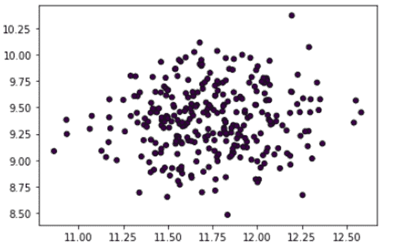
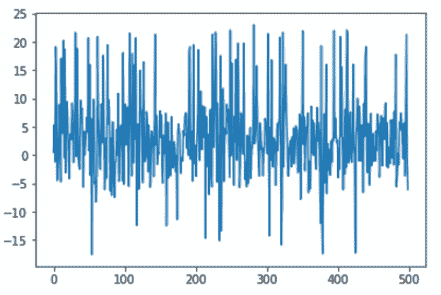

# 利用隔离林和核密度估计进行异常检测

> 原文：<https://machinelearningmastery.com/anomaly-detection-with-isolation-forest-and-kernel-density-estimation/>

异常检测是发现偏离规范的数据点。换句话说，这些都是不符合预期模式的点。异常值和异常值是用来描述异常数据的术语。异常检测在许多领域都很重要，因为它提供了有价值且可操作的见解。例如，磁共振成像扫描中的异常可能指示大脑中的肿瘤区域，而来自制造厂传感器的异常读数可能指示部件损坏。

完成本教程后，您将能够:

*   定义和理解异常检测。
*   实现异常检测算法来分析和解释结果。
*   查看任何数据中可能导致异常行为的隐藏模式。

我们开始吧。


带隔离森林和核密度估计的异常检测
图片由[凯瑟琳·蔡斯](https://unsplash.com/photos/BzF1XBy5xOc)提供。保留部分权利。

## **什么是异常检测？**

离群值只是一个数据点，它与特定数据集中的其他数据点有很大的偏差。同样，异常检测是帮助我们识别数据异常值或与大量其他数据点有很大偏差的点的过程。

当涉及到大型数据集时，可能会包含非常复杂的模式，这些模式不能通过简单地查看数据来检测。因此，为了实现一个关键的机器学习应用，研究异常检测具有重要意义。

## **异常类型**

在数据科学领域，我们有三种不同的方法来对异常进行分类。正确理解它们可能对你如何处理异常有很大影响。

*   **点或全局异常:**对应于与其余数据点显著不同的数据点，已知全局异常是最常见的异常形式。通常，发现的全局异常非常远离任何数据分布的平均值或中值。
*   **上下文或条件异常:**这些异常的值与同一上下文中其他数据点的值有显著差异。一个数据集中的异常可能不是另一个数据集中的异常。
*   **集体异常:**由于具有相同的异常特征而被紧密聚类的异常对象被称为集体异常。例如，您的服务器不是每天都受到网络攻击，因此，它将被视为异常。

虽然有许多技术用于异常检测，但让我们实现一些来了解它们如何用于各种用例。

## 隔离林

就像随机森林一样，**隔离森林**是使用决策树构建的。它们以无监督的方式实现，因为没有预定义的标签。隔离森林的设计理念是，异常是数据集中“很少且不同”的数据点。

回想一下，决策树是使用信息标准(如基尼指数或熵)构建的。明显不同的群体在树根处被分开，在树枝深处，更细微的区别被识别出来。基于随机选取的特征，隔离林以树形结构处理随机二次抽样数据。深入到树中并需要更多的切口来分离它们的样本，它们是异常的概率非常小。同样，在树的较短分支上发现的样本更有可能是异常，因为树发现将它们与其他数据区分开来更简单。

在本节中，我们将在 Python 中实现隔离林，以了解它如何检测数据集中的异常。我们都知道不可思议的 scikit-learn API，它为简单的实现提供了各种 API。因此，我们将使用它来应用隔离森林，以展示其异常检测的有效性。

首先，让我们加载必要的库和包。

```py
from sklearn.datasets import make_blobs
from numpy import quantile, random, where
from sklearn.ensemble import IsolationForest
import matplotlib.pyplot as plt
```

### **数据准备**

我们将使用`make_blob()`函数创建一个带有随机数据点的数据集。

```py
random.seed(3)
X, _ = make_blobs(n_samples=300, centers=1, cluster_std=.3, center_box=(20, 5))
```

让我们可视化数据集图，以查看样本空间中随机分离的数据点。

```py
plt.scatter(X[:, 0], X[:, 1], marker="o", c=_, s=25, edgecolor="k")
```



### **定义和拟合用于预测的隔离林模型**

如上所述，我们将使用 scikit-learn API 中的`IsolationForest`类来定义我们的模型。在类参数中，我们将设置估计量的数量和污染值。然后，我们将使用`fit_predict()`函数通过将数据集拟合到模型来获得数据集的预测。

```py
IF = IsolationForest(n_estimators=100, contamination=.03)
predictions = IF.fit_predict(X)
```

现在，让我们提取负值作为异常值，并用颜色突出显示异常值来绘制结果。

```py
outlier_index = where(predictions==-1)
values = X[outlier_index]

plt.scatter(X[:,0], X[:,1])
plt.scatter(values[:,0], values[:,1], color='y')
plt.show()
```


将所有这些放在一起，下面是完整的代码:

```py
from sklearn.datasets import make_blobs
from numpy import quantile, random, where
from sklearn.ensemble import IsolationForest
import matplotlib.pyplot as plt

random.seed(3)
X, _ = make_blobs(n_samples=300, centers=1, cluster_std=.3, center_box=(20, 5))
plt.scatter(X[:, 0], X[:, 1], marker="o", c=_, s=25, edgecolor="k")

IF = IsolationForest(n_estimators=100, contamination=.03)
predictions = IF.fit_predict(X)

outlier_index = where(predictions==-1)
values = X[outlier_index]
plt.scatter(X[:,0], X[:,1])
plt.scatter(values[:,0], values[:,1], color='y')
plt.show()
```

## **核密度估计**

如果我们认为数据集的范数应该符合某种概率分布，那么异常就是我们应该很少看到的，或者概率很低的异常。核密度估计是一种在样本空间中随机估计数据点概率密度函数的技术。利用密度函数，我们可以检测数据集中的异常。

为了实现，我们将通过创建均匀分布来准备数据，然后应用 scikit-learn 库中的`KernelDensity`类来检测异常值。

首先，我们将加载必要的库和包。

```py
from sklearn.neighbors import KernelDensity
from numpy import where, random, array, quantile
from sklearn.preprocessing import scale
import matplotlib.pyplot as plt
from sklearn.datasets import load_boston
```

### **准备并绘制数据**

让我们编写一个简单的函数来准备数据集。随机生成的数据将用作目标数据集。

```py
random.seed(135)
def prepData(N):
    X = []
    for i in range(n):
        A = i/1000 + random.uniform(-4, 3)
        R = random.uniform(-5, 10)
        if(R >= 8.6):
            R = R + 10
        elif(R < (-4.6)):
            R = R +(-9)        
        X.append([A + R])   
    return array(X)

n = 500
X = prepData(n)
```

让我们可视化图来检查数据集。

```py
x_ax = range(n)
plt.plot(x_ax, X)
plt.show()
```



### **准备并拟合用于预测的核密度函数**

我们将使用 scikit-learn API 来准备和适应模型。然后使用`score_sample()`函数获取数据集中样本的得分。接下来，我们将使用`quantile()`函数来获取阈值。

```py
kern_dens = KernelDensity()
kern_dens.fit(X)

scores = kern_dens.score_samples(X)
threshold = quantile(scores, .02)
print(threshold)
```

```py
-5.676136054971186
```

分数等于或低于获得的阈值的样本将被检测到，然后用颜色突出显示异常:

```py
idx = where(scores <= threshold)
values = X[idx]

plt.plot(x_ax, X)
plt.scatter(idx,values, color='r')
plt.show()
```


将所有这些放在一起，下面是完整的代码:

```py
from sklearn.neighbors import KernelDensity
from numpy import where, random, array, quantile
from sklearn.preprocessing import scale
import matplotlib.pyplot as plt
from sklearn.datasets import load_boston

random.seed(135)
def prepData(N):
    X = []
    for i in range(n):
        A = i/1000 + random.uniform(-4, 3)
        R = random.uniform(-5, 10)
        if(R >= 8.6):
            R = R + 10
        elif(R < (-4.6)):
            R = R +(-9)        
        X.append([A + R])   
    return array(X)

n = 500
X = prepData(n)

x_ax = range(n)
plt.plot(x_ax, X)
plt.show() 

kern_dens = KernelDensity()
kern_dens.fit(X)

scores = kern_dens.score_samples(X)
threshold = quantile(scores, .02)
print(threshold)

idx = where(scores <= threshold)
values = X[idx]
plt.plot(x_ax, X)
plt.scatter(idx,values, color='r')
plt.show()
```

## **进一步阅读**

如果您想更深入地了解这个主题，本节将提供更多资源。

### API

*   [sklearn . neights . kerneldensity](https://scikit-learn.org/stable/modules/generated/sklearn.neighbors.KernelDensity.html)API
*   [硬化。一起。绝缘林](https://scikit-learn.org/stable/modules/generated/sklearn.ensemble.IsolationForest.html) API

## **总结**

在本教程中，您发现了如何检测数据集中的异常。

具体来说，您了解到:

*   如何定义异常及其不同类型
*   什么是隔离林，如何使用它进行异常检测
*   什么是核密度估计以及如何将其用于异常检测