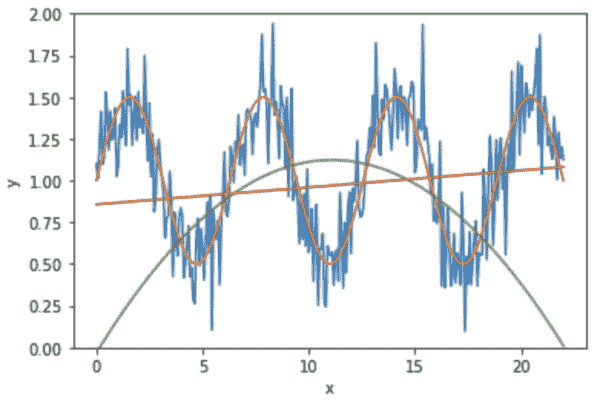

# 正确实现训练-验证-测试拆分和交叉验证

> 原文：<https://machinelearningmastery.com/training-validation-test-split-and-cross-validation-done-right/>

最后更新于 2021 年 9 月 23 日

机器学习的一个关键步骤是模型的选择。一个合适的模型和合适的超参数是获得良好预测结果的关键。当我们面临模式之间的选择时，应该如何做决定？

这就是为什么我们有交叉验证。在 scikit-learn 中，有一系列函数可以帮助我们做到这一点。但是，我们经常看到交叉验证使用不当，或者交叉验证的结果没有被正确解释。

在本教程中，您将发现使用交叉验证和数据集为项目选择最佳模型的正确过程。

完成本教程后，您将知道:

*   数据的训练-验证-测试分割的意义以及不同分割比例下的权衡
*   评估模型的指标以及如何比较模型
*   如何使用交叉验证来评估模型
*   如果我们有基于交叉验证的决策，我们应该怎么做

我们开始吧。


培训-验证-测试分割和交叉验证正确完成。
柯纳尔·加拉格尔摄影，版权所有。

## 教程概述

本教程分为三个部分:

*   模型选择问题
*   样本外评估
*   使用交叉验证的模型选择工作流示例

## 模型选择问题

机器学习的结果是一个可以做预测的模型。最常见的情况是分类模型和回归模型；前者是预测输入的类别成员，后者是基于输入预测因变量的值。然而，无论哪种情况，我们都有多种型号可供选择。例如，分类模型包括决策树、支持向量机和神经网络等。其中任何一个，都依赖于一些超参数。因此，在我们开始训练模型之前，我们必须决定一些设置**。**

如果我们有两个基于直觉的候选模型，我们想挑选一个用于我们的项目，我们应该如何挑选？

我们通常可以使用一些标准指标。在[回归问题](https://machinelearningmastery.com/regression-metrics-for-machine-learning/)中，我们常用以下其中一种:

*   均方误差
*   均方根误差(RMSE)
*   平均绝对误差

在[分类问题](https://machinelearningmastery.com/tour-of-evaluation-metrics-for-imbalanced-classification/)的情况下，经常使用的指标包括:

*   准确(性)
*   对数损失
*   f-测度

scikit-learn 的[指标页面有一个较长但并非详尽的列表，列出了不同类别的常见评估。如果我们有一个样本数据集，并希望训练一个模型来预测它，我们可以使用这些指标之一来评估模型的效率。](https://scikit-learn.org/stable/modules/model_evaluation.html)

但是，有一个问题；对于样本数据集，我们只评估了模型一次。假设我们正确地将数据集分为训练集和测试集，并在用测试集评估时用训练集拟合模型，那么我们只获得了用一个测试集评估的单个样本点。我们如何确定它是一个准确的评价，而不是一个偶然的过低或过高的值？如果我们有两个模型，并且根据评价发现一个模型比另一个模型好，我们怎么知道这也不是偶然的呢？

我们关注这一点的原因是，为了避免在将来，当模型被部署和使用在一个全新的数据上，而不是我们获得的数据上时，出现令人惊讶的低精确率。

## 样本外评估

这个问题的解决方案是训练-验证-测试分离。

> 该模型最初拟合在训练数据集上，[……]随后，拟合的模型用于预测第二个数据集(称为验证数据集)中的观测值的响应。[……]最后，测试数据集是用于对训练数据集上的最终模型拟合提供无偏评估的数据集。如果测试数据集中的数据从未用于训练(例如交叉验证)，测试数据集也称为保持数据集。
> 
> ——“培训、验证和测试集”，维基百科

这样做法的原因，在于防止**数据泄露**的理念。

“衡量的东西会得到改善。”，或者如古德哈特定律所言，“当一项措施成为目标时，它就不再是一项好措施。”如果我们用一组数据来选择一个模型，那么在相同的评估指标下，我们选择的模型肯定会在同一组数据上表现良好。然而，我们应该关心的是**看不见的数据**上的评估指标。

因此，我们需要从整个模型选择和训练过程中保留一部分数据，并保存起来以备最终评估。这一片数据是我们模型的“期末考试”，考题之前一定不能被模型看到。准确地说，这是数据使用的工作流程:

1.  训练数据集用于训练一些候选模型
2.  验证数据集用于评估候选模型
3.  其中一名候选人被选中
4.  用新的训练数据集训练所选模型
5.  用测试数据集评估训练好的模型

在步骤 1 和 2 中，我们不想对候选模型进行一次评估。相反，我们更喜欢用不同的数据集多次评估每个模型，并在第 3 步为我们的决策取平均分数。如果我们拥有海量数据，这很容易做到。否则，我们可以使用 *k* -fold 的技巧对同一个数据集进行多次重采样，假装它们是不同的。当我们评估模型或超参数时，每次都必须从头开始训练模型，而不能重复使用之前的训练结果。我们称这个过程为**交叉验证**。

从交叉验证的结果，我们可以得出一个模型是否优于另一个模型的结论。由于交叉验证是在较小的数据集上完成的，一旦我们对模型做出决定，我们可能希望再次重新训练模型。原因和我们为什么需要在交叉验证中使用 *k* -fold 相同；我们没有很多数据，我们之前使用的较小的数据集有一部分需要验证。我们相信结合训练和验证数据集可以产生更好的模型。这就是第 4 步中会出现的情况。

步骤 5 中用于评估的数据集和我们在交叉验证中使用的数据集不同，因为我们不希望**数据泄露**。如果它们相同，我们将看到与我们已经从交叉验证中看到的相同的分数。或者更糟糕的是，测试分数保证是好的，因为它是我们用来训练所选模型的数据的一部分，并且我们已经针对该测试数据集调整了模型。

一旦我们完成了培训，我们希望(1)将此模型与我们之前的评估进行比较，以及(2)估计如果我们部署它，它将如何运行。

我们使用在之前的步骤中从未使用过的测试数据集来评估表现。因为这是看不见的数据，它可以帮助我们评估泛化，或样本外的误差。这应该模拟当我们部署它时模型会做什么。如果存在过度拟合，我们预计该评估的误差会很大。

同样，如果我们正确地进行了模型训练，我们并不期望这个评估分数与我们在上一步中从交叉验证中获得的分数有很大不同。这可以作为我们选择型号的确认。

## 使用交叉验证的模型选择工作流示例

在下面，我们编造一个回归问题来说明模型选择工作流应该是怎样的。

首先，我们使用 numpy 生成一个数据集:

```py
...
# Generate data and plot
N = 300
x = np.linspace(0, 7*np.pi, N)
smooth = 1 + 0.5*np.sin(x)
y = smooth + 0.2*np.random.randn(N)
```

我们生成一条正弦曲线，并在其中加入一些噪声。本质上，数据是

$ y = 1+0.5 \ sin(x)+\ε$

对于一些小噪声信号$ \ε$。数据如下所示:


然后，我们执行一个训练-测试分割，并保持测试集，直到我们完成我们的最终模型。因为我们将使用 scikit-learn 模型进行回归，并且他们假设输入`x`是二维数组，所以我们首先在这里重塑它。此外，为了使模型选择的效果更明显，我们不会在分割中打乱数据。实际上，这通常不是一个好主意。

```py
...
# Train-test split, intentionally use shuffle=False
X = x.reshape(-1,1)
X_train, X_test, y_train, y_test = train_test_split(X, y, test_size=0.20, shuffle=False)
```

下一步，我们创建两个回归模型。它们是二次的:

$ y = c+b \乘以 x+a \乘以 x^2$

线性:

$ y = b+ a \乘以 x$

scikit-learn 中没有多项式回归，但是我们可以利用`PolynomialFeatures`结合`LinearRegression`来实现。`PolynomialFeatures(2)`将输入$x$转换成$1,x,x^2$，对这三者进行线性回归，我们会发现上面公式中的系数$a，b，c$。

```py
...
# Create two models: Quadratic and linear regression
polyreg = make_pipeline(PolynomialFeatures(2), LinearRegression(fit_intercept=False))
linreg = LinearRegression()
```

下一步是仅使用训练集并将 *k* 折叠交叉验证应用于两个模型中的每一个:

```py
...
# Cross-validation
scoring = "neg_root_mean_squared_error"
polyscores = cross_validate(polyreg, X_train, y_train, scoring=scoring, return_estimator=True)
linscores = cross_validate(linreg, X_train, y_train, scoring=scoring, return_estimator=True)
```

函数`cross_validate()`返回如下 Python 字典:

```py
{'fit_time': array([0.00177097, 0.00117302, 0.00219226, 0.0015142 , 0.00126314]),
 'score_time': array([0.00054097, 0.0004108 , 0.00086379, 0.00092077, 0.00043106]),
 'estimator': [Pipeline(steps=[('polynomialfeatures', PolynomialFeatures()),
                               ('linearregression', LinearRegression(fit_intercept=False))]),
               Pipeline(steps=[('polynomialfeatures', PolynomialFeatures()),
                               ('linearregression', LinearRegression(fit_intercept=False))]),
               Pipeline(steps=[('polynomialfeatures', PolynomialFeatures()),
                               ('linearregression', LinearRegression(fit_intercept=False))]),
               Pipeline(steps=[('polynomialfeatures', PolynomialFeatures()),
                               ('linearregression', LinearRegression(fit_intercept=False))]),
               Pipeline(steps=[('polynomialfeatures', PolynomialFeatures()),
                               ('linearregression', LinearRegression(fit_intercept=False))])],
 'test_score': array([-1.00421665, -0.53397399, -0.47742336, -0.41834582, -0.68043053])}
```

其中`test_score`键保存每次折叠的分数。我们使用**负均方根误差**进行交叉验证，分数越高，误差越小，因此模型越好。

以上来自二次模型。线性模型的相应测试分数如下:

```py
array([-0.43401194, -0.52385836, -0.42231028, -0.41532203, -0.43441137])
```

通过比较平均得分，我们发现线性模型比二次模型表现更好。

```py
...
# Which one is better? Linear and polynomial
print(linscores["test_score"].mean())
print(polyscores["test_score"].mean())
print(linscores["test_score"].mean() - polyscores["test_score"].mean())
```

```py
Linear regression score: -0.4459827970437929
Polynomial regression score: -0.6228780695994603
Difference: 0.17689527255566745
```

在我们开始训练我们的选择模型之前，我们可以说明发生了什么。以第一次交叉验证迭代为例，我们可以看到二次回归的系数如下:

```py
...
# Let's show the coefficient of the first fitted polynomial regression
# This starts from the constant term and in ascending order of powers
print(polyscores["estimator"][0].steps[1][1].coef_)
```

```py
[-0.03190358 0.20818594 -0.00937904]
```

这意味着我们拟合的二次模型是:

$ y =-0.0319+0.2082 \倍 x–0.0094 \倍 x^2$

线性回归在交叉验证的第一次迭代时的系数为

```py
...
# And show the coefficient of the last-fitted linear regression
print(linscores["estimator"][0].intercept_, linscores["estimator"][-1].coef_)
```

```py
0.856999187854241 [-0.00918622]
```

这意味着拟合的线性模型是

$ y = 0.8570–0.0092 \乘以 x$

我们可以在一个情节中看到它们的样子:

```py
...
# Plot and compare
plt.plot(x, y)
plt.plot(x, smooth)
plt.plot(x, polyscores["estimator"][0].predict(X))
plt.plot(x, linscores["estimator"][0].predict(X))
plt.ylim(0,2)
plt.xlabel("x")
plt.ylabel("y")
plt.show()
```



这里我们看到红线是线性回归，而绿线是二次回归。我们可以看到二次曲线在两端与输入数据(蓝色曲线)相差甚远。

由于我们决定使用线性模型进行回归，我们需要重新训练模型，并使用我们的测试数据进行测试。

```py
...
# Retrain the model and evaluate
linreg.fit(X_train, y_train)
print("Test set RMSE:", mean_squared_error(y_test, linreg.predict(X_test), squared=False))
print("Mean validation RMSE:", -linscores["test_score"].mean())
```

```py
Test set RMSE: 0.4403109417232645
Mean validation RMSE: 0.4459827970437929
```

在这里，由于 scikit-learn 将在交叉验证的每次迭代中克隆一个新模型，因此我们创建的模型**在交叉验证后仍未经过训练**。否则，我们应该使用`linreg = sklearn.base.clone(linreg)`克隆一个新的模型来重置模型。但是从上面，我们看到我们从我们的测试集中获得了 0.440 的均方根误差，而我们从交叉验证中获得的分数是 0.446。这没有太大的差别，因此，我们得出结论，对于新数据，这个模型应该看到类似大小的误差。

将所有这些结合在一起，完整的示例如下所示。

```py
import matplotlib.pyplot as plt
import numpy as np
from sklearn.model_selection import cross_validate, train_test_split
from sklearn.preprocessing import PolynomialFeatures, StandardScaler
from sklearn.pipeline import make_pipeline
from sklearn.linear_model import LinearRegression
from sklearn.metrics import mean_squared_error

np.random.seed(42)

# Generate data and plot
N = 300
x = np.linspace(0, 7*np.pi, N)
smooth = 1 + 0.5*np.sin(x)
y = smooth + 0.2*np.random.randn(N)
plt.plot(x, y)
plt.plot(x, smooth)
plt.xlabel("x")
plt.ylabel("y")
plt.ylim(0,2)
plt.show()

# Train-test split, intentionally use shuffle=False
X = x.reshape(-1,1)
X_train, X_test, y_train, y_test = train_test_split(X, y, test_size=0.20, shuffle=False)

# Create two models: Polynomial and linear regression
degree = 2
polyreg = make_pipeline(PolynomialFeatures(degree), LinearRegression(fit_intercept=False))
linreg = LinearRegression()

# Cross-validation
scoring = "neg_root_mean_squared_error"
polyscores = cross_validate(polyreg, X_train, y_train, scoring=scoring, return_estimator=True)
linscores = cross_validate(linreg, X_train, y_train, scoring=scoring, return_estimator=True)

# Which one is better? Linear and polynomial
print("Linear regression score:", linscores["test_score"].mean())
print("Polynomial regression score:", polyscores["test_score"].mean())
print("Difference:", linscores["test_score"].mean() - polyscores["test_score"].mean())

print("Coefficients of polynomial regression and linear regression:")
# Let's show the coefficient of the last fitted polynomial regression
# This starts from the constant term and in ascending order of powers
print(polyscores["estimator"][0].steps[1][1].coef_)
# And show the coefficient of the last-fitted linear regression
print(linscores["estimator"][0].intercept_, linscores["estimator"][-1].coef_)

# Plot and compare
plt.plot(x, y)
plt.plot(x, smooth)
plt.plot(x, polyscores["estimator"][0].predict(X))
plt.plot(x, linscores["estimator"][0].predict(X))
plt.ylim(0,2)
plt.xlabel("x")
plt.ylabel("y")
plt.show()

# Retrain the model and evaluate
import sklearn
linreg = sklearn.base.clone(linreg)
linreg.fit(X_train, y_train)
print("Test set RMSE:", mean_squared_error(y_test, linreg.predict(X_test), squared=False))
print("Mean validation RMSE:", -linscores["test_score"].mean())
```

## 进一步阅读

如果您想更深入地了解这个主题，本节将提供更多资源。

### 教程

*   [k 倍交叉验证的温和介绍](https://machinelearningmastery.com/k-fold-cross-validation/)
*   [测试数据集和验证数据集有什么区别？](https://machinelearningmastery.com/difference-test-validation-datasets/)
*   [如何配置 k 重交叉验证](https://machinelearningmastery.com/how-to-configure-k-fold-cross-validation/)

### 蜜蜂

*   [sklearn.model_selection。KFold](https://scikit-learn.org/stable/modules/generated/sklearn.model_selection.KFold.html) API。
*   [sklearn . model _ selection . cross _ val _ score](https://scikit-learn.org/stable/modules/generated/sklearn.model_selection.cross_val_score.html)API。
*   [sklearn . model _ selection . cross _ validate](https://scikit-learn.org/stable/modules/generated/sklearn.model_selection.cross_validate.html)API。

### 文章

*   [交叉验证(统计)，维基百科。](https://en.wikipedia.org/wiki/Cross-validation_(statistics))

## 摘要

在本教程中，您发现了如何对数据集进行训练-验证-测试分割并执行*k*-折叠交叉验证以正确选择模型，以及如何在选择后重新训练模型。

具体来说，您了解到:

*   训练-验证-测试分离对模型选择的意义
*   如何在训练集上使用 k 倍交叉验证来评估和比较机器学习模型。
*   如何在我们根据交叉验证的建议从候选人中选择后重新训练模型
*   如何使用测试集来确认我们的模型选择