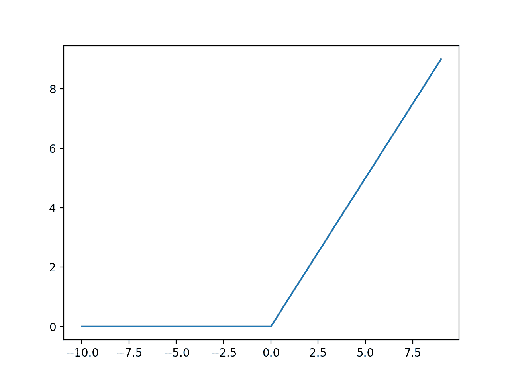
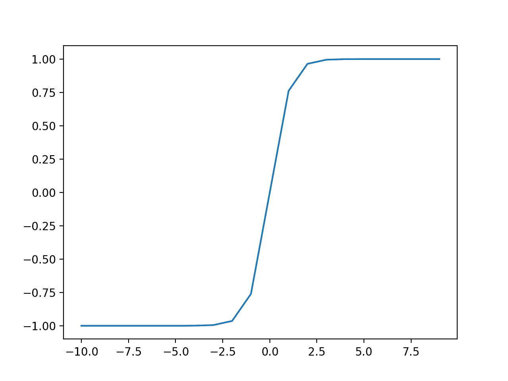
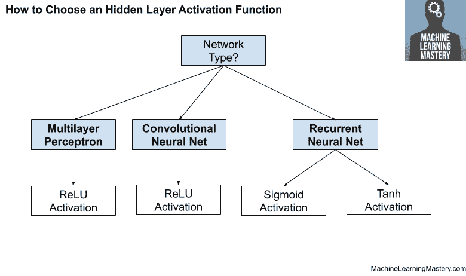

# 如何选择深度学习的激活函数

> 原文:[https://machinelearning master . com/select-an-activation-function-for-deep-learning/](https://machinelearningmastery.com/choose-an-activation-function-for-deep-learning/)

最后更新于 2021 年 1 月 22 日

**激活函数**是神经网络设计的关键部分。

隐藏层中激活函数的选择将控制网络模型学习训练数据集的程度。输出层激活函数的选择将定义模型可以做出的预测类型。

因此，必须为每个深度学习神经网络项目仔细选择激活函数。

在本教程中，您将发现如何为神经网络模型选择激活函数。

完成本教程后，您将知道:

*   激活函数是神经网络设计的关键部分。
*   隐藏层的现代默认激活功能是 ReLU 功能。
*   输出层的激活函数取决于预测问题的类型。

我们开始吧。


如何选择深度学习的激活功能
图片由[彼得·道利](https://www.flickr.com/photos/pedronet/6355538863/)提供，版权所有。

## 教程概述

本教程分为三个部分；它们是:

1.  激活函数
2.  隐藏层的激活
3.  输出层的激活

## 激活函数

神经网络中的[激活函数](https://en.wikipedia.org/wiki/Activation_function)定义了如何将输入的加权和转换为网络层中一个或多个节点的输出。

有时激活函数被称为“*传递函数*”如果激活功能的输出范围有限，则可称为“*挤压功能*”许多激活函数是非线性的，在层或网络设计中可能被称为“*非线性*”。

激活函数的选择对神经网络的能力和性能有很大的影响，不同的激活函数可以用于模型的不同部分。

从技术上讲，激活功能在网络中每个节点的内部处理内部或之后使用，尽管网络被设计为对一层中的所有节点使用相同的激活功能。

一个网络可以有三种类型的层:从域中获取原始输入的输入层、**从另一个层获取输入并将输出传递到另一个层的隐藏层、**进行预测的输出层。****

所有隐藏层通常使用相同的激活功能。输出层通常使用不同于隐藏层的激活函数，并且取决于模型所需的预测类型。

激活函数通常也是可微的，这意味着可以为给定的输入值计算一阶导数。这是必需的，因为神经网络通常使用误差反向传播算法来训练，该算法需要预测误差的导数，以便更新模型的权重。

神经网络中使用了许多不同类型的激活函数，尽管实际上可能只有少量函数用于隐藏层和输出层。

让我们依次看看每种类型的层所使用的激活函数。

## 隐藏层的激活

神经网络中的隐藏层是从另一层(例如另一隐藏层或输入层)接收输入并向另一层(例如另一隐藏层或输出层)提供输出的层。

至少在一般情况下，隐藏层不会直接接触输入数据或为模型生成输出。

神经网络可以有零个或多个隐藏层。

典型地，在神经网络的隐藏层中使用可微分的非线性激活函数。这允许模型学习比使用线性激活函数训练的网络更复杂的函数。

> 为了获得更丰富的假设空间，从深度表示中获益，你需要一个非线性，或者说激活函数。

—第 72 页，[Python 深度学习](https://amzn.to/3qVpSin)，2017。

可能有三个激活函数，您可能想考虑在隐藏层中使用；它们是:

*   整流线性激活( **ReLU** )
*   物流( **Sigmoid** )
*   双曲线正切( **Tanh** )

这不是用于隐藏层的激活函数的详尽列表，但它们是最常用的。

让我们依次仔细看看每一个。

### ReLU 隐藏层激活功能

[整流线性激活功能](https://machinelearningmastery.com/rectified-linear-activation-function-for-deep-learning-neural-networks/)，或 ReLU 激活功能，可能是用于隐藏层的最常见功能。

它之所以常见，是因为它既易于实现，又能有效克服其他以前流行的激活功能(如 Sigmoid 和 Tanh)的限制。具体来说，它不太容易受到阻止深度模型被训练的[消失梯度](https://machinelearningmastery.com/how-to-fix-vanishing-gradients-using-the-rectified-linear-activation-function/)的影响，尽管它可能会遇到其他问题，如饱和或“*死亡*”单位。

ReLU 函数计算如下:

*   最大值(0.0，x)

这意味着如果输入值(x)为负，则返回值 0.0，否则返回值。

您可以在本教程中了解更多关于 ReLU 激活功能的细节:

*   [整流线性单元的温和介绍](https://machinelearningmastery.com/rectified-linear-activation-function-for-deep-learning-neural-networks/)

我们可以通过下面的例子得到这个函数形状的直觉。

```py
# example plot for the relu activation function
from matplotlib import pyplot

# rectified linear function
def rectified(x):
	return max(0.0, x)

# define input data
inputs = [x for x in range(-10, 10)]
# calculate outputs
outputs = [rectified(x) for x in inputs]
# plot inputs vs outputs
pyplot.plot(inputs, outputs)
pyplot.show()
```

运行该示例计算一系列值的输出，并创建输入与输出的关系图。

我们可以看到熟悉的 ReLU 激活函数的扭结形状。



ReLU 激活功能的输入与输出图。

对隐藏图层使用 ReLU 函数时，最好在训练前使用“ *He Normal* ”或“ *He Uniform* ”进行权重初始化，并将输入数据缩放到 0-1(Normal)的范围。

### Sigmoid 隐藏层激活函数

sigmoid 激活函数也称为逻辑函数。

它与逻辑回归分类算法中使用的函数相同。

该函数将任何实数值作为输入，并输出 0 到 1 范围内的值。输入越大(越正)，输出值越接近 1.0，而输入越小(越负)，输出越接近 0.0。

sigmoid 激活函数计算如下:

*   1.0 / (1.0 + e^-x)

其中 [e 是数学常数](https://en.wikipedia.org/wiki/E_(mathematical_constant))，是自然对数的底数。

我们可以通过下面的例子得到这个函数形状的直觉。

```py
# example plot for the sigmoid activation function
from math import exp
from matplotlib import pyplot

# sigmoid activation function
def sigmoid(x):
	return 1.0 / (1.0 + exp(-x))

# define input data
inputs = [x for x in range(-10, 10)]
# calculate outputs
outputs = [sigmoid(x) for x in inputs]
# plot inputs vs outputs
pyplot.plot(inputs, outputs)
pyplot.show()
```

运行该示例计算一系列值的输出，并创建输入与输出的关系图。

我们可以看到熟悉的 S 形的乙状结肠激活功能。


Sigmoid 激活函数的输入与输出图。

对隐藏层使用 Sigmoid 函数时，最好在训练前使用“ *Xavier Normal* ”或“ *Xavier Uniform* ”权重初始化(也称为 Glorot 初始化，以 [Xavier Glorot](https://www.linkedin.com/in/xglorot/) 命名)并将输入数据缩放到 0-1 的范围(例如激活函数的范围)。

### 隐藏层激活函数

双曲正切激活函数也简称为 Tanh(也是“ *tanh* ”和“ *TanH* ”)函数。

它与乙状结肠激活功能非常相似，甚至具有相同的 S 形。

该函数将任何实数值作为输入，并输出-1 到 1 范围内的值。输入越大(越正)，输出值越接近 1.0，而输入越小(越负)，输出越接近-1.0。

Tanh 激活函数计算如下:

*   (e^x-e^-x)/(e^x+e^-x)

其中 [e 是数学常数](https://en.wikipedia.org/wiki/E_(mathematical_constant))，是自然对数的底数。

我们可以通过下面的例子得到这个函数形状的直觉。

```py
# example plot for the tanh activation function
from math import exp
from matplotlib import pyplot

# tanh activation function
def tanh(x):
	return (exp(x) - exp(-x)) / (exp(x) + exp(-x))

# define input data
inputs = [x for x in range(-10, 10)]
# calculate outputs
outputs = [tanh(x) for x in inputs]
# plot inputs vs outputs
pyplot.plot(inputs, outputs)
pyplot.show()
```

运行该示例计算一系列值的输出，并创建输入与输出的关系图。

我们可以看到我们熟悉的 Tanh 激活函数的 S 形。



Tanh 激活函数的输入与输出图。

当对隐藏层使用 TanH 函数时，最好在训练前使用“*泽维尔正常*”或“*泽维尔均匀*”权重初始化(也称为格洛罗初始化，以泽维尔格洛罗命名)，并将输入数据缩放到-1 到 1 的范围(例如激活函数的范围)。

### 如何选择隐藏层激活功能

神经网络在所有隐藏层中几乎总是具有相同的激活功能。

通过网络模型改变激活函数是非常不寻常的。

传统上，sigmoid 激活函数是 20 世纪 90 年代的默认激活函数。也许在 20 世纪 90 年代中后期到 2010 年代，Tanh 功能是隐藏层的默认激活功能。

> …双曲正切激活函数的性能通常优于逻辑 sigmoid。

—第 195 页，[深度学习](https://amzn.to/2QHVWmW)，2016。

sigmoid 和 Tanh 函数都可以通过所谓的消失梯度问题，使模型在训练过程中更容易出现问题。

您可以在本教程中了解有关此问题的更多信息:

*   [整流线性单元的温和介绍](https://machinelearningmastery.com/rectified-linear-activation-function-for-deep-learning-neural-networks/)

隐藏层中使用的激活函数通常是基于神经网络体系结构的类型来选择的。

具有通用架构的现代神经网络模型，如 MLP 和美国有线电视新闻网，将利用 ReLU 激活功能或扩展。

> 在现代神经网络中，默认的建议是使用校正后的线性单元或 ReLU …

—第 174 页，[深度学习](https://amzn.to/2QHVWmW)，2016。

递归网络仍然普遍使用 Tanh 或 sigmoid 激活函数，甚至两者都使用。例如，LSTM 通常使用 Sigmoid 激活进行循环连接，使用 Tanh 激活进行输出。

*   **多层感知器(MLP)** : ReLU 激活功能。
*   **卷积神经网络(CNN)** : ReLU 激活函数。
*   **递归神经网络** : Tanh 和/或 Sigmoid 激活功能。

如果您不确定要为您的网络使用哪种激活功能，请尝试一些并比较结果。

下图总结了如何为神经网络模型的隐藏层选择激活函数。



如何选择隐藏层激活功能

## 输出层的激活

输出层是神经网络模型中直接输出预测的层。

所有前馈神经网络模型都有一个输出层。

在输出层中，您可能需要考虑使用三个激活函数；它们是:

*   线性的
*   物流(西格蒙德)
*   Softmax(软件最大值)

这不是用于输出层的激活函数的详尽列表，但它们是最常用的。

让我们依次仔细看看每一个。

### 线性输出激活函数

线性激活函数也称为“*身份*”(乘以 1.0)或“*无激活*”

这是因为线性激活函数不会以任何方式改变输入的加权和，而是直接返回值。

我们可以通过下面的例子得到这个函数形状的直觉。

```py
# example plot for the linear activation function
from matplotlib import pyplot

# linear activation function
def linear(x):
	return x

# define input data
inputs = [x for x in range(-10, 10)]
# calculate outputs
outputs = [linear(x) for x in inputs]
# plot inputs vs outputs
pyplot.plot(inputs, outputs)
pyplot.show()
```

运行该示例计算一系列值的输出，并创建输入与输出的关系图。

我们可以看到一个对角线形状，其中输入相对于相同的输出进行绘制。


线性激活函数的输入与输出图

用于训练输出层中具有线性激活函数的模型的目标值通常在使用标准化或标准化变换建模之前进行缩放。

### Sigmoid 输出激活函数

逻辑激活函数的 sigmoid 在前一节中已经描述过了。

然而，为了增加一些对称性，我们可以用下面的例子来检查这个函数的形状。

```py
# example plot for the sigmoid activation function
from math import exp
from matplotlib import pyplot

# sigmoid activation function
def sigmoid(x):
	return 1.0 / (1.0 + exp(-x))

# define input data
inputs = [x for x in range(-10, 10)]
# calculate outputs
outputs = [sigmoid(x) for x in inputs]
# plot inputs vs outputs
pyplot.plot(inputs, outputs)
pyplot.show()
```

运行该示例计算一系列值的输出，并创建输入与输出的关系图。

我们可以看到熟悉的 S 形的乙状结肠激活功能。


Sigmoid 激活函数的输入与输出图。

用于训练输出层中具有 sigmoid 激活函数的模型的目标标签将具有值 0 或 1。

### 软最大输出激活功能

[softmax 函数](https://machinelearningmastery.com/softmax-activation-function-with-python/)输出一个总和为 1.0 的值向量，该向量可以解释为类成员的概率。

它与 [argmax 功能](https://machinelearningmastery.com/argmax-in-machine-learning/)相关，该功能为所有选项输出 0，为所选选项输出 1。Softmax 是 argmax 的“*更软的*版本，允许赢家通吃功能的概率输出。

因此，该函数的输入是一个实值向量，输出是一个长度相同的向量，其值的和为 1.0，类似于概率。

softmax 函数计算如下:

*   e^x / sum(e^x)

其中 *x* 是输出向量， [e 是数学常数](https://en.wikipedia.org/wiki/E_(mathematical_constant))，是自然对数的底数。

您可以在本教程中了解更多关于 Softmax 功能的详细信息:

*   [Python 的 Softmax 激活功能](https://machinelearningmastery.com/softmax-activation-function-with-python/)

我们无法绘制 softmax 函数，但我们可以用 Python 给出一个计算它的例子。

```py
from numpy import exp

# softmax activation function
def softmax(x):
	return exp(x) / exp(x).sum()

# define input data
inputs = [1.0, 3.0, 2.0]
# calculate outputs
outputs = softmax(inputs)
# report the probabilities
print(outputs)
# report the sum of the probabilities
print(outputs.sum())
```

运行该示例计算输入向量的 softmax 输出。

然后，我们确认 softmax 输出的总和确实等于值 1.0。

```py
[0.09003057 0.66524096 0.24472847]
1.0
```

用于在输出层使用 softmax 激活函数训练模型的目标标签将是向量，目标类为 1，所有其他类为 0。

### 如何选择输出激活功能

您必须根据正在解决的预测问题的类型为输出图层选择激活函数。

具体来说，被预测的变量的类型。

例如，您可以将预测问题分为两大类，预测分类变量(*分类*)和预测数值变量(*回归*)。

如果你的问题是一个回归问题，你应该使用线性激活函数。

*   **回归**:一个节点，线性激活。

如果你的问题是分类问题，那么有三种主要的分类问题，每一种都可能使用不同的激活函数。

预测概率不是回归问题；这是分类。在所有分类情况下，您的模型将预测类成员的概率(例如，一个示例属于每个类的概率)，您可以通过舍入(对于 sigmoid)或 argmax(对于 softmax)将其转换为清晰的类标签。

如果有两个互斥的类(二进制分类)，那么您的输出层将有一个节点，应该使用 sigmoid 激活函数。如果有两个以上互斥的类(多类分类)，那么你的输出层每个类有一个节点，应该使用 softmax 激活。如果有两个或更多相互包含的类(multilabel 分类)，那么输出层将为每个类提供一个节点，并使用 sigmoid 激活函数。

*   **二元分类**:一个节点，乙状结肠激活。
*   **多类分类**:每类一个节点，softmax 激活。
*   **多标签分类**:每类一个节点，乙状结肠激活。

下图总结了如何为神经网络模型的输出层选择激活函数。


如何选择输出层激活功能

## 进一步阅读

如果您想更深入地了解这个主题，本节将提供更多资源。

### 教程

*   [整流线性单元的温和介绍](https://machinelearningmastery.com/rectified-linear-activation-function-for-deep-learning-neural-networks/)
*   [Python 的 Softmax 激活功能](https://machinelearningmastery.com/softmax-activation-function-with-python/)
*   [机器学习中的 4 类分类任务](https://machinelearningmastery.com/types-of-classification-in-machine-learning/)
*   [如何使用 ReLU](https://machinelearningmastery.com/how-to-fix-vanishing-gradients-using-the-rectified-linear-activation-function/) 修复渐变消失问题

### 书

*   [深度学习](https://amzn.to/3qSk3C2)，2016 年。
*   [神经锻造:前馈人工神经网络中的监督学习](https://amzn.to/380Yjvd)，1999。
*   [用于模式识别的神经网络](https://amzn.to/2Wd6uze)，1996。
*   [用 Python 深度学习](https://amzn.to/3qVpSin)，2017。

### 文章

*   [激活功能，维基百科](https://en.wikipedia.org/wiki/Activation_function)。

## 摘要

在本教程中，您发现了如何为神经网络模型选择激活函数。

具体来说，您了解到:

*   激活函数是神经网络设计的关键部分。
*   隐藏层的现代默认激活功能是 ReLU 功能。
*   输出层的激活函数取决于预测问题的类型。

**你有什么问题吗？**
在下面的评论中提问，我会尽力回答。