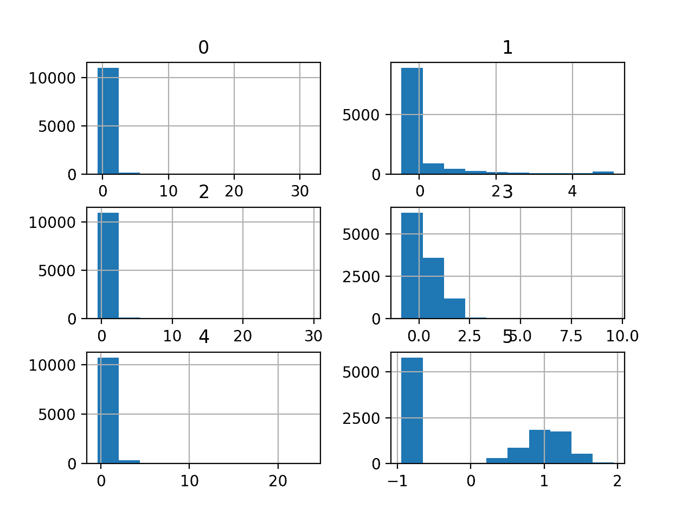

# 为伍兹乳腺摄影数据集开发神经网络

> 原文：<https://machinelearningmastery.com/develop-a-neural-network-for-woods-mammography-dataset/>

为新数据集开发神经网络预测模型可能具有挑战性。

一种方法是首先检查数据集，并为哪些模型可能起作用提出想法，然后探索数据集上简单模型的学习动态，最后利用强大的测试工具为数据集开发和调整模型。

该过程可用于开发用于分类和回归预测建模问题的有效神经网络模型。

在本教程中，您将发现如何为伍德的乳腺摄影分类数据集开发多层感知器神经网络模型。

完成本教程后，您将知道:

*   如何加载和总结伍德的乳腺摄影数据集，并使用结果建议数据准备和模型配置使用。
*   如何探索数据集上简单 MLP 模型的学习动态。
*   如何对模型性能进行稳健的估计，调整模型性能并对新数据进行预测。

我们开始吧。


为伍兹乳腺摄影数据集开发神经网络
图片由[拉里·罗](https://flickr.com/photos/trippinlarry/5469027222/)提供，保留部分权利。

## 教程概述

本教程分为 4 个部分；它们是:

1.  伍兹乳房 x 线摄影数据集
2.  神经网络学习动力学
3.  稳健模型评估
4.  最终模型和做出预测

## 伍兹乳房 x 线摄影数据集

第一步是定义和探索数据集。

我们将使用“*乳腺摄影*”标准二进制分类数据集，有时称为“*伍兹乳腺摄影*”。

该数据集归功于 Kevin Woods 等人和 1993 年发表的题为“乳腺摄影中检测微钙化的模式识别技术的比较评估”的论文

问题的焦点是从放射扫描中检测乳腺癌，特别是在乳房 x 光片上看起来明亮的微钙化簇的存在。

有两类，目标是使用给定分割对象的特征来区分微钙化和非微钙化。

*   **非微钙化**:阴性，或多数类。
*   **微钙化**:阳性病例，或少数民族。

乳腺摄影数据集是一个广泛使用的标准机器学习数据集，用于探索和演示许多专门为不平衡分类设计的技术。

**注**:说得再清楚不过了，我们是不是“*解决乳腺癌*”。我们正在探索一个标准的分类数据集。

下面是数据集前 5 行的示例

```py
0.23001961,5.0725783,-0.27606055,0.83244412,-0.37786573,0.4803223,'-1'
0.15549112,-0.16939038,0.67065219,-0.85955255,-0.37786573,-0.94572324,'-1'
-0.78441482,-0.44365372,5.6747053,-0.85955255,-0.37786573,-0.94572324,'-1'
0.54608818,0.13141457,-0.45638679,-0.85955255,-0.37786573,-0.94572324,'-1'
-0.10298725,-0.3949941,-0.14081588,0.97970269,-0.37786573,1.0135658,'-1'
...
```

您可以在此了解有关数据集的更多信息:

*   [乳腺摄影数据集(乳腺摄影. csv)](https://github.com/jbrownlee/Datasets/blob/master/mammography.csv)
*   [乳腺摄影详情(乳腺摄影.名称)](https://github.com/jbrownlee/Datasets/blob/master/mammography.names)

我们可以直接从网址将数据集加载为熊猫数据帧；例如:

```py
# load the mammography dataset and summarize the shape
from pandas import read_csv
# define the location of the dataset
url = 'https://raw.githubusercontent.com/jbrownlee/Datasets/master/mammography.csv'
# load the dataset
df = read_csv(url, header=None)
# summarize shape
print(df.shape)
```

运行该示例直接从 URL 加载数据集，并报告数据集的形状。

在这种情况下，我们可以确认数据集有 7 个变量(6 个输入和 1 个输出)，并且数据集有 11，183 行数据。

这是一个中等大小的神经网络数据集，建议使用小型网络。

它还建议使用 k 倍交叉验证将是一个好主意，因为它将给出比训练/测试分割更可靠的模型性能估计，并且因为单个模型将在几秒钟内适合最大数据集，而不是几小时或几天。

```py
(11183, 7)
```

接下来，我们可以通过查看汇总统计数据和数据图来了解更多关于数据集的信息。

```py
# show summary statistics and plots of the mammography dataset
from pandas import read_csv
from matplotlib import pyplot
# define the location of the dataset
url = 'https://raw.githubusercontent.com/jbrownlee/Datasets/master/mammography.csv'
# load the dataset
df = read_csv(url, header=None)
# show summary statistics
print(df.describe())
# plot histograms
df.hist()
pyplot.show()
```

运行该示例首先加载之前的数据，然后打印每个变量的汇总统计信息。

我们可以看到这些值通常很小，平均值接近于零。

```py
                  0             1  ...             4             5
count  1.118300e+04  1.118300e+04  ...  1.118300e+04  1.118300e+04
mean   1.096535e-10  1.297595e-09  ... -1.120680e-09  1.459483e-09
std    1.000000e+00  1.000000e+00  ...  1.000000e+00  1.000000e+00
min   -7.844148e-01 -4.701953e-01  ... -3.778657e-01 -9.457232e-01
25%   -7.844148e-01 -4.701953e-01  ... -3.778657e-01 -9.457232e-01
50%   -1.085769e-01 -3.949941e-01  ... -3.778657e-01 -9.457232e-01
75%    3.139489e-01 -7.649473e-02  ... -3.778657e-01  1.016613e+00
max    3.150844e+01  5.085849e+00  ...  2.361712e+01  1.949027e+00
```

然后为每个变量创建直方图。

我们可以看到，也许大多数变量具有指数分布，也许变量 5(最后一个输入变量)是具有异常值/缺失值的高斯分布。

我们在每个变量上使用幂变换可能会有一些好处，以便使概率分布不那么偏斜，这可能会提高模型性能。



乳腺摄影分类数据集的直方图

了解数据集实际上有多不平衡可能会有所帮助。

我们可以使用 Counter 对象来统计每个类中的示例数量，然后使用这些计数来总结分布。

下面列出了完整的示例。

```py
# summarize the class ratio of the mammography dataset
from pandas import read_csv
from collections import Counter
# define the location of the dataset
url = 'https://raw.githubusercontent.com/jbrownlee/Datasets/master/mammography.csv'
# load the csv file as a data frame
dataframe = read_csv(url, header=None)
# summarize the class distribution
target = dataframe.values[:,-1]
counter = Counter(target)
for k,v in counter.items():
	per = v / len(target) * 100
	print('Class=%s, Count=%d, Percentage=%.3f%%' % (k, v, per))
```

运行该示例总结了类别分布，确认了严重的类别不平衡，多数类别(无癌症)约为 98%，少数类别(癌症)约为 2%。

```py
Class='-1', Count=10923, Percentage=97.675%
Class='1', Count=260, Percentage=2.325%
```

这是有帮助的，因为如果我们使用分类精确率，那么任何达到低于约 97.7%的精确率的模型都没有这个数据集的技能。

现在我们已经熟悉了数据集，让我们探索如何开发一个神经网络模型。

## 神经网络学习动力学

我们将使用张量流为数据集开发一个多层感知器(MLP)模型。

我们无法知道什么样的学习超参数的模型架构对这个数据集是好的或最好的，所以我们必须实验并发现什么是好的。

假设数据集很小，小批量可能是个好主意，例如 16 或 32 行。开始时使用[亚当版本的随机梯度下降](https://machinelearningmastery.com/adam-optimization-from-scratch/)是一个好主意，因为它会自动调整学习速率，并且在大多数数据集上运行良好。

在我们认真评估模型之前，最好回顾学习动态，调整模型架构和学习配置，直到我们有稳定的学习动态，然后看看如何从模型中获得最大收益。

我们可以通过使用简单的数据训练/测试分割和学习曲线的回顾图来做到这一点。这将有助于我们了解自己是学习过度还是学习不足；然后我们可以相应地调整配置。

首先，我们必须确保所有输入变量都是浮点值，并将目标标签编码为整数值 0 和 1。

```py
...
# ensure all data are floating point values
X = X.astype('float32')
# encode strings to integer
y = LabelEncoder().fit_transform(y)
```

接下来，我们可以将数据集分成输入和输出变量，然后分成 67/33 训练集和测试集。

我们必须确保按类对拆分进行分层，确保训练集和测试集具有与主数据集相同的类标签分布。

```py
...
# split into input and output columns
X, y = df.values[:, :-1], df.values[:, -1]
# split into train and test datasets
X_train, X_test, y_train, y_test = train_test_split(X, y, test_size=0.5, stratify=y, random_state=1)
```

我们可以定义一个最小 MLP 模型。

在这种情况下，我们将使用一个具有 50 个节点的隐藏层和一个输出层(任意选择)。我们将使用隐藏层中的 ReLU 激活函数和“*he _ normal*”[权重初始化](https://machinelearningmastery.com/weight-initialization-for-deep-learning-neural-networks/)，作为一个整体，它们是一个很好的实践。

模型的输出是用于二进制分类的 [sigmoid 激活](https://machinelearningmastery.com/choose-an-activation-function-for-deep-learning/)，我们将最小化二进制交叉熵损失。

```py
...
# define model
model = Sequential()
model.add(Dense(50, activation='relu', kernel_initializer='he_normal', input_shape=(n_features,)))
model.add(Dense(1, activation='sigmoid'))
# compile the model
model.compile(optimizer='adam', loss='binary_crossentropy')
```

我们将使模型适合 300 个训练时期(任意选择)，批量大小为 32，因为它是一个中等大小的数据集。

我们正在原始数据上拟合模型，我们认为这可能是一个好主意，但这是一个重要的起点。

```py
...
history = model.fit(X_train, y_train, epochs=300, batch_size=32, verbose=0, validation_data=(X_test,y_test))
```

在训练结束时，我们将评估模型在测试数据集上的性能，并将性能报告为分类精确率。

```py
...
# predict test set
yhat = model.predict_classes(X_test)
# evaluate predictions
score = accuracy_score(y_test, yhat)
print('Accuracy: %.3f' % score)
```

最后，我们将绘制训练和测试集上交叉熵损失的学习曲线。

```py
...
# plot learning curves
pyplot.title('Learning Curves')
pyplot.xlabel('Epoch')
pyplot.ylabel('Cross Entropy')
pyplot.plot(history.history['loss'], label='train')
pyplot.plot(history.history['val_loss'], label='val')
pyplot.legend()
pyplot.show()
```

将所有这些结合起来，下面列出了在癌症存活数据集上评估我们的第一个 MLP 的完整示例。

```py
# fit a simple mlp model on the mammography and review learning curves
from pandas import read_csv
from sklearn.model_selection import train_test_split
from sklearn.preprocessing import LabelEncoder
from sklearn.metrics import accuracy_score
from tensorflow.keras import Sequential
from tensorflow.keras.layers import Dense
from matplotlib import pyplot
# load the dataset
path = 'https://raw.githubusercontent.com/jbrownlee/Datasets/master/mammography.csv'
df = read_csv(path, header=None)
# split into input and output columns
X, y = df.values[:, :-1], df.values[:, -1]
# ensure all data are floating point values
X = X.astype('float32')
# encode strings to integer
y = LabelEncoder().fit_transform(y)
# split into train and test datasets
X_train, X_test, y_train, y_test = train_test_split(X, y, test_size=0.5, stratify=y, random_state=1)
# determine the number of input features
n_features = X.shape[1]
# define model
model = Sequential()
model.add(Dense(50, activation='relu', kernel_initializer='he_normal', input_shape=(n_features,)))
model.add(Dense(1, activation='sigmoid'))
# compile the model
model.compile(optimizer='adam', loss='binary_crossentropy')
# fit the model
history = model.fit(X_train, y_train, epochs=300, batch_size=32, verbose=0, validation_data=(X_test,y_test))
# predict test set
yhat = model.predict_classes(X_test)
# evaluate predictions
score = accuracy_score(y_test, yhat)
print('Accuracy: %.3f' % score)
# plot learning curves
pyplot.title('Learning Curves')
pyplot.xlabel('Epoch')
pyplot.ylabel('Cross Entropy')
pyplot.plot(history.history['loss'], label='train')
pyplot.plot(history.history['val_loss'], label='val')
pyplot.legend()
pyplot.show()
```

运行该示例首先在训练数据集上拟合模型，然后在测试数据集上报告分类精确率。

**注**:考虑到算法或评估程序的随机性，或数值精确率的差异，您的[结果可能会有所不同](https://machinelearningmastery.com/different-results-each-time-in-machine-learning/)。考虑运行该示例几次，并比较平均结果。

在这种情况下，我们可以看到该模型比无技能模型表现得更好，假设准确率在大约 97.7%以上，在这种情况下达到大约 98.8%的准确率。

```py
Accuracy: 0.988
```

然后创建列车和测试集上的损耗线图。

我们可以看到，模型很快在数据集上找到了一个很好的拟合，并且看起来没有过度拟合或拟合不足。


乳腺摄影数据集上简单多层感知器的学习曲线

现在，我们已经对数据集上的简单 MLP 模型的学习动态有了一些了解，我们可以考虑对数据集上的模型性能进行更稳健的评估。

## 稳健模型评估

k 倍交叉验证程序可以提供更可靠的 MLP 性能估计，尽管它可能非常慢。

这是因为 k 模型必须被拟合和评估。当数据集规模较小时，例如癌症存活数据集，这不是问题。

我们可以使用[stratifiedfold](https://scikit-learn.org/stable/modules/generated/sklearn.model_selection.StratifiedKFold.html)类手动枚举每个折叠，拟合模型，对其进行评估，然后在程序结束时报告评估分数的平均值。

```py
...
# prepare cross validation
kfold = KFold(10)
# enumerate splits
scores = list()
for train_ix, test_ix in kfold.split(X, y):
	# fit and evaluate the model...
	...
...
# summarize all scores
print('Mean Accuracy: %.3f (%.3f)' % (mean(scores), std(scores)))
```

我们可以使用这个框架，利用我们的基本配置，甚至利用一系列不同的数据准备、模型架构和学习配置，来开发 MLP 模型性能的可靠估计。

重要的是，在使用 k-fold 交叉验证来估计性能之前，我们首先了解了上一节中模型在数据集上的学习动态。如果我们开始直接调整模型，我们可能会得到好的结果，但如果没有，我们可能不知道为什么，例如，模型过度或拟合不足。

如果我们再次对模型进行大的更改，最好返回并确认模型正在适当收敛。

下面列出了评估前一节中的基本 MLP 模型的框架的完整示例。

```py
# k-fold cross-validation of base model for the mammography dataset
from numpy import mean
from numpy import std
from pandas import read_csv
from sklearn.model_selection import StratifiedKFold
from sklearn.preprocessing import LabelEncoder
from sklearn.metrics import accuracy_score
from tensorflow.keras import Sequential
from tensorflow.keras.layers import Dense
from matplotlib import pyplot
# load the dataset
path = 'https://raw.githubusercontent.com/jbrownlee/Datasets/master/mammography.csv'
df = read_csv(path, header=None)
# split into input and output columns
X, y = df.values[:, :-1], df.values[:, -1]
# ensure all data are floating point values
X = X.astype('float32')
# encode strings to integer
y = LabelEncoder().fit_transform(y)
# prepare cross validation
kfold = StratifiedKFold(10, random_state=1)
# enumerate splits
scores = list()
for train_ix, test_ix in kfold.split(X, y):
	# split data
	X_train, X_test, y_train, y_test = X[train_ix], X[test_ix], y[train_ix], y[test_ix]
	# determine the number of input features
	n_features = X.shape[1]
	# define model
	model = Sequential()
	model.add(Dense(50, activation='relu', kernel_initializer='he_normal', input_shape=(n_features,)))
	model.add(Dense(1, activation='sigmoid'))
	# compile the model
	model.compile(optimizer='adam', loss='binary_crossentropy')
	# fit the model
	model.fit(X_train, y_train, epochs=300, batch_size=32, verbose=0)
	# predict test set
	yhat = model.predict_classes(X_test)
	# evaluate predictions
	score = accuracy_score(y_test, yhat)
	print('>%.3f' % score)
	scores.append(score)
# summarize all scores
print('Mean Accuracy: %.3f (%.3f)' % (mean(scores), std(scores)))
```

运行该示例会报告评估程序每次迭代的模型性能，并在运行结束时报告分类精确率的平均值和标准偏差。

**注**:考虑到算法或评估程序的随机性，或数值精确率的差异，您的[结果可能会有所不同](https://machinelearningmastery.com/different-results-each-time-in-machine-learning/)。考虑运行该示例几次，并比较平均结果。

在这种情况下，我们可以看到 MLP 模型获得了大约 98.7%的平均精确率，这与我们在前面部分中的粗略估计非常接近。

这证实了我们的预期，即对于这个数据集，基本模型配置可能比简单模型工作得更好

```py
>0.987
>0.986
>0.989
>0.987
>0.986
>0.988
>0.989
>0.989
>0.983
>0.988
Mean Accuracy: 0.987 (0.002)
```

接下来，让我们看看如何拟合最终模型并使用它进行预测。

## 最终模型和做出预测

一旦我们选择了一个模型配置，我们就可以在所有可用的数据上训练一个最终模型，并使用它来对新数据进行预测。

在这种情况下，我们将使用具有脱落和小批量的模型作为最终模型。

我们可以像以前一样准备数据并拟合模型，尽管是在整个数据集上，而不是数据集的训练子集上。

```py
...
# split into input and output columns
X, y = df.values[:, :-1], df.values[:, -1]
# ensure all data are floating point values
X = X.astype('float32')
# encode strings to integer
le = LabelEncoder()
y = le.fit_transform(y)
# determine the number of input features
n_features = X.shape[1]
# define model
model = Sequential()
model.add(Dense(50, activation='relu', kernel_initializer='he_normal', input_shape=(n_features,)))
model.add(Dense(1, activation='sigmoid'))
# compile the model
model.compile(optimizer='adam', loss='binary_crossentropy')
```

然后，我们可以使用这个模型对新数据进行预测。

首先，我们可以定义一行新数据。

```py
...
# define a row of new data
row = [0.23001961,5.0725783,-0.27606055,0.83244412,-0.37786573,0.4803223]
```

注意:我从数据集的第一行提取了这一行，预期的标签是“-1”。

然后我们可以做一个预测。

```py
...
# make prediction
yhat = model.predict_classes([row])
```

然后反转预测上的转换，这样我们就可以使用或解释正确标签中的结果(对于这个数据集，它只是一个整数)。

```py
...
# invert transform to get label for class
yhat = le.inverse_transform(yhat)
```

在这种情况下，我们将简单地报告预测。

```py
...
# report prediction
print('Predicted: %s' % (yhat[0]))
```

将所有这些结合起来，下面列出了为乳腺摄影数据集拟合最终模型并使用它对新数据进行预测的完整示例。

```py
# fit a final model and make predictions on new data for the mammography dataset
from pandas import read_csv
from sklearn.preprocessing import LabelEncoder
from sklearn.metrics import accuracy_score
from tensorflow.keras import Sequential
from tensorflow.keras.layers import Dense
from tensorflow.keras.layers import Dropout
# load the dataset
path = 'https://raw.githubusercontent.com/jbrownlee/Datasets/master/mammography.csv'
df = read_csv(path, header=None)
# split into input and output columns
X, y = df.values[:, :-1], df.values[:, -1]
# ensure all data are floating point values
X = X.astype('float32')
# encode strings to integer
le = LabelEncoder()
y = le.fit_transform(y)
# determine the number of input features
n_features = X.shape[1]
# define model
model = Sequential()
model.add(Dense(50, activation='relu', kernel_initializer='he_normal', input_shape=(n_features,)))
model.add(Dense(1, activation='sigmoid'))
# compile the model
model.compile(optimizer='adam', loss='binary_crossentropy')
# fit the model
model.fit(X, y, epochs=300, batch_size=32, verbose=0)
# define a row of new data
row = [0.23001961,5.0725783,-0.27606055,0.83244412,-0.37786573,0.4803223]
# make prediction
yhat = model.predict_classes([row])
# invert transform to get label for class
yhat = le.inverse_transform(yhat)
# report prediction
print('Predicted: %s' % (yhat[0]))
```

运行该示例使模型适合整个数据集，并对单行新数据进行预测。

**注**:考虑到算法或评估程序的随机性，或数值精确率的差异，您的[结果可能会有所不同](https://machinelearningmastery.com/different-results-each-time-in-machine-learning/)。考虑运行该示例几次，并比较平均结果。

在这种情况下，我们可以看到模型为输入行预测了一个“-1”标签。

```py
Predicted: '-1'
```

## 进一步阅读

如果您想更深入地了解这个主题，本节将提供更多资源。

### 教程

*   [检测乳腺摄影微钙化的不平衡分类模型](https://machinelearningmastery.com/imbalanced-classification-model-to-detect-microcalcifications/)
*   [标准机器学习数据集的最佳结果](https://machinelearningmastery.com/results-for-standard-classification-and-regression-machine-learning-datasets/)
*   [TensorFlow 2 教程:使用 tf.keras 开始深度学习](https://machinelearningmastery.com/tensorflow-tutorial-deep-learning-with-tf-keras/)
*   [k 倍交叉验证的温和介绍](https://machinelearningmastery.com/k-fold-cross-validation/)

## 摘要

在本教程中，您发现了如何为伍德的乳腺摄影分类数据集开发多层感知器神经网络模型。

具体来说，您了解到:

*   如何加载和总结伍德的乳腺摄影数据集，并使用结果建议数据准备和模型配置使用。
*   如何探索数据集上简单 MLP 模型的学习动态。
*   如何对模型性能进行稳健的估计，调整模型性能并对新数据进行预测。

**你有什么问题吗？**
在下面的评论中提问，我会尽力回答。