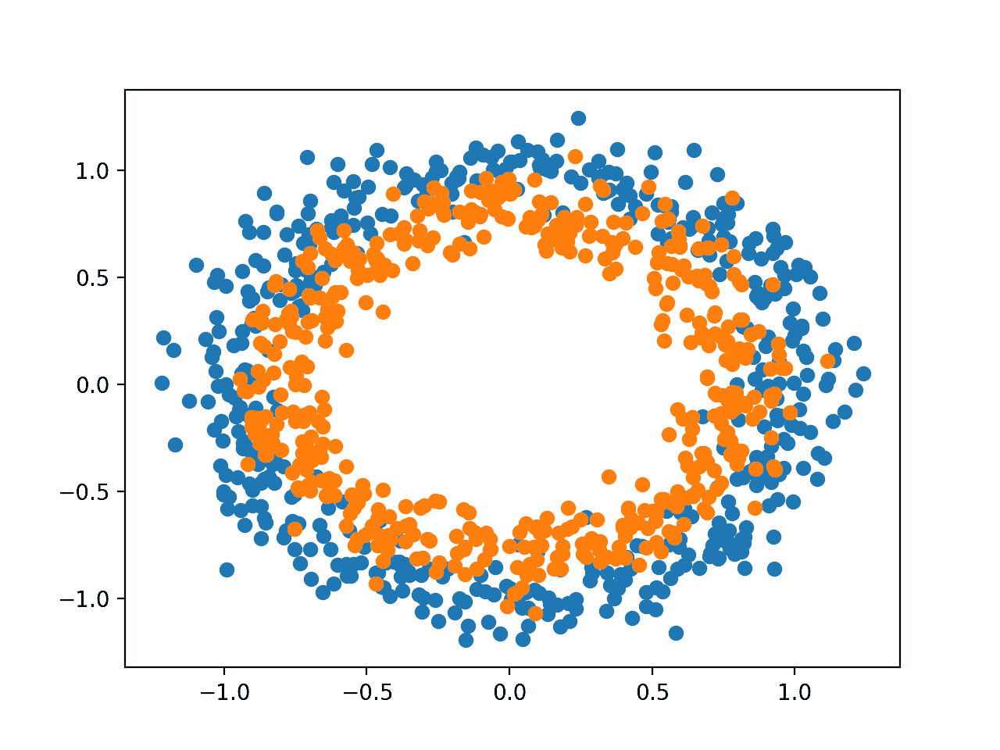

# 如何计算深度学习模型的精度、召回率、F1 等

> 原文:[https://machinelearning master . com/如何计算精度-召回-f1-和更多-用于深度学习-模型/](https://machinelearningmastery.com/how-to-calculate-precision-recall-f1-and-more-for-deep-learning-models/)

最后更新于 2020 年 8 月 27 日

一旦适合深度学习神经网络模型，就必须在测试数据集上评估其性能。

这很重要，因为报告的性能允许您在候选模型之间进行选择，并向利益相关者传达模型在解决问题方面有多好。

就您可以用来报告模型性能的指标而言，Keras 深度学习 API 模型非常有限。

我经常被问到的问题，比如:

> 如何计算模型的精度和召回率？

以及:

> 如何计算我的模型的 F1 分数或混淆矩阵？

在本教程中，您将通过一个循序渐进的示例发现如何计算度量来评估您的深度学习神经网络模型。

完成本教程后，您将知道:

*   如何使用 scikit-learn metrics API 评估深度学习模型？
*   如何用 scikit-learn API 要求的最终模型进行类和概率预测。
*   如何用 scikit-learn API 为一个模型计算精度、召回率、F1-评分、ROC AUC 等。

**用我的新书[用 Python 深度学习](https://machinelearningmastery.com/deep-learning-with-python/)来启动你的项目**，包括*分步教程*和所有示例的 *Python 源代码*文件。

我们开始吧。

*   **2020 年 1 月更新**:更新了 Keras 2.3 和 TensorFlow 2.0 的 API。


如何计算深度学习模型的精度、召回率、F1 和更多信息[约翰](https://www.flickr.com/photos/shebalso/358533824/)摄，版权所有。

## 教程概述

本教程分为三个部分；它们是:

1.  二元分类问题
2.  多层感知器模型
3.  如何计算模型度量

## 二元分类问题

我们将使用一个标准的二元分类问题作为本教程的基础，称为“*两个圆*”问题。

它被称为两个圆的问题，因为这个问题是由点组成的，当绘制时，显示两个同心圆，每个类一个。因此，这是二元分类问题的一个例子。这个问题有两个输入，可以解释为图上的 x 和 y 坐标。每个点属于内圆或外圆。

scikit-learn 库中的 [make_circles()函数](https://scikit-learn.org/stable/modules/generated/sklearn.datasets.make_circles.html)允许您从两个圆的问题中生成样本。“ *n_samples* ”参数允许您指定要生成的样本数量，在两个类之间平均分配。“*噪声*”参数允许您指定向每个点的输入或坐标添加多少随机统计噪声，从而使分类任务更具挑战性。“ *random_state* ”参数指定伪随机数发生器的种子，确保每次运行代码时生成相同的样本。

下面的示例生成 1000 个样本，统计噪声为 0.1，种子为 1。

```
# generate 2d classification dataset
X, y = make_circles(n_samples=1000, noise=0.1, random_state=1)
```

一旦生成，我们就可以创建一个数据集图来了解分类任务的挑战性。

下面的示例生成样本并绘制它们，根据类别给每个点着色，其中属于类别 0(外圈)的点被着色为蓝色，属于类别 1(内圈)的点被着色为橙色。

```
# Example of generating samples from the two circle problem
from sklearn.datasets import make_circles
from matplotlib import pyplot
from numpy import where
# generate 2d classification dataset
X, y = make_circles(n_samples=1000, noise=0.1, random_state=1)
# scatter plot, dots colored by class value
for i in range(2):
	samples_ix = where(y == i)
	pyplot.scatter(X[samples_ix, 0], X[samples_ix, 1])
pyplot.show()
```

运行该示例会生成数据集并在图形上绘制点，清楚地显示属于类别 0 和类别 1 的点的两个同心圆。



两个圆问题的样本散点图

## 多层感知器模型

我们将开发一个多层感知器或 MLP 模型来解决二元分类问题。

这个模型不是针对问题优化的，但是很有技巧(比随机好)。

生成数据集的样本后，我们将它们分成两个相等的部分:一个用于训练模型，一个用于评估训练好的模型。

```
# split into train and test
n_test = 500
trainX, testX = X[:n_test, :], X[n_test:, :]
trainy, testy = y[:n_test], y[n_test:]
```

接下来，我们可以定义我们的 MLP 模型。该模型很简单，需要来自数据集的 2 个输入变量、一个具有 100 个节点的隐藏层和一个 ReLU 激活函数，然后是一个具有单个节点和 sigmoid 激活函数的输出层。

该模型将预测一个介于 0 和 1 之间的值，该值将被解释为输入示例属于类别 0 还是类别 1。

```
# define model
model = Sequential()
model.add(Dense(100, input_dim=2, activation='relu'))
model.add(Dense(1, activation='sigmoid'))
```

模型将使用二元交叉熵损失函数进行拟合，我们将使用有效的[亚当版本的随机梯度下降](https://machinelearningmastery.com/adam-optimization-algorithm-for-deep-learning/)。该模型还将监控分类精度度量。

```
# compile model
model.compile(loss='binary_crossentropy', optimizer='adam', metrics=['accuracy'])
```

我们将为 300 个训练时期拟合模型，默认批量为 32 个样本，并在每个训练时期结束时在测试数据集上评估模型的性能。

```
# fit model
history = model.fit(trainX, trainy, validation_data=(testX, testy), epochs=300, verbose=0)
```

在训练结束时，我们将在训练和测试数据集上再次评估最终模型，并报告分类精度。

```
# evaluate the model
_, train_acc = model.evaluate(trainX, trainy, verbose=0)
_, test_acc = model.evaluate(testX, testy, verbose=0)
```

最后，模型在列车上的性能和在训练期间记录的测试集将使用线图来绘制，损失和分类精度各一个。

```
# plot loss during training
pyplot.subplot(211)
pyplot.title('Loss')
pyplot.plot(history.history['loss'], label='train')
pyplot.plot(history.history['val_loss'], label='test')
pyplot.legend()
# plot accuracy during training
pyplot.subplot(212)
pyplot.title('Accuracy')
pyplot.plot(history.history['accuracy'], label='train')
pyplot.plot(history.history['val_accuracy'], label='test')
pyplot.legend()
pyplot.show()
```

将所有这些元素结合在一起，下面列出了训练和评估两个圆圈问题上的 MLP 的完整代码列表。

```
# multilayer perceptron model for the two circles problem
from sklearn.datasets import make_circles
from keras.models import Sequential
from keras.layers import Dense
from matplotlib import pyplot
# generate dataset
X, y = make_circles(n_samples=1000, noise=0.1, random_state=1)
# split into train and test
n_test = 500
trainX, testX = X[:n_test, :], X[n_test:, :]
trainy, testy = y[:n_test], y[n_test:]
# define model
model = Sequential()
model.add(Dense(100, input_dim=2, activation='relu'))
model.add(Dense(1, activation='sigmoid'))
# compile model
model.compile(loss='binary_crossentropy', optimizer='adam', metrics=['accuracy'])
# fit model
history = model.fit(trainX, trainy, validation_data=(testX, testy), epochs=300, verbose=0)
# evaluate the model
_, train_acc = model.evaluate(trainX, trainy, verbose=0)
_, test_acc = model.evaluate(testX, testy, verbose=0)
print('Train: %.3f, Test: %.3f' % (train_acc, test_acc))
# plot loss during training
pyplot.subplot(211)
pyplot.title('Loss')
pyplot.plot(history.history['loss'], label='train')
pyplot.plot(history.history['val_loss'], label='test')
pyplot.legend()
# plot accuracy during training
pyplot.subplot(212)
pyplot.title('Accuracy')
pyplot.plot(history.history['accuracy'], label='train')
pyplot.plot(history.history['val_accuracy'], label='test')
pyplot.legend()
pyplot.show()
```

在中央处理器上运行该示例非常快速地符合模型(不需要图形处理器)。

**注**:考虑到算法或评估程序的随机性，或数值精度的差异，您的[结果可能会有所不同](https://machinelearningmastery.com/different-results-each-time-in-machine-learning/)。考虑运行该示例几次，并比较平均结果。

对该模型进行了评估，报告在列车和测试集上的分类准确率分别约为 83%和 85%。

```
Train: 0.838, Test: 0.850
```

创建一个图形，显示两条线图:一条是列车和测试集上损失的[学习曲线](https://machinelearningmastery.com/how-to-control-neural-network-model-capacity-with-nodes-and-layers/)，另一条是列车和测试集上的分类。

这些图表明这个模型很适合这个问题。


训练中 MLP 对两个圆问题的损失和准确性学习曲线的线图

## 如何计算模型度量

也许你需要使用 [Keras 度量 API](https://keras.io/metrics/) 不支持的额外度量来评估你的深度学习神经网络模型。

Keras 度量 API 是有限的，您可能想要计算诸如精度、召回率、F1 等度量。

计算新度量的一种方法是在 Keras API 中自己实现它们，并让 Keras 在模型训练和模型评估期间为您计算它们。

有关这种方法的帮助，请参见教程:

*   [如何使用 Python 中的 Keras 进行深度学习的度量](https://machinelearningmastery.com/custom-metrics-deep-learning-keras-python/)

这在技术上具有挑战性。

一个更简单的替代方法是使用您的最终模型对测试数据集进行预测，然后使用 [scikit-learn metrics API](https://scikit-learn.org/stable/modules/classes.html#module-sklearn.metrics) 计算您想要的任何度量。

除了分类精度之外，二元分类问题的神经网络模型通常还需要三个指标:

*   精确
*   回忆
*   F1 分数

在本节中，我们将使用 scikit-learn metrics API 计算这三个指标以及分类精度，我们还将计算三个不太常见但可能有用的附加指标。它们是:

*   科恩的卡帕
*   中华民国
*   [混乱矩阵](https://machinelearningmastery.com/confusion-matrix-machine-learning/)。

这不是 scikit-learn 支持的分类模型的完整指标列表；尽管如此，计算这些指标将向您展示如何使用 scikit-learn API 计算您可能需要的任何指标。

有关支持的指标的完整列表，请参见:

*   [sklearn . Metrics:Metrics API](https://scikit-learn.org/stable/modules/classes.html#module-sklearn.metrics)
*   [分类指标指南](https://scikit-learn.org/stable/modules/model_evaluation.html#classification-metrics)

本节中的示例将计算 MLP 模型的度量，但是计算度量的相同代码也可以用于其他模型，例如神经网络和中枢神经网络。

我们可以使用前面几节中相同的代码来准备数据集，以及定义和拟合模型。为了使示例更简单，我们将把这些步骤的代码放入简单的函数中。

首先，我们可以定义一个名为 *get_data()* 的函数，该函数将生成数据集并将其拆分为训练集和测试集。

```
# generate and prepare the dataset
def get_data():
	# generate dataset
	X, y = make_circles(n_samples=1000, noise=0.1, random_state=1)
	# split into train and test
	n_test = 500
	trainX, testX = X[:n_test, :], X[n_test:, :]
	trainy, testy = y[:n_test], y[n_test:]
	return trainX, trainy, testX, testy
```

接下来，我们将定义一个名为 *get_model()* 的函数，该函数将定义 MLP 模型并将其拟合到训练数据集上。

```
# define and fit the model
def get_model(trainX, trainy):
	# define model
	model = Sequential()
	model.add(Dense(100, input_dim=2, activation='relu'))
	model.add(Dense(1, activation='sigmoid'))
	# compile model
	model.compile(loss='binary_crossentropy', optimizer='adam', metrics=['accuracy'])
	# fit model
	model.fit(trainX, trainy, epochs=300, verbose=0)
	return model
```

然后我们可以调用 *get_data()* 函数准备数据集，调用 *get_model()* 函数拟合并返回模型。

```
# generate data
trainX, trainy, testX, testy = get_data()
# fit model
model = get_model(trainX, trainy)
```

现在我们已经有了一个适合训练数据集的模型，我们可以使用 scikit-learn metrics API 中的度量来评估它。

首先，我们必须使用模型进行预测。大多数度量函数需要真实类值(例如 *testy* )和预测类值(*yhat _ class*)之间的比较。我们可以使用模型上的*predict _ class()*函数直接用我们的模型预测类值。

有些指标，比如 ROC AUC，需要预测类概率( *yhat_probs* )。这些可以通过调用模型上的*预测()*函数来检索。

有关使用 Keras 模型进行预测的更多帮助，请参见帖子:

*   [如何用 Keras 进行预测](https://machinelearningmastery.com/how-to-make-classification-and-regression-predictions-for-deep-learning-models-in-keras/)

我们可以用这个模型进行分类和概率预测。

```
# predict probabilities for test set
yhat_probs = model.predict(testX, verbose=0)
# predict crisp classes for test set
yhat_classes = model.predict_classes(testX, verbose=0)
```

预测以二维数组的形式返回，测试数据集中的每个示例对应一行，预测对应一列。

scikit-learn metrics API 期望使用 1D 阵列的实际值和预测值进行比较，因此，我们必须将 2D 预测阵列简化为 1D 阵列。

```
# reduce to 1d array
yhat_probs = yhat_probs[:, 0]
yhat_classes = yhat_classes[:, 0]
```

我们现在准备为我们的深度学习神经网络模型计算度量。我们可以从计算分类准确度、精确度、召回率和 F1 分数开始。

```
# accuracy: (tp + tn) / (p + n)
accuracy = accuracy_score(testy, yhat_classes)
print('Accuracy: %f' % accuracy)
# precision tp / (tp + fp)
precision = precision_score(testy, yhat_classes)
print('Precision: %f' % precision)
# recall: tp / (tp + fn)
recall = recall_score(testy, yhat_classes)
print('Recall: %f' % recall)
# f1: 2 tp / (2 tp + fp + fn)
f1 = f1_score(testy, yhat_classes)
print('F1 score: %f' % f1)
```

请注意，计算度量就像选择我们感兴趣的度量并调用传递真实类值( *testy* )和预测类值(*yhat _ class*)的函数一样简单。

我们还可以计算一些额外的指标，如科恩的 kappa、ROC AUC 和混淆矩阵。

请注意，ROC AUC 需要预测的类概率( *yhat_probs* )作为参数，而不是预测的类(*yhat _ class*)。

```
# kappa
kappa = cohen_kappa_score(testy, yhat_classes)
print('Cohens kappa: %f' % kappa)
# ROC AUC
auc = roc_auc_score(testy, yhat_probs)
print('ROC AUC: %f' % auc)
# confusion matrix
matrix = confusion_matrix(testy, yhat_classes)
print(matrix)
```

现在我们知道了如何使用 scikit-learn API 计算深度学习神经网络的指标，我们可以将所有这些元素结合成一个完整的示例，如下所示。

```
# demonstration of calculating metrics for a neural network model using sklearn
from sklearn.datasets import make_circles
from sklearn.metrics import accuracy_score
from sklearn.metrics import precision_score
from sklearn.metrics import recall_score
from sklearn.metrics import f1_score
from sklearn.metrics import cohen_kappa_score
from sklearn.metrics import roc_auc_score
from sklearn.metrics import confusion_matrix
from keras.models import Sequential
from keras.layers import Dense

# generate and prepare the dataset
def get_data():
	# generate dataset
	X, y = make_circles(n_samples=1000, noise=0.1, random_state=1)
	# split into train and test
	n_test = 500
	trainX, testX = X[:n_test, :], X[n_test:, :]
	trainy, testy = y[:n_test], y[n_test:]
	return trainX, trainy, testX, testy

# define and fit the model
def get_model(trainX, trainy):
	# define model
	model = Sequential()
	model.add(Dense(100, input_dim=2, activation='relu'))
	model.add(Dense(1, activation='sigmoid'))
	# compile model
	model.compile(loss='binary_crossentropy', optimizer='adam', metrics=['accuracy'])
	# fit model
	model.fit(trainX, trainy, epochs=300, verbose=0)
	return model

# generate data
trainX, trainy, testX, testy = get_data()
# fit model
model = get_model(trainX, trainy)

# predict probabilities for test set
yhat_probs = model.predict(testX, verbose=0)
# predict crisp classes for test set
yhat_classes = model.predict_classes(testX, verbose=0)
# reduce to 1d array
yhat_probs = yhat_probs[:, 0]
yhat_classes = yhat_classes[:, 0]

# accuracy: (tp + tn) / (p + n)
accuracy = accuracy_score(testy, yhat_classes)
print('Accuracy: %f' % accuracy)
# precision tp / (tp + fp)
precision = precision_score(testy, yhat_classes)
print('Precision: %f' % precision)
# recall: tp / (tp + fn)
recall = recall_score(testy, yhat_classes)
print('Recall: %f' % recall)
# f1: 2 tp / (2 tp + fp + fn)
f1 = f1_score(testy, yhat_classes)
print('F1 score: %f' % f1)

# kappa
kappa = cohen_kappa_score(testy, yhat_classes)
print('Cohens kappa: %f' % kappa)
# ROC AUC
auc = roc_auc_score(testy, yhat_probs)
print('ROC AUC: %f' % auc)
# confusion matrix
matrix = confusion_matrix(testy, yhat_classes)
print(matrix)
```

**注**:考虑到算法或评估程序的随机性，或数值精度的差异，您的[结果可能会有所不同](https://machinelearningmastery.com/different-results-each-time-in-machine-learning/)。考虑运行该示例几次，并比较平均结果。

运行该示例准备数据集，拟合模型，然后计算并报告在测试数据集上评估的模型的度量。

```
Accuracy: 0.842000
Precision: 0.836576
Recall: 0.853175
F1 score: 0.844794
Cohens kappa: 0.683929
ROC AUC: 0.923739
[[206  42]
 [ 37 215]]
```

如果您需要解释给定指标的帮助，或许可以从 scikit-learn API 文档中的“分类指标指南”开始:[分类指标指南](https://scikit-learn.org/stable/modules/model_evaluation.html#classification-metrics)

此外，查看维基百科页面了解你的指标；比如:[精准与召回，维基百科](https://en.wikipedia.org/wiki/Precision_and_recall)。

## 进一步阅读

如果您想更深入地了解这个主题，本节将提供更多资源。

### 邮件

*   [如何使用 Python 中的 Keras 进行深度学习的度量](https://machinelearningmastery.com/custom-metrics-deep-learning-keras-python/)
*   [如何用 scikit 在 Python 中生成测试数据集-学习](https://machinelearningmastery.com/generate-test-datasets-python-scikit-learn/)
*   [如何用 Keras 进行预测](https://machinelearningmastery.com/how-to-make-classification-and-regression-predictions-for-deep-learning-models-in-keras/)

### 应用程序接口

*   [sklearn . Metrics:Metrics API](https://scikit-learn.org/stable/modules/classes.html#module-sklearn.metrics)
*   [分类指标指南](https://scikit-learn.org/stable/modules/model_evaluation.html#classification-metrics)
*   [硬指标 API](https://keras.io/metrics/)
*   [sklearn . dataset . make _ circles API](https://scikit-learn.org/stable/modules/generated/sklearn.datasets.make_circles.html)

### 文章

*   [二进制分类器的评价，维基百科](https://en.wikipedia.org/wiki/Evaluation_of_binary_classifiers)。
*   [混淆矩阵，维基百科](https://en.wikipedia.org/wiki/Confusion_matrix)。
*   [精准与召回，维基百科](https://en.wikipedia.org/wiki/Precision_and_recall)。

## 摘要

在本教程中，您通过一个逐步的示例发现了如何计算度量来评估您的深度学习神经网络模型。

具体来说，您了解到:

*   如何使用 scikit-learn metrics API 评估深度学习模型？
*   如何用 scikit-learn API 要求的最终模型进行类和概率预测。
*   如何用 scikit-learn API 为一个模型计算精度、召回率、F1-score、ROC、AUC 等。

你有什么问题吗？
在下面的评论中提问，我会尽力回答。