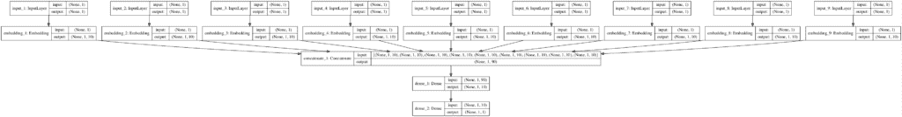

# 深度学习类别变量的 3 种编码方式

> 原文：<https://machinelearningmastery.com/how-to-prepare-categorical-data-for-deep-learning-in-python/>

最后更新于 2020 年 8 月 27 日

像 Keras 中的机器学习和深度学习模型一样，要求所有的输入和输出变量都是数字的。

这意味着，如果您的数据包含分类数据，您必须将其编码为数字，然后才能拟合和评估模型。

最流行的两种技术是**整数编码**和**一种热门编码**，尽管一种叫做**的新技术学习嵌入**可能会在这两种方法之间提供一个有用的中间地带。

在本教程中，您将发现在 Keras 中开发神经网络模型时如何编码分类数据。

完成本教程后，您将知道:

*   使用机器学习和深度学习模型时处理分类数据的挑战。
*   如何对建模的类别变量进行整数编码和热编码？
*   如何学习嵌入分布式表示作为类别变量神经网络的一部分。

**用我的新书[用 Python 深度学习](https://machinelearningmastery.com/deep-learning-with-python/)来启动你的项目**，包括*分步教程*和所有示例的 *Python 源代码*文件。

我们开始吧。


如何在 Keras 中为深度学习编码分类数据
图片由 [Ken Dixon](https://www.flickr.com/photos/kendixon/43872634992/) 提供，保留部分权利。

## 教程概述

本教程分为五个部分；它们是:

1.  分类数据的挑战
2.  乳腺癌分类数据集
3.  如何对分类数据进行有序编码
4.  如何对分类数据进行热编码
5.  如何对分类数据使用学习嵌入

## 分类数据的挑战

类别变量是其值具有标签值的变量。

例如，变量可以是“*颜色*”，可以取值“*红色*”、“*绿色*”和“*蓝色*

有时，分类数据可能在类别之间具有有序关系，例如“*第一*”、“*第二*”和“*第三*”这种类型的分类数据被称为序数，附加的排序信息可能是有用的。

机器学习算法和深度学习神经网络要求输入和输出变量都是数字。

这意味着分类数据必须编码成数字，然后我们才能使用它来拟合和评估模型。

有许多方法可以为建模编码类别变量，尽管最常见的有以下三种:

1.  **整数编码**:每个唯一的标签映射到一个整数。
2.  **一个热编码**:每个标签映射到一个二进制向量。
3.  **学习嵌入**:学习类别的分布式表示。

我们将仔细研究如何使用这些方法中的每一种来编码分类数据，以便在 Keras 中训练深度学习神经网络。

## 乳腺癌分类数据集

作为本教程的基础，我们将使用自 20 世纪 80 年代以来在机器学习中广泛研究的所谓的“[乳腺癌](https://archive.ics.uci.edu/ml/datasets/Breast+Cancer)”数据集。

数据集将乳腺癌患者数据分类为癌症复发或不复发。有 286 个例子和 9 个输入变量。这是一个二元分类问题。

该数据集上合理的分类准确度分数在 68%和 73%之间。我们将针对该区域，但请注意，本教程中的模型并未优化:*它们旨在演示编码方案*。

您可以下载数据集，并将文件保存为当前工作目录中的“*乳腺癌. csv* ”。

*   [乳腺癌数据集(乳腺癌. csv)](https://raw.githubusercontent.com/jbrownlee/Datasets/master/breast-cancer.csv)

查看数据，我们可以看到所有九个输入变量都是绝对的。

具体来说，所有变量都是带引号的字符串；有些是序数，有些不是。

```py
'40-49','premeno','15-19','0-2','yes','3','right','left_up','no','recurrence-events'
'50-59','ge40','15-19','0-2','no','1','right','central','no','no-recurrence-events'
'50-59','ge40','35-39','0-2','no','2','left','left_low','no','recurrence-events'
'40-49','premeno','35-39','0-2','yes','3','right','left_low','yes','no-recurrence-events'
'40-49','premeno','30-34','3-5','yes','2','left','right_up','no','recurrence-events'
...
```

我们可以使用熊猫库将这个数据集加载到内存中。

```py
...
# load the dataset as a pandas DataFrame
data = read_csv(filename, header=None)
# retrieve numpy array
dataset = data.values
```

加载后，我们可以将列拆分为输入( *X* )和输出( *y* )进行建模。

```py
...
# split into input (X) and output (y) variables
X = dataset[:, :-1]
y = dataset[:,-1]
```

最后，我们可以强制输入数据中的所有字段都是字符串，以防 Pandas 尝试自动将一些字段映射到数字(它确实尝试了)。

我们还可以将输出变量整形为一列(例如，2D 形状)。

```py
...
# format all fields as string
X = X.astype(str)
# reshape target to be a 2d array
y = y.reshape((len(y), 1))
```

我们可以将所有这些结合到一个有用的函数中，以便以后重用。

```py
# load the dataset
def load_dataset(filename):
	# load the dataset as a pandas DataFrame
	data = read_csv(filename, header=None)
	# retrieve numpy array
	dataset = data.values
	# split into input (X) and output (y) variables
	X = dataset[:, :-1]
	y = dataset[:,-1]
	# format all fields as string
	X = X.astype(str)
	# reshape target to be a 2d array
	y = y.reshape((len(y), 1))
	return X, y
```

加载后，我们可以将数据分成训练集和测试集，这样我们就可以拟合和评估深度学习模型。

我们将使用 scikit-learn 中的 [train_test_split()函数](https://scikit-learn.org/stable/modules/generated/sklearn.model_selection.train_test_split.html)，使用 67%的数据进行训练，33%的数据进行测试。

```py
...
# load the dataset
X, y = load_dataset('breast-cancer.csv')
# split into train and test sets
X_train, X_test, y_train, y_test = train_test_split(X, y, test_size=0.33, random_state=1)
```

将所有这些元素结合在一起，下面列出了加载、拆分和汇总原始分类数据集的完整示例。

```py
# load and summarize the dataset
from pandas import read_csv
from sklearn.model_selection import train_test_split

# load the dataset
def load_dataset(filename):
	# load the dataset as a pandas DataFrame
	data = read_csv(filename, header=None)
	# retrieve numpy array
	dataset = data.values
	# split into input (X) and output (y) variables
	X = dataset[:, :-1]
	y = dataset[:,-1]
	# format all fields as string
	X = X.astype(str)
	# reshape target to be a 2d array
	y = y.reshape((len(y), 1))
	return X, y

# load the dataset
X, y = load_dataset('breast-cancer.csv')
# split into train and test sets
X_train, X_test, y_train, y_test = train_test_split(X, y, test_size=0.33, random_state=1)
# summarize
print('Train', X_train.shape, y_train.shape)
print('Test', X_test.shape, y_test.shape)
```

运行该示例会报告训练集和测试集的输入和输出元素的大小。

我们可以看到，我们有 191 个示例用于培训，95 个示例用于测试。

```py
Train (191, 9) (191, 1)
Test (95, 9) (95, 1)
```

现在我们已经熟悉了数据集，让我们看看如何对它进行编码以进行建模。

## 如何对分类数据进行有序编码

序数编码包括将每个唯一标签映射到一个整数值。

因此，它有时被简单地称为整数编码。

只有当类别之间存在已知的关系时，这种类型的编码才是真正合适的。

对于数据集中的一些变量，这种关系确实存在，理想情况下，在准备数据时应该利用这种关系。

在这种情况下，我们将忽略任何可能存在的序数关系，并假设所有变量都是分类的。使用序数编码仍然是有帮助的，至少作为其他编码方案的参考点。

我们可以使用 scikit-learn 中的[序数编码器()将每个变量编码为整数。这是一个灵活的类，如果已知任何这样的顺序，它确实允许将类别的顺序指定为参数。](https://scikit-learn.org/stable/modules/generated/sklearn.preprocessing.OrdinalEncoder.html)

**注**:我会留给你一个练习，更新下面的例子，尝试为那些具有自然排序的变量指定顺序，看看是否对模型性能有影响。

对变量进行编码的最佳实践是在训练数据集上进行编码，然后将其应用于训练和测试数据集。

下面的函数名为 *prepare_inputs()* ，获取列车和测试集的输入数据，并使用顺序编码对其进行编码。

```py
# prepare input data
def prepare_inputs(X_train, X_test):
	oe = OrdinalEncoder()
	oe.fit(X_train)
	X_train_enc = oe.transform(X_train)
	X_test_enc = oe.transform(X_test)
	return X_train_enc, X_test_enc
```

我们还需要准备目标变量。

这是一个二元分类问题，所以我们需要将两个类标签映射为 0 和 1。

这是一种序数编码，scikit-learn 提供了专门为此目的设计的 [LabelEncoder](https://scikit-learn.org/stable/modules/generated/sklearn.preprocessing.LabelEncoder.html) 类。虽然*标签编码器*是为编码单个变量而设计的，但是我们也可以很容易地使用[普通编码器](https://scikit-learn.org/stable/modules/generated/sklearn.preprocessing.OrdinalEncoder.html)来获得同样的结果。

*prepare_targets()* 整数编码列车和测试集的输出数据。

```py
# prepare target
def prepare_targets(y_train, y_test):
	le = LabelEncoder()
	le.fit(y_train)
	y_train_enc = le.transform(y_train)
	y_test_enc = le.transform(y_test)
	return y_train_enc, y_test_enc
```

我们可以调用这些函数来准备我们的数据。

```py
...
# prepare input data
X_train_enc, X_test_enc = prepare_inputs(X_train, X_test)
# prepare output data
y_train_enc, y_test_enc = prepare_targets(y_train, y_test)
```

我们现在可以定义一个神经网络模型。

我们将在所有这些示例中使用相同的通用模型。具体来说，就是一个多层感知器(MLP)神经网络，其中一个隐藏层有 10 个节点，输出层有一个节点用于进行二进制分类。

下面的代码没有涉及太多细节，而是定义了模型，将其放在训练数据集上，然后在测试数据集上对其进行评估。

```py
...
# define the model
model = Sequential()
model.add(Dense(10, input_dim=X_train_enc.shape[1], activation='relu', kernel_initializer='he_normal'))
model.add(Dense(1, activation='sigmoid'))
# compile the keras model
model.compile(loss='binary_crossentropy', optimizer='adam', metrics=['accuracy'])
# fit the keras model on the dataset
model.fit(X_train_enc, y_train_enc, epochs=100, batch_size=16, verbose=2)
# evaluate the keras model
_, accuracy = model.evaluate(X_test_enc, y_test_enc, verbose=0)
print('Accuracy: %.2f' % (accuracy*100))
```

如果你是在 Keras 开发神经网络的新手，我推荐这个教程:

*   [用 Python 逐步开发你的第一个神经网络](https://machinelearningmastery.com/tutorial-first-neural-network-python-keras/)

将所有这些联系在一起，下面列出了用序数编码准备数据以及对数据拟合和评估神经网络的完整示例。

```py
# example of ordinal encoding for a neural network
from pandas import read_csv
from sklearn.model_selection import train_test_split
from sklearn.preprocessing import LabelEncoder
from sklearn.preprocessing import OrdinalEncoder
from keras.models import Sequential
from keras.layers import Dense

# load the dataset
def load_dataset(filename):
	# load the dataset as a pandas DataFrame
	data = read_csv(filename, header=None)
	# retrieve numpy array
	dataset = data.values
	# split into input (X) and output (y) variables
	X = dataset[:, :-1]
	y = dataset[:,-1]
	# format all fields as string
	X = X.astype(str)
	# reshape target to be a 2d array
	y = y.reshape((len(y), 1))
	return X, y

# prepare input data
def prepare_inputs(X_train, X_test):
	oe = OrdinalEncoder()
	oe.fit(X_train)
	X_train_enc = oe.transform(X_train)
	X_test_enc = oe.transform(X_test)
	return X_train_enc, X_test_enc

# prepare target
def prepare_targets(y_train, y_test):
	le = LabelEncoder()
	le.fit(y_train)
	y_train_enc = le.transform(y_train)
	y_test_enc = le.transform(y_test)
	return y_train_enc, y_test_enc

# load the dataset
X, y = load_dataset('breast-cancer.csv')
# split into train and test sets
X_train, X_test, y_train, y_test = train_test_split(X, y, test_size=0.33, random_state=1)
# prepare input data
X_train_enc, X_test_enc = prepare_inputs(X_train, X_test)
# prepare output data
y_train_enc, y_test_enc = prepare_targets(y_train, y_test)
# define the  model
model = Sequential()
model.add(Dense(10, input_dim=X_train_enc.shape[1], activation='relu', kernel_initializer='he_normal'))
model.add(Dense(1, activation='sigmoid'))
# compile the keras model
model.compile(loss='binary_crossentropy', optimizer='adam', metrics=['accuracy'])
# fit the keras model on the dataset
model.fit(X_train_enc, y_train_enc, epochs=100, batch_size=16, verbose=2)
# evaluate the keras model
_, accuracy = model.evaluate(X_test_enc, y_test_enc, verbose=0)
print('Accuracy: %.2f' % (accuracy*100))
```

在任何现代硬件(不需要图形处理器)上运行该示例只需几秒钟即可适应该模型。

在每个训练时期结束时报告模型的损失和精确率，最后报告模型在测试数据集上的精确率。

**注**:考虑到算法或评估程序的随机性，或数值精确率的差异，您的[结果可能会有所不同](https://machinelearningmastery.com/different-results-each-time-in-machine-learning/)。考虑运行该示例几次，并比较平均结果。

在这种情况下，我们可以看到模型在测试数据集上达到了大约 70%的准确率。

还不错，因为序数关系只存在于一些输入变量中，而对于那些存在序数关系的变量，它在编码中并不被认可。

```py
...
Epoch 95/100
 - 0s - loss: 0.5349 - acc: 0.7696
Epoch 96/100
 - 0s - loss: 0.5330 - acc: 0.7539
Epoch 97/100
 - 0s - loss: 0.5316 - acc: 0.7592
Epoch 98/100
 - 0s - loss: 0.5302 - acc: 0.7696
Epoch 99/100
 - 0s - loss: 0.5291 - acc: 0.7644
Epoch 100/100
 - 0s - loss: 0.5277 - acc: 0.7644

Accuracy: 70.53
```

这为处理分类数据提供了一个很好的起点。

更好更通用的方法是使用一个热编码。

## 如何对分类数据进行热编码

单一热编码适用于类别之间不存在关系的分类数据。

它包括用二进制向量表示每个类别变量，每个唯一标签有一个元素，用 1 标记类标签，所有其他元素为 0。

例如，如果我们的变量是“ *color* ”，标签是“ *red* ”、“ *green* ”和“ *blue* ”，我们将这些标签中的每一个编码为三元素二进制向量，如下所示:

*   红色:[1，0，0]
*   绿色:[0，1，0]
*   蓝色:[0，0，1]

然后，数据集中的每个标签将被替换为一个向量(一列变成三列)。这是对所有类别变量进行的，因此在乳腺癌数据集的情况下，我们的九个输入变量或列变为 43。

scikit-learn 库提供了 [OneHotEncoder](https://scikit-learn.org/stable/modules/generated/sklearn.preprocessing.OneHotEncoder.html) 来自动对一个或多个变量进行热编码。

下面的 *prepare_inputs()* 函数为上一节中的示例提供了一个插入替换函数。它没有使用 T2 普通编码器，而是使用了 T4 统一编码器。

```py
# prepare input data
def prepare_inputs(X_train, X_test):
	ohe = OneHotEncoder()
	ohe.fit(X_train)
	X_train_enc = ohe.transform(X_train)
	X_test_enc = ohe.transform(X_test)
	return X_train_enc, X_test_enc
```

将这些联系在一起，下面列出了一个完整的例子，它对乳腺癌分类数据集进行了热编码，并用神经网络对其进行建模。

```py
# example of one hot encoding for a neural network
from pandas import read_csv
from sklearn.model_selection import train_test_split
from sklearn.preprocessing import LabelEncoder
from sklearn.preprocessing import OneHotEncoder
from keras.models import Sequential
from keras.layers import Dense

# load the dataset
def load_dataset(filename):
	# load the dataset as a pandas DataFrame
	data = read_csv(filename, header=None)
	# retrieve numpy array
	dataset = data.values
	# split into input (X) and output (y) variables
	X = dataset[:, :-1]
	y = dataset[:,-1]
	# format all fields as string
	X = X.astype(str)
	# reshape target to be a 2d array
	y = y.reshape((len(y), 1))
	return X, y

# prepare input data
def prepare_inputs(X_train, X_test):
	ohe = OneHotEncoder()
	ohe.fit(X_train)
	X_train_enc = ohe.transform(X_train)
	X_test_enc = ohe.transform(X_test)
	return X_train_enc, X_test_enc

# prepare target
def prepare_targets(y_train, y_test):
	le = LabelEncoder()
	le.fit(y_train)
	y_train_enc = le.transform(y_train)
	y_test_enc = le.transform(y_test)
	return y_train_enc, y_test_enc

# load the dataset
X, y = load_dataset('breast-cancer.csv')
# split into train and test sets
X_train, X_test, y_train, y_test = train_test_split(X, y, test_size=0.33, random_state=1)
# prepare input data
X_train_enc, X_test_enc = prepare_inputs(X_train, X_test)
# prepare output data
y_train_enc, y_test_enc = prepare_targets(y_train, y_test)
# define the  model
model = Sequential()
model.add(Dense(10, input_dim=X_train_enc.shape[1], activation='relu', kernel_initializer='he_normal'))
model.add(Dense(1, activation='sigmoid'))
# compile the keras model
model.compile(loss='binary_crossentropy', optimizer='adam', metrics=['accuracy'])
# fit the keras model on the dataset
model.fit(X_train_enc, y_train_enc, epochs=100, batch_size=16, verbose=2)
# evaluate the keras model
_, accuracy = model.evaluate(X_test_enc, y_test_enc, verbose=0)
print('Accuracy: %.2f' % (accuracy*100))
```

示例 one hot 对输入分类数据进行了编码，标签也对目标变量进行了编码，就像我们在上一节中所做的那样。然后在准备好的数据集上拟合相同的神经网络模型。

**注**:考虑到算法或评估程序的随机性，或数值精确率的差异，您的[结果可能会有所不同](https://machinelearningmastery.com/different-results-each-time-in-machine-learning/)。考虑运行该示例几次，并比较平均结果。

在这种情况下，模型表现相当好，达到了大约 72%的准确率，接近上一节看到的结果。

更公平的比较是将每个配置运行 10 或 30 次，并使用平均精确率来比较性能。回想一下，在本教程中，我们更关注如何对分类数据进行编码，而不是在这个特定的数据集上获得最佳分数。

```py
...
Epoch 95/100
 - 0s - loss: 0.3837 - acc: 0.8272
Epoch 96/100
 - 0s - loss: 0.3823 - acc: 0.8325
Epoch 97/100
 - 0s - loss: 0.3814 - acc: 0.8325
Epoch 98/100
 - 0s - loss: 0.3795 - acc: 0.8325
Epoch 99/100
 - 0s - loss: 0.3788 - acc: 0.8325
Epoch 100/100
 - 0s - loss: 0.3773 - acc: 0.8325

Accuracy: 72.63
```

序数编码和一种热编码可能是两种最流行的方法。

一种更新的技术类似于一种热编码，被设计用于神经网络，称为学习嵌入。

## 如何对分类数据使用学习嵌入

学习嵌入，或简称为“*嵌入”*，是分类数据的分布式表示。

每个类别被映射到一个不同的向量，并且向量的属性在训练神经网络时被调整或学习。向量空间提供了类别的投影，允许那些相近或相关的类别自然地聚集在一起。

这既提供了序数关系的好处，允许从数据中学习任何这样的关系，又提供了一种热编码，为每个类别提供向量表示。与一种热编码不同，输入向量不是稀疏的(没有很多零)。缺点是它需要作为模型的一部分进行学习，并创建更多的输入变量(列)。

该技术最初是为了提供单词的分布式表示而开发的，例如允许相似的单词具有相似的向量表示。因此，该技术通常被称为单词嵌入，并且在文本数据的情况下，已经开发了算法来学习独立于神经网络的表示。关于这个主题的更多信息，请查看帖子:

*   [什么是文本的单词嵌入？](https://machinelearningmastery.com/what-are-word-embeddings/)

使用嵌入的另一个好处是，每个类别映射到的学习向量可以适合具有中等技能的模型，但是向量可以被提取并通常用作一系列不同模型和应用上的类别的输入。也就是说，它们可以被学习和重用。

嵌入可以通过*嵌入*层在 Keras 中使用。

关于在 Keras 中学习文本数据的单词嵌入的示例，请参见文章:

*   [如何使用单词嵌入层对 Keras 进行深度学习](https://machinelearningmastery.com/use-word-embedding-layers-deep-learning-keras/)

每个类别变量需要一个嵌入层，嵌入期望类别是有序编码的，尽管类别之间没有关系。

每个嵌入还需要用于分布式表示(向量空间)的维数。在自然语言应用程序中，使用 50、100 或 300 维是很常见的。对于我们的小例子，我们将维数固定为 10，但这是任意的；你应该用其他价值观来做实验。

首先，我们可以使用序数编码来准备输入数据。

我们将开发的模型将对每个输入变量进行一次单独的嵌入。因此，该模型将采用九个不同的输入数据集。因此，我们将使用*标签编码器*分别分割输入变量和序数编码(整数编码)，并返回单独准备的训练和测试输入数据集的列表。

下面的 *prepare_inputs()* 函数实现了这一点，枚举每个输入变量，使用最佳实践对每个变量进行整数编码，并返回编码的训练和测试变量(或单变量数据集)列表，这些变量可以用作我们模型的输入。

```py
# prepare input data
def prepare_inputs(X_train, X_test):
	X_train_enc, X_test_enc = list(), list()
	# label encode each column
	for i in range(X_train.shape[1]):
		le = LabelEncoder()
		le.fit(X_train[:, i])
		# encode
		train_enc = le.transform(X_train[:, i])
		test_enc = le.transform(X_test[:, i])
		# store
		X_train_enc.append(train_enc)
		X_test_enc.append(test_enc)
	return X_train_enc, X_test_enc
```

现在我们可以构建模型了。

在这种情况下，我们必须以不同的方式构建模型，因为我们将有九个输入层，九个嵌入层的输出(九个不同的 10 元素向量)需要连接成一个长向量，然后作为输入传递到密集层。

我们可以使用功能性的 Keras API 来实现这一点。如果您是 Keras 功能 API 的新手，请查看帖子:

*   [如何使用 Keras 函数 API 进行深度学习](https://machinelearningmastery.com/keras-functional-api-deep-learning/)

首先，我们可以枚举每个变量，构造一个输入层，并将其连接到一个嵌入层，并将两个层都存储在列表中。在定义模型时，我们需要一个对所有输入层的引用，并且我们需要一个对每个嵌入层的引用，以便用一个合并层来集中它们。

```py
...
# prepare each input head
in_layers = list()
em_layers = list()
for i in range(len(X_train_enc)):
	# calculate the number of unique inputs
	n_labels = len(unique(X_train_enc[i]))
	# define input layer
	in_layer = Input(shape=(1,))
	# define embedding layer
	em_layer = Embedding(n_labels, 10)(in_layer)
	# store layers
	in_layers.append(in_layer)
	em_layers.append(em_layer)
```

然后我们可以合并所有的嵌入层，定义隐藏层和输出层，然后定义模型。

```py
...
# concat all embeddings
merge = concatenate(em_layers)
dense = Dense(10, activation='relu', kernel_initializer='he_normal')(merge)
output = Dense(1, activation='sigmoid')(dense)
model = Model(inputs=in_layers, outputs=output)
```

当使用具有多个输入的模型时，我们将需要为每个输入指定一个具有一个数据集的列表，例如，在我们的数据集的情况下，一个由九个数组组成的列表，每个数组有一列。谢天谢地，这是我们从 *prepare_inputs()* 函数返回的格式。

因此，拟合和评估模型看起来就像上一节一样。

另外，我们将通过调用 *plot_model()* 函数来绘制模型，并将其保存到文件中。这需要安装 pygraphviz 和 pydot，这在某些系统上可能会很麻烦。**如果有麻烦**就评论一下进口声明，打电话给 *plot_model()* 。

```py
...
# compile the keras model
model.compile(loss='binary_crossentropy', optimizer='adam', metrics=['accuracy'])
# plot graph
plot_model(model, show_shapes=True, to_file='embeddings.png')
# fit the keras model on the dataset
model.fit(X_train_enc, y_train_enc, epochs=20, batch_size=16, verbose=2)
# evaluate the keras model
_, accuracy = model.evaluate(X_test_enc, y_test_enc, verbose=0)
print('Accuracy: %.2f' % (accuracy*100))
```

将所有这些结合起来，下面列出了在多输入层模型中对每个分类输入变量使用单独嵌入的完整示例。

```py
# example of learned embedding encoding for a neural network
from numpy import unique
from pandas import read_csv
from sklearn.model_selection import train_test_split
from sklearn.preprocessing import LabelEncoder
from keras.models import Model
from keras.layers import Input
from keras.layers import Dense
from keras.layers import Embedding
from keras.layers.merge import concatenate
from keras.utils import plot_model

# load the dataset
def load_dataset(filename):
	# load the dataset as a pandas DataFrame
	data = read_csv(filename, header=None)
	# retrieve numpy array
	dataset = data.values
	# split into input (X) and output (y) variables
	X = dataset[:, :-1]
	y = dataset[:,-1]
	# format all fields as string
	X = X.astype(str)
	# reshape target to be a 2d array
	y = y.reshape((len(y), 1))
	return X, y

# prepare input data
def prepare_inputs(X_train, X_test):
	X_train_enc, X_test_enc = list(), list()
	# label encode each column
	for i in range(X_train.shape[1]):
		le = LabelEncoder()
		le.fit(X_train[:, i])
		# encode
		train_enc = le.transform(X_train[:, i])
		test_enc = le.transform(X_test[:, i])
		# store
		X_train_enc.append(train_enc)
		X_test_enc.append(test_enc)
	return X_train_enc, X_test_enc

# prepare target
def prepare_targets(y_train, y_test):
	le = LabelEncoder()
	le.fit(y_train)
	y_train_enc = le.transform(y_train)
	y_test_enc = le.transform(y_test)
	return y_train_enc, y_test_enc

# load the dataset
X, y = load_dataset('breast-cancer.csv')
# split into train and test sets
X_train, X_test, y_train, y_test = train_test_split(X, y, test_size=0.33, random_state=1)
# prepare input data
X_train_enc, X_test_enc = prepare_inputs(X_train, X_test)
# prepare output data
y_train_enc, y_test_enc = prepare_targets(y_train, y_test)
# make output 3d
y_train_enc = y_train_enc.reshape((len(y_train_enc), 1, 1))
y_test_enc = y_test_enc.reshape((len(y_test_enc), 1, 1))
# prepare each input head
in_layers = list()
em_layers = list()
for i in range(len(X_train_enc)):
	# calculate the number of unique inputs
	n_labels = len(unique(X_train_enc[i]))
	# define input layer
	in_layer = Input(shape=(1,))
	# define embedding layer
	em_layer = Embedding(n_labels, 10)(in_layer)
	# store layers
	in_layers.append(in_layer)
	em_layers.append(em_layer)
# concat all embeddings
merge = concatenate(em_layers)
dense = Dense(10, activation='relu', kernel_initializer='he_normal')(merge)
output = Dense(1, activation='sigmoid')(dense)
model = Model(inputs=in_layers, outputs=output)
# compile the keras model
model.compile(loss='binary_crossentropy', optimizer='adam', metrics=['accuracy'])
# plot graph
plot_model(model, show_shapes=True, to_file='embeddings.png')
# fit the keras model on the dataset
model.fit(X_train_enc, y_train_enc, epochs=20, batch_size=16, verbose=2)
# evaluate the keras model
_, accuracy = model.evaluate(X_test_enc, y_test_enc, verbose=0)
print('Accuracy: %.2f' % (accuracy*100))
```

运行该示例如上所述准备数据，拟合模型，并报告性能。

**注**:考虑到算法或评估程序的随机性，或数值精确率的差异，您的[结果可能会有所不同](https://machinelearningmastery.com/different-results-each-time-in-machine-learning/)。考虑运行该示例几次，并比较平均结果。

在这种情况下，模型表现相当好，与我们在前面部分看到的一个热编码相匹配。

由于学习的向量是在一个熟练的模型中训练的，因此可以保存它们，并将其用作对相同数据进行操作的其他模型中这些变量的一般表示。探索这种编码的一个有用且令人信服的理由。

```py
...
Epoch 15/20
 - 0s - loss: 0.4891 - acc: 0.7696
Epoch 16/20
 - 0s - loss: 0.4845 - acc: 0.7749
Epoch 17/20
 - 0s - loss: 0.4783 - acc: 0.7749
Epoch 18/20
 - 0s - loss: 0.4763 - acc: 0.7906
Epoch 19/20
 - 0s - loss: 0.4696 - acc: 0.7906
Epoch 20/20
 - 0s - loss: 0.4660 - acc: 0.7958

Accuracy: 72.63
```

为了确认我们对模型的理解，创建了一个图，并将其保存到当前工作目录中的文件 embeddings.png 中。

该图显示了九个输入，每个输入映射到一个 10 元素向量，这意味着模型的实际输入是一个 90 元素向量。

**注**:点击图片查看大版。

[](https://machinelearningmastery.com/wp-content/uploads/2019/09/Plot-of-the-Model-Architecture-with-Separate-Inputs-and-Embeddings-for-each-Categorical-Variable.png)

每个类别变量有单独输入和嵌入的模型架构图
点击放大。

## 常见问题

本节列出了编码分类数据时的一些常见问题和答案。

#### **问:如果我有数字和分类数据的混合会怎么样？**

或者，如果我有分类和顺序数据的混合呢？

您需要分别准备或编码数据集中的每个变量(列)，然后将所有准备好的变量重新连接到一个数组中，以便拟合或评估模型。

#### **问:如果我有上百个类别呢？**

或者，如果我连接多个一个热编码向量来创建一个数千元素的输入向量呢？

你可以使用一个热门的编码多达成千上万的类别。此外，使用大向量作为输入听起来很吓人，但是模型通常可以处理它。

尝试嵌入；它提供了更小的向量空间(投影)的好处，表示可以有更多的意义。

#### 问:什么编码技术最好？

这是不可知的。

使用您选择的模型在数据集上测试每种技术(以及更多)，并发现最适合您的案例的技术。

## 进一步阅读

如果您想更深入地了解这个主题，本节将提供更多资源。

### 邮件

*   [用 Python 逐步开发你的第一个神经网络](https://machinelearningmastery.com/tutorial-first-neural-network-python-keras/)
*   [机器学习中为什么一热编码数据？](https://machinelearningmastery.com/why-one-hot-encode-data-in-machine-learning/)
*   [Python 中使用 XGBoost 进行梯度提升的数据准备](https://machinelearningmastery.com/data-preparation-gradient-boosting-xgboost-python/)
*   [什么是文本的单词嵌入？](https://machinelearningmastery.com/what-are-word-embeddings/)
*   [如何使用单词嵌入层对 Keras 进行深度学习](https://machinelearningmastery.com/use-word-embedding-layers-deep-learning-keras/)
*   [如何使用 Keras 函数 API 进行深度学习](https://machinelearningmastery.com/keras-functional-api-deep-learning/)

### 应用程序接口

*   [sklearn . model _ selection . train _ test _ split API](https://scikit-learn.org/stable/modules/generated/sklearn.model_selection.train_test_split.html)。
*   [硬化。预处理。序编码器 API](https://scikit-learn.org/stable/modules/generated/sklearn.preprocessing.OrdinalEncoder.html) 。
*   硬化。预处理。标签编码 API 。
*   [嵌入硬 API](https://keras.io/layers/embeddings/) 。
*   [可视化 Keras API](https://keras.io/visualization/) 。

### 资料组

*   [乳腺癌数据集，UCI 机器学习资源库](https://archive.ics.uci.edu/ml/datasets/Breast+Cancer)。
*   [乳腺癌原始数据集](https://raw.githubusercontent.com/jbrownlee/Datasets/master/breast-cancer.csv)
*   [乳腺癌描述](https://github.com/jbrownlee/Datasets/blob/master/breast-cancer.names)

## 摘要

在本教程中，您发现了在 Keras 中开发神经网络模型时如何编码分类数据。

具体来说，您了解到:

*   使用机器学习和深度学习模型时处理分类数据的挑战。
*   如何对建模的类别变量进行整数编码和热编码？
*   如何学习嵌入分布式表示作为类别变量神经网络的一部分。

你有什么问题吗？
在下面的评论中提问，我会尽力回答。