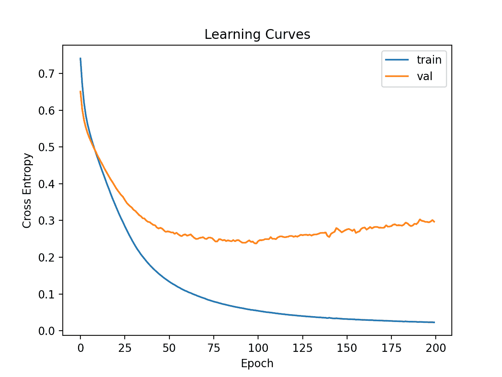
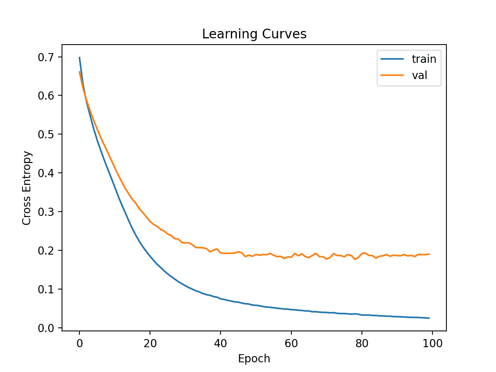

# 如何开发预测电离层扰动的神经网络

> 原文：<https://machinelearningmastery.com/predicting-disturbances-in-the-ionosphere/>

为新数据集开发神经网络预测模型可能具有挑战性。

一种方法是首先检查数据集，并为哪些模型可能起作用提出想法，然后探索数据集上简单模型的学习动态，最后利用强大的测试工具为数据集开发和调整模型。

该过程可用于开发用于分类和回归预测建模问题的有效神经网络模型。

在本教程中，您将发现如何为电离层二进制分类数据集开发多层感知器神经网络模型。

完成本教程后，您将知道:

*   如何加载和总结电离层数据集，并使用结果建议数据准备和模型配置使用。
*   如何探索数据集上简单 MLP 模型的学习动态。
*   如何对模型性能进行稳健估计，调整模型性能，并对新数据进行预测。

我们开始吧。


如何开发一个预测电离层扰动的神经网络
图片由[谢尔盖·劳利耶夫](https://www.flickr.com/photos/pesterev/15779556605/)提供，版权所有。

## 教程概述

本教程分为四个部分；它们是:

1.  电离层二进制分类数据集
2.  神经网络学习动力学
3.  评估和调整 MLP 模型
4.  最终模型和做出预测

## 电离层二进制分类数据集

第一步是定义和探索数据集。

我们将使用“*电离层*”标准二进制分类数据集。

这个数据集包括预测一个结构是否在大气中，给定雷达回波。

您可以在此了解有关数据集的更多信息:

*   [电离层数据集(电离层. csv)](https://raw.githubusercontent.com/jbrownlee/Datasets/master/ionosphere.csv)
*   [电离层数据集详细信息(电离层.名称)](https://raw.githubusercontent.com/jbrownlee/Datasets/master/ionosphere.names)

您可以在下面看到数据集的前几行。

```py
1,0,0.99539,-0.05889,0.85243,0.02306,0.83398,-0.37708,1,0.03760,0.85243,-0.17755,0.59755,-0.44945,0.60536,-0.38223,0.84356,-0.38542,0.58212,-0.32192,0.56971,-0.29674,0.36946,-0.47357,0.56811,-0.51171,0.41078,-0.46168,0.21266,-0.34090,0.42267,-0.54487,0.18641,-0.45300,g
1,0,1,-0.18829,0.93035,-0.36156,-0.10868,-0.93597,1,-0.04549,0.50874,-0.67743,0.34432,-0.69707,-0.51685,-0.97515,0.05499,-0.62237,0.33109,-1,-0.13151,-0.45300,-0.18056,-0.35734,-0.20332,-0.26569,-0.20468,-0.18401,-0.19040,-0.11593,-0.16626,-0.06288,-0.13738,-0.02447,b
1,0,1,-0.03365,1,0.00485,1,-0.12062,0.88965,0.01198,0.73082,0.05346,0.85443,0.00827,0.54591,0.00299,0.83775,-0.13644,0.75535,-0.08540,0.70887,-0.27502,0.43385,-0.12062,0.57528,-0.40220,0.58984,-0.22145,0.43100,-0.17365,0.60436,-0.24180,0.56045,-0.38238,g
1,0,1,-0.45161,1,1,0.71216,-1,0,0,0,0,0,0,-1,0.14516,0.54094,-0.39330,-1,-0.54467,-0.69975,1,0,0,1,0.90695,0.51613,1,1,-0.20099,0.25682,1,-0.32382,1,b
1,0,1,-0.02401,0.94140,0.06531,0.92106,-0.23255,0.77152,-0.16399,0.52798,-0.20275,0.56409,-0.00712,0.34395,-0.27457,0.52940,-0.21780,0.45107,-0.17813,0.05982,-0.35575,0.02309,-0.52879,0.03286,-0.65158,0.13290,-0.53206,0.02431,-0.62197,-0.05707,-0.59573,-0.04608,-0.65697,g
...
```

我们可以看到这些值都是数字，可能在[-1，1]的范围内。这表明可能不需要某种类型的缩放。

我们还可以看到标签是一个字符串(“ *g* ”和“ *b* ”)，这表明在拟合模型之前需要将值编码为 0 和 1。

我们可以直接从网址将数据集加载为熊猫数据帧；例如:

```py
# load the ionosphere dataset and summarize the shape
from pandas import read_csv
# define the location of the dataset
url = 'https://raw.githubusercontent.com/jbrownlee/Datasets/master/ionosphere.csv'
# load the dataset
df = read_csv(url, header=None)
# summarize shape
print(df.shape)
```

运行该示例直接从 URL 加载数据集，并报告数据集的形状。

在这种情况下，我们可以看到数据集有 35 个变量(34 个输入和一个输出)，数据集有 351 行数据。

对于神经网络来说，这不是很多行的数据，这表明一个小的网络，也许带有正则化，将是合适的。

它还建议使用 [k 倍交叉验证](https://machinelearningmastery.com/k-fold-cross-validation/)将是一个好主意，因为它将给出比训练/测试分割更可靠的模型性能估计，并且因为单个模型将在几秒钟内适合最大数据集，而不是几小时或几天。

```py
(351, 35)
```

接下来，我们可以通过查看汇总统计数据和数据图来了解更多关于数据集的信息。

```py
# show summary statistics and plots of the ionosphere dataset
from pandas import read_csv
from matplotlib import pyplot
# define the location of the dataset
url = 'https://raw.githubusercontent.com/jbrownlee/Datasets/master/ionosphere.csv'
# load the dataset
df = read_csv(url, header=None)
# show summary statistics
print(df.describe())
# plot histograms
df.hist()
pyplot.show()
```

运行该示例首先加载之前的数据，然后打印每个变量的汇总统计信息。

我们可以看到每个变量的平均值都在十位数，取值范围从-1 到 1。这证实了缩放数据可能不是必需的。

```py
               0      1           2   ...          31          32          33
count  351.000000  351.0  351.000000  ...  351.000000  351.000000  351.000000
mean     0.891738    0.0    0.641342  ...   -0.003794    0.349364    0.014480
std      0.311155    0.0    0.497708  ...    0.513574    0.522663    0.468337
min      0.000000    0.0   -1.000000  ...   -1.000000   -1.000000   -1.000000
25%      1.000000    0.0    0.472135  ...   -0.242595    0.000000   -0.165350
50%      1.000000    0.0    0.871110  ...    0.000000    0.409560    0.000000
75%      1.000000    0.0    1.000000  ...    0.200120    0.813765    0.171660
max      1.000000    0.0    1.000000  ...    1.000000    1.000000    1.000000
```

然后为每个变量创建直方图。

我们可以看到许多变量具有高斯或类高斯分布。

我们在每个变量上使用[幂变换](https://machinelearningmastery.com/power-transforms-with-scikit-learn/)可能会有一些好处，以便使概率分布不那么偏斜，这可能会提高模型性能。


电离层分类数据集的直方图

现在我们已经熟悉了数据集，让我们探索如何开发一个神经网络模型。

## 神经网络学习动力学

我们将使用张量流为数据集开发一个多层感知器(MLP)模型。

我们无法知道什么样的学习超参数的模型架构对这个数据集是好的或最好的，所以我们必须实验并发现什么是好的。

假设数据集很小，小的[批量](https://machinelearningmastery.com/how-to-control-the-speed-and-stability-of-training-neural-networks-with-gradient-descent-batch-size/)可能是个好主意，例如 16 或 32 行。开始时使用亚当版本的随机梯度下降是一个好主意，因为它会自动适应[学习速率](https://machinelearningmastery.com/understand-the-dynamics-of-learning-rate-on-deep-learning-neural-networks/)，并且在大多数数据集上运行良好。

在我们认真评估模型之前，最好回顾学习动态，调整模型架构和学习配置，直到我们有稳定的学习动态，然后看看如何从模型中获得最大收益。

我们可以通过使用数据的简单[训练/测试分割](https://machinelearningmastery.com/train-test-split-for-evaluating-machine-learning-algorithms/)和[学习曲线](https://machinelearningmastery.com/learning-curves-for-diagnosing-machine-learning-model-performance/)的复习图来做到这一点。这将有助于我们了解自己是学习过度还是学习不足；然后我们可以相应地调整配置。

首先，我们必须确保所有输入变量都是浮点值，并将目标标签编码为整数值 0 和 1。

```py
...
# ensure all data are floating point values
X = X.astype('float32')
# encode strings to integer
y = LabelEncoder().fit_transform(y)
```

接下来，我们可以将数据集分成输入和输出变量，然后分成 67/33 训练集和测试集。

```py
...
# split into input and output columns
X, y = df.values[:, :-1], df.values[:, -1]
# split into train and test datasets
X_train, X_test, y_train, y_test = train_test_split(X, y, test_size=0.33)
```

我们可以定义一个最小 MLP 模型。在这种情况下，我们将使用一个具有 10 个节点的隐藏层和一个输出层(任意选择)。我们将使用隐藏层中的 [ReLU 激活函数](https://machinelearningmastery.com/how-to-fix-vanishing-gradients-using-the-rectified-linear-activation-function/)和 *he_normal* 权重初始化，作为一个整体，它们是一个很好的实践。

模型的输出是二进制分类的 sigmoid 激活，我们将最小化[二进制交叉熵损失](https://machinelearningmastery.com/cross-entropy-for-machine-learning/)。

```py
...
# determine the number of input features
n_features = X.shape[1]
# define model
model = Sequential()
model.add(Dense(10, activation='relu', kernel_initializer='he_normal', input_shape=(n_features,)))
model.add(Dense(1, activation='sigmoid'))
# compile the model
model.compile(optimizer='adam', loss='binary_crossentropy')
```

我们将使模型适合 200 个训练时期(任意选择)，批量大小为 32，因为它是一个小数据集。

我们正在原始数据上拟合模型，我们认为这可能是一个好主意，但这是一个重要的起点。

```py
...
# fit the model
history = model.fit(X_train, y_train, epochs=200, batch_size=32, verbose=0, validation_data=(X_test,y_test))
```

在训练结束时，我们将评估模型在测试数据集上的性能，并将性能报告为分类精度。

```py
...
# predict test set
yhat = model.predict_classes(X_test)
# evaluate predictions
score = accuracy_score(y_test, yhat)
print('Accuracy: %.3f' % score)
```

最后，我们将绘制训练和测试集上交叉熵损失的学习曲线。

```py
...
# plot learning curves
pyplot.title('Learning Curves')
pyplot.xlabel('Epoch')
pyplot.ylabel('Cross Entropy')
pyplot.plot(history.history['loss'], label='train')
pyplot.plot(history.history['val_loss'], label='val')
pyplot.legend()
pyplot.show()
```

将所有这些联系在一起，下面列出了在电离层数据集上评估我们的第一个 MLP 的完整示例。

```py
# fit a simple mlp model on the ionosphere and review learning curves
from pandas import read_csv
from sklearn.model_selection import train_test_split
from sklearn.preprocessing import LabelEncoder
from sklearn.metrics import accuracy_score
from tensorflow.keras import Sequential
from tensorflow.keras.layers import Dense
from matplotlib import pyplot
# load the dataset
path = 'https://raw.githubusercontent.com/jbrownlee/Datasets/master/ionosphere.csv'
df = read_csv(path, header=None)
# split into input and output columns
X, y = df.values[:, :-1], df.values[:, -1]
# ensure all data are floating point values
X = X.astype('float32')
# encode strings to integer
y = LabelEncoder().fit_transform(y)
# split into train and test datasets
X_train, X_test, y_train, y_test = train_test_split(X, y, test_size=0.33)
# determine the number of input features
n_features = X.shape[1]
# define model
model = Sequential()
model.add(Dense(10, activation='relu', kernel_initializer='he_normal', input_shape=(n_features,)))
model.add(Dense(1, activation='sigmoid'))
# compile the model
model.compile(optimizer='adam', loss='binary_crossentropy')
# fit the model
history = model.fit(X_train, y_train, epochs=200, batch_size=32, verbose=0, validation_data=(X_test,y_test))
# predict test set
yhat = model.predict_classes(X_test)
# evaluate predictions
score = accuracy_score(y_test, yhat)
print('Accuracy: %.3f' % score)
# plot learning curves
pyplot.title('Learning Curves')
pyplot.xlabel('Epoch')
pyplot.ylabel('Cross Entropy')
pyplot.plot(history.history['loss'], label='train')
pyplot.plot(history.history['val_loss'], label='val')
pyplot.legend()
pyplot.show()
```

运行该示例首先在训练数据集上拟合模型，然后在测试数据集上报告分类精度。

**注**:考虑到算法或评估程序的随机性，或数值精度的差异，您的[结果可能会有所不同](https://machinelearningmastery.com/different-results-each-time-in-machine-learning/)。考虑运行该示例几次，并比较平均结果。

在这种情况下，我们可以看到模型达到了大约 88%的准确率，这是一个很好的性能基线，我们或许可以在此基础上进行改进。

```py
Accuracy: 0.888
```

然后创建列车和测试集上的损耗线图。

我们可以看到模型似乎收敛了，但是对训练数据集进行了过拟合。


电离层数据集上简单 MLP 的学习曲线

让我们试着增加模型的容量。

这将减缓相同学习超参数的学习，并可能提供更好的准确性。

我们将添加带有八个节点的第二个隐藏层，任意选择。

```py
...
# define model
model = Sequential()
model.add(Dense(10, activation='relu', kernel_initializer='he_normal', input_shape=(n_features,)))
model.add(Dense(8, activation='relu', kernel_initializer='he_normal'))
model.add(Dense(1, activation='sigmoid'))
```

下面列出了完整的示例。

```py
# fit a deeper mlp model on the ionosphere and review learning curves
from pandas import read_csv
from sklearn.model_selection import train_test_split
from sklearn.preprocessing import LabelEncoder
from sklearn.metrics import accuracy_score
from tensorflow.keras import Sequential
from tensorflow.keras.layers import Dense
from matplotlib import pyplot
# load the dataset
path = 'https://raw.githubusercontent.com/jbrownlee/Datasets/master/ionosphere.csv'
df = read_csv(path, header=None)
# split into input and output columns
X, y = df.values[:, :-1], df.values[:, -1]
# ensure all data are floating point values
X = X.astype('float32')
# encode strings to integer
y = LabelEncoder().fit_transform(y)
# split into train and test datasets
X_train, X_test, y_train, y_test = train_test_split(X, y, test_size=0.33)
# determine the number of input features
n_features = X.shape[1]
# define model
model = Sequential()
model.add(Dense(10, activation='relu', kernel_initializer='he_normal', input_shape=(n_features,)))
model.add(Dense(8, activation='relu', kernel_initializer='he_normal'))
model.add(Dense(1, activation='sigmoid'))
# compile the model
model.compile(optimizer='adam', loss='binary_crossentropy')
# fit the model
history = model.fit(X_train, y_train, epochs=200, batch_size=32, verbose=0, validation_data=(X_test,y_test))
# predict test set
yhat = model.predict_classes(X_test)
# evaluate predictions
score = accuracy_score(y_test, yhat)
print('Accuracy: %.3f' % score)
# plot learning curves
pyplot.title('Learning Curves')
pyplot.xlabel('Epoch')
pyplot.ylabel('Cross Entropy')
pyplot.plot(history.history['loss'], label='train')
pyplot.plot(history.history['val_loss'], label='val')
pyplot.legend()
```

运行该示例首先在训练数据集上拟合模型，然后在测试数据集上报告精度。

**注**:考虑到算法或评估程序的随机性，或数值精度的差异，您的[结果可能会有所不同](https://machinelearningmastery.com/different-results-each-time-in-machine-learning/)。考虑运行该示例几次，并比较平均结果。

在这种情况下，我们可以看到准确率略有提高，约为 93%，尽管训练/测试分割的高方差意味着该评估不可靠。

```py
Accuracy: 0.931
```

然后绘制列车和测试集上损失的学习曲线。我们可以看到，模型似乎仍然表现出过度拟合的行为。



电离层数据集上更深 MLP 的学习曲线

最后，我们可以尝试更广泛的网络。

我们将第一个隐藏层的节点数量从 10 个增加到 50 个，第二个隐藏层的节点数量从 8 个增加到 10 个。

这将增加模型的容量，减慢学习速度，并可能进一步提高结果。

```py
...
# define model
model = Sequential()
model.add(Dense(50, activation='relu', kernel_initializer='he_normal', input_shape=(n_features,)))
model.add(Dense(10, activation='relu', kernel_initializer='he_normal'))
model.add(Dense(1, activation='sigmoid'))
```

我们还将把训练期从 200 个减少到 100 个。

```py
...
# fit the model
history = model.fit(X_train, y_train, epochs=100, batch_size=32, verbose=0, validation_data=(X_test,y_test))
```

下面列出了完整的示例。

```py
# fit a wider mlp model on the ionosphere and review learning curves
from pandas import read_csv
from sklearn.model_selection import train_test_split
from sklearn.preprocessing import LabelEncoder
from sklearn.metrics import accuracy_score
from tensorflow.keras import Sequential
from tensorflow.keras.layers import Dense
from matplotlib import pyplot
# load the dataset
path = 'https://raw.githubusercontent.com/jbrownlee/Datasets/master/ionosphere.csv'
df = read_csv(path, header=None)
# split into input and output columns
X, y = df.values[:, :-1], df.values[:, -1]
# ensure all data are floating point values
X = X.astype('float32')
# encode strings to integer
y = LabelEncoder().fit_transform(y)
# split into train and test datasets
X_train, X_test, y_train, y_test = train_test_split(X, y, test_size=0.33)
# determine the number of input features
n_features = X.shape[1]
# define model
model = Sequential()
model.add(Dense(50, activation='relu', kernel_initializer='he_normal', input_shape=(n_features,)))
model.add(Dense(10, activation='relu', kernel_initializer='he_normal'))
model.add(Dense(1, activation='sigmoid'))
# compile the model
model.compile(optimizer='adam', loss='binary_crossentropy')
# fit the model
history = model.fit(X_train, y_train, epochs=100, batch_size=32, verbose=0, validation_data=(X_test,y_test))
# predict test set
yhat = model.predict_classes(X_test)
# evaluate predictions
score = accuracy_score(y_test, yhat)
print('Accuracy: %.3f' % score)
# plot learning curves
pyplot.title('Learning Curves')
pyplot.xlabel('Epoch')
pyplot.ylabel('Cross Entropy')
pyplot.plot(history.history['loss'], label='train')
pyplot.plot(history.history['val_loss'], label='val')
pyplot.legend()
pyplot.show()
```

运行该示例首先在训练数据集上拟合模型，然后在测试数据集上报告精度。

**注**:考虑到算法或评估程序的随机性，或数值精度的差异，您的[结果可能会有所不同](https://machinelearningmastery.com/different-results-each-time-in-machine-learning/)。考虑运行该示例几次，并比较平均结果。

在这种情况下，模型获得了更好的准确性分数，其值约为 94%。我们将暂时忽略模型性能。

```py
Accuracy: 0.940
```

创建的学习曲线的线图表明，该模型实现了合理的拟合，并且有足够的时间收敛。



电离层数据集上的广义 MLP 学习曲线

现在我们已经对数据集上的简单 MLP 模型的学习动态有了一些了解，我们可以考虑评估模型的性能以及调整模型的配置。

## 评估和调整 MLP 模型

k 倍交叉验证程序可以提供更可靠的 MLP 性能估计，尽管它可能非常慢。

这是因为 *k* 模型必须拟合和评估。当数据集规模较小时，例如电离层数据集，这不是问题。

我们可以使用[stratifiedfold](https://scikit-learn.org/stable/modules/generated/sklearn.model_selection.StratifiedKFold.html)类手动枚举每个折叠，拟合模型，对其进行评估，然后在程序结束时报告评估分数的平均值。

```py
# prepare cross validation
kfold = KFold(10)
# enumerate splits
scores = list()
for train_ix, test_ix in kfold.split(X, y):
	# fit and evaluate the model...
	...
...
# summarize all scores
print('Mean Accuracy: %.3f (%.3f)' % (mean(scores), std(scores)))
```

我们可以使用这个框架，通过一系列不同的数据准备、模型架构和学习配置，来开发 MLP 模型性能的可靠估计。

重要的是，在使用 k-fold 交叉验证来估计性能之前，我们首先了解了上一节中模型在数据集上的学习动态。如果我们开始直接调整模型，我们可能会得到好的结果，但如果没有，我们可能不知道为什么，例如，模型过度或拟合不足。

如果我们再次对模型进行大的更改，最好返回并确认模型正在适当收敛。

下面列出了评估前一节中的基本 MLP 模型的框架的完整示例。

```py
# k-fold cross-validation of base model for the ionosphere dataset
from numpy import mean
from numpy import std
from pandas import read_csv
from sklearn.model_selection import StratifiedKFold
from sklearn.preprocessing import LabelEncoder
from sklearn.metrics import accuracy_score
from tensorflow.keras import Sequential
from tensorflow.keras.layers import Dense
from matplotlib import pyplot
# load the dataset
path = 'https://raw.githubusercontent.com/jbrownlee/Datasets/master/ionosphere.csv'
df = read_csv(path, header=None)
# split into input and output columns
X, y = df.values[:, :-1], df.values[:, -1]
# ensure all data are floating point values
X = X.astype('float32')
# encode strings to integer
y = LabelEncoder().fit_transform(y)
# prepare cross validation
kfold = StratifiedKFold(10)
# enumerate splits
scores = list()
for train_ix, test_ix in kfold.split(X, y):
	# split data
	X_train, X_test, y_train, y_test = X[train_ix], X[test_ix], y[train_ix], y[test_ix]
	# determine the number of input features
	n_features = X.shape[1]
	# define model
	model = Sequential()
	model.add(Dense(50, activation='relu', kernel_initializer='he_normal', input_shape=(n_features,)))
	model.add(Dense(10, activation='relu', kernel_initializer='he_normal'))
	model.add(Dense(1, activation='sigmoid'))
	# compile the model
	model.compile(optimizer='adam', loss='binary_crossentropy')
	# fit the model
	model.fit(X_train, y_train, epochs=100, batch_size=32, verbose=0)
	# predict test set
	yhat = model.predict_classes(X_test)
	# evaluate predictions
	score = accuracy_score(y_test, yhat)
	print('>%.3f' % score)
	scores.append(score)
# summarize all scores
print('Mean Accuracy: %.3f (%.3f)' % (mean(scores), std(scores)))
```

运行该示例会报告评估程序每次迭代的模型性能，并在运行结束时报告分类精度的平均值和标准偏差。

**注**:考虑到算法或评估程序的随机性，或数值精度的差异，您的[结果可能会有所不同](https://machinelearningmastery.com/different-results-each-time-in-machine-learning/)。考虑运行该示例几次，并比较平均结果。

在这种情况下，我们可以看到 MLP 模型达到了大约 93.4%的平均精度。

我们将使用这个结果作为我们的基线，看看我们是否可以实现更好的性能。

```py
>0.972
>0.886
>0.943
>0.886
>0.914
>0.943
>0.943
>1.000
>0.971
>0.886
Mean Accuracy: 0.934 (0.039)
```

接下来，让我们尝试添加正则化以减少模型的过拟合。

在这种情况下，我们可以在网络的隐藏层之间添加脱落层。例如:

```py
...
# define model
model = Sequential()
model.add(Dense(50, activation='relu', kernel_initializer='he_normal', input_shape=(n_features,)))
model.add(Dropout(0.4))
model.add(Dense(10, activation='relu', kernel_initializer='he_normal'))
model.add(Dropout(0.4))
model.add(Dense(1, activation='sigmoid'))
```

下面列出了辍学的 MLP 模式的完整例子。

```py
# k-fold cross-validation of the MLP with dropout for the ionosphere dataset
from numpy import mean
from numpy import std
from pandas import read_csv
from sklearn.model_selection import StratifiedKFold
from sklearn.preprocessing import LabelEncoder
from sklearn.metrics import accuracy_score
from tensorflow.keras import Sequential
from tensorflow.keras.layers import Dense
from tensorflow.keras.layers import Dropout
from matplotlib import pyplot
# load the dataset
path = 'https://raw.githubusercontent.com/jbrownlee/Datasets/master/ionosphere.csv'
df = read_csv(path, header=None)
# split into input and output columns
X, y = df.values[:, :-1], df.values[:, -1]
# ensure all data are floating point values
X = X.astype('float32')
# encode strings to integer
y = LabelEncoder().fit_transform(y)
# prepare cross validation
kfold = StratifiedKFold(10)
# enumerate splits
scores = list()
for train_ix, test_ix in kfold.split(X, y):
	# split data
	X_train, X_test, y_train, y_test = X[train_ix], X[test_ix], y[train_ix], y[test_ix]
	# determine the number of input features
	n_features = X.shape[1]
	# define model
	model = Sequential()
	model.add(Dense(50, activation='relu', kernel_initializer='he_normal', input_shape=(n_features,)))
	model.add(Dropout(0.4))
	model.add(Dense(10, activation='relu', kernel_initializer='he_normal'))
	model.add(Dropout(0.4))
	model.add(Dense(1, activation='sigmoid'))
	# compile the model
	model.compile(optimizer='adam', loss='binary_crossentropy')
	# fit the model
	model.fit(X_train, y_train, epochs=100, batch_size=32, verbose=0)
	# predict test set
	yhat = model.predict_classes(X_test)
	# evaluate predictions
	score = accuracy_score(y_test, yhat)
	print('>%.3f' % score)
	scores.append(score)
# summarize all scores
print('Mean Accuracy: %.3f (%.3f)' % (mean(scores), std(scores)))
```

运行报告运行结束时分类准确度的平均值和标准偏差。

**注**:考虑到算法或评估程序的随机性，或数值精度的差异，您的[结果可能会有所不同](https://machinelearningmastery.com/different-results-each-time-in-machine-learning/)。考虑运行该示例几次，并比较平均结果。

在这种情况下，我们可以看到，有辍学的 MLP 模型取得了更好的结果，准确率约为 94.6%，而没有辍学的准确率为 93.4%

```py
Mean Accuracy: 0.946 (0.043)
```

最后，我们将尝试将批量从 32 减少到 8。

这将导致更多的噪声梯度，也可能降低模型学习问题的速度。

```py
...
# fit the model
model.fit(X_train, y_train, epochs=100, batch_size=8, verbose=0)
```

下面列出了完整的示例。

```py
# k-fold cross-validation of the MLP with dropout for the ionosphere dataset
from numpy import mean
from numpy import std
from pandas import read_csv
from sklearn.model_selection import StratifiedKFold
from sklearn.preprocessing import LabelEncoder
from sklearn.metrics import accuracy_score
from tensorflow.keras import Sequential
from tensorflow.keras.layers import Dense
from tensorflow.keras.layers import Dropout
from matplotlib import pyplot
# load the dataset
path = 'https://raw.githubusercontent.com/jbrownlee/Datasets/master/ionosphere.csv'
df = read_csv(path, header=None)
# split into input and output columns
X, y = df.values[:, :-1], df.values[:, -1]
# ensure all data are floating point values
X = X.astype('float32')
# encode strings to integer
y = LabelEncoder().fit_transform(y)
# prepare cross validation
kfold = StratifiedKFold(10)
# enumerate splits
scores = list()
for train_ix, test_ix in kfold.split(X, y):
	# split data
	X_train, X_test, y_train, y_test = X[train_ix], X[test_ix], y[train_ix], y[test_ix]
	# determine the number of input features
	n_features = X.shape[1]
	# define model
	model = Sequential()
	model.add(Dense(50, activation='relu', kernel_initializer='he_normal', input_shape=(n_features,)))
	model.add(Dropout(0.4))
	model.add(Dense(10, activation='relu', kernel_initializer='he_normal'))
	model.add(Dropout(0.4))
	model.add(Dense(1, activation='sigmoid'))
	# compile the model
	model.compile(optimizer='adam', loss='binary_crossentropy')
	# fit the model
	model.fit(X_train, y_train, epochs=100, batch_size=8, verbose=0)
	# predict test set
	yhat = model.predict_classes(X_test)
	# evaluate predictions
	score = accuracy_score(y_test, yhat)
	print('>%.3f' % score)
	scores.append(score)
# summarize all scores
print('Mean Accuracy: %.3f (%.3f)' % (mean(scores), std(scores)))
```

运行报告运行结束时分类准确度的平均值和标准偏差。

**注**:考虑到算法或评估程序的随机性，或数值精度的差异，您的[结果可能会有所不同](https://machinelearningmastery.com/different-results-each-time-in-machine-learning/)。考虑运行该示例几次，并比较平均结果。

在这种情况下，我们可以看到，带有脱落的 MLP 模型获得了稍好的结果，准确率约为 94.9%。

```py
Mean Accuracy: 0.949 (0.042)
```

我们将使用这种配置作为我们的最终模型。

我们可以继续测试模型架构的替代配置(更多或更少的节点或层)、学习超参数(更多或更少的批次)和数据转换。

我把这个作为练习；让我知道你的发现。**能不能取得更好的成绩？**
在下面的评论中发布你的结果，我很想看看你得到了什么。

接下来，让我们看看如何拟合最终模型并使用它进行预测。

## 最终模型和做出预测

一旦我们选择了一个模型配置，我们就可以在所有可用的数据上训练一个最终模型，并使用它来对新数据进行预测。

在这种情况下，我们将使用具有脱落和小批量的模型作为最终模型。

我们可以像以前一样准备数据并拟合模型，尽管是在整个数据集上，而不是数据集的训练子集上。

```py
...
# split into input and output columns
X, y = df.values[:, :-1], df.values[:, -1]
# ensure all data are floating point values
X = X.astype('float32')
# encode strings to integer
le = LabelEncoder()
y = le.fit_transform(y)
# determine the number of input features
n_features = X.shape[1]
# define model
model = Sequential()
model.add(Dense(50, activation='relu', kernel_initializer='he_normal', input_shape=(n_features,)))
model.add(Dropout(0.4))
model.add(Dense(10, activation='relu', kernel_initializer='he_normal'))
model.add(Dropout(0.4))
model.add(Dense(1, activation='sigmoid'))
# compile the model
model.compile(optimizer='adam', loss='binary_crossentropy')
```

然后，我们可以使用这个模型对新数据进行预测。

首先，我们可以定义一行新数据。

```py
...
# define a row of new data
row = [1,0,0.99539,-0.05889,0.85243,0.02306,0.83398,-0.37708,1,0.03760,0.85243,-0.17755,0.59755,-0.44945,0.60536,-0.38223,0.84356,-0.38542,0.58212,-0.32192,0.56971,-0.29674,0.36946,-0.47357,0.56811,-0.51171,0.41078,-0.46168,0.21266,-0.34090,0.42267,-0.54487,0.18641,-0.45300]
```

注意:我从数据集的第一行取了这一行，期望的标签是一个' *g* '。

然后我们可以做一个预测。

```py
...
# make prediction
yhat = model.predict_classes([row])
```

然后反转预测上的变换，这样我们就可以在正确的标签中使用或解释结果。

```py
...
# invert transform to get label for class
yhat = le.inverse_transform(yhat)
```

在这种情况下，我们将简单地报告预测。

```py
...
# report prediction
print('Predicted: %s' % (yhat[0]))
```

将所有这些结合起来，下面列出了为电离层数据集拟合最终模型并使用它对新数据进行预测的完整示例。

```py
# fit a final model and make predictions on new data for the ionosphere dataset
from pandas import read_csv
from sklearn.preprocessing import LabelEncoder
from sklearn.metrics import accuracy_score
from tensorflow.keras import Sequential
from tensorflow.keras.layers import Dense
from tensorflow.keras.layers import Dropout
# load the dataset
path = 'https://raw.githubusercontent.com/jbrownlee/Datasets/master/ionosphere.csv'
df = read_csv(path, header=None)
# split into input and output columns
X, y = df.values[:, :-1], df.values[:, -1]
# ensure all data are floating point values
X = X.astype('float32')
# encode strings to integer
le = LabelEncoder()
y = le.fit_transform(y)
# determine the number of input features
n_features = X.shape[1]
# define model
model = Sequential()
model.add(Dense(50, activation='relu', kernel_initializer='he_normal', input_shape=(n_features,)))
model.add(Dropout(0.4))
model.add(Dense(10, activation='relu', kernel_initializer='he_normal'))
model.add(Dropout(0.4))
model.add(Dense(1, activation='sigmoid'))
# compile the model
model.compile(optimizer='adam', loss='binary_crossentropy')
# fit the model
model.fit(X, y, epochs=100, batch_size=8, verbose=0)
# define a row of new data
row = [1,0,0.99539,-0.05889,0.85243,0.02306,0.83398,-0.37708,1,0.03760,0.85243,-0.17755,0.59755,-0.44945,0.60536,-0.38223,0.84356,-0.38542,0.58212,-0.32192,0.56971,-0.29674,0.36946,-0.47357,0.56811,-0.51171,0.41078,-0.46168,0.21266,-0.34090,0.42267,-0.54487,0.18641,-0.45300]
# make prediction
yhat = model.predict_classes([row])
# invert transform to get label for class
yhat = le.inverse_transform(yhat)
# report prediction
print('Predicted: %s' % (yhat[0]))
```

运行该示例使模型适合整个数据集，并对单行新数据进行预测。

**注**:考虑到算法或评估程序的随机性，或数值精度的差异，您的[结果可能会有所不同](https://machinelearningmastery.com/different-results-each-time-in-machine-learning/)。考虑运行该示例几次，并比较平均结果。

在这种情况下，我们可以看到模型为输入行预测了一个“g”标签。

```py
Predicted: g
```

## 进一步阅读

如果您想更深入地了解这个主题，本节将提供更多资源。

### 教程

*   [标准机器学习数据集的最佳结果](https://machinelearningmastery.com/results-for-standard-classification-and-regression-machine-learning-datasets/)
*   [TensorFlow 2 教程:使用 tf.keras 开始深度学习](https://machinelearningmastery.com/tensorflow-tutorial-deep-learning-with-tf-keras/)
*   [k 倍交叉验证的温和介绍](https://machinelearningmastery.com/k-fold-cross-validation/)

## 摘要

在本教程中，您发现了如何为电离层二进制分类数据集开发多层感知器神经网络模型。

具体来说，您了解到:

*   如何加载和总结电离层数据集，并使用结果建议数据准备和模型配置使用。
*   如何探索数据集上简单 MLP 模型的学习动态。
*   如何对模型性能进行稳健的估计，调整模型性能并对新数据进行预测。

**你有什么问题吗？**
在下面的评论中提问，我会尽力回答。