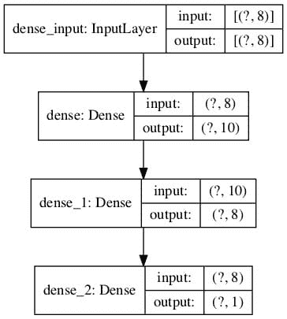

# TensorFlow 2 教程：使用`tf.keras`开始深度学习

> 原文：<https://machinelearningmastery.com/tensorflow-tutorial-deep-learning-with-tf-keras/>

最后更新于 2020 年 8 月 27 日

具有深度学习的预测建模是现代开发人员需要了解的技能。

TensorFlow 是由谷歌开发和维护的首要开源深度学习框架。虽然直接使用 TensorFlow 可能具有挑战性，但现代 tf.keras API 将 keras 的简单易用性赋予了 TensorFlow 项目。

使用 tf.keras 允许您设计、拟合、评估和使用深度学习模型，只需几行代码就可以做出预测。它使普通的深度学习任务，如分类和回归预测建模，对于希望完成事情的普通开发人员来说是可访问的。

在本教程中，您将发现一个使用 tf.keras API 在 TensorFlow 中开发深度学习模型的分步指南。

完成本教程后，您将知道:

*   Keras 和 tf.keras 的区别以及如何安装和确认 TensorFlow 正在工作。
*   tf.keras 模型的 5 步生命周期以及如何使用顺序和功能 API。
*   如何用 tf.keras 开发用于回归、分类和时间序列预测的 MLP、CNN 和 RNN 模型。
*   如何使用 tf.keras API 的高级功能来检查和诊断您的模型。
*   如何通过减少过度训练和加速训练来提高 tf.keras 模型的性能？

这是一个大型教程，非常有趣。你可能想把它做成书签。

例子小而集中；您可以在大约 60 分钟内完成本教程。

**用我的新书[用 Python 深度学习](https://machinelearningmastery.com/deep-learning-with-python/)来启动你的项目**，包括*分步教程*和所有示例的 *Python 源代码*文件。

我们开始吧。

*   **2020 年 6 月更新**:针对 TensorFlow 2.2.0 中的 API 变更进行了更新。


如何用 tf.keras 开发深度学习模型
斯蒂芬·哈兰摄，版权所有。

## 张量流教程概述

本教程旨在为您的深度学习项目提供 tf.keras 的完整介绍。

重点是将 API 用于常见的深度学习模型开发任务；我们不会深入学习数学和理论。为此，我推荐[从这本优秀的书](https://amzn.to/2Y8JuBv)开始。

在 python 中学习深度学习的最好方法是做。一头扎进去。你可以回头再找更多的理论。

我已经将每个代码示例设计成使用最佳实践和独立的，这样您就可以将它直接复制并粘贴到您的项目中，并根据您的特定需求进行调整。这将让你有一个很好的开端来尝试从官方文档中找出应用编程接口。

这是一个大型教程，因此，它分为五个部分；它们是:

1.  安装 TensorFlow 和 tf.keras
    1.  什么是 Keras 和 tf.keras？
    2.  如何安装张量流
    3.  如何确认安装了张量流
2.  深度学习模型生命周期
    1.  五步模型生命周期
    2.  顺序模型应用编程接口(简单)
    3.  功能模型应用编程接口(高级)
3.  如何开发深度学习模型
    1.  开发多层感知器模型
    2.  发展卷积神经网络模型
    3.  开发递归神经网络模型
4.  如何使用高级模型功能
    1.  如何可视化深度学习模型
    2.  如何绘制模型学习曲线
    3.  如何保存和加载模型
5.  如何获得更好的模型性能
    1.  如何减少辍学的过度适应
    2.  如何利用批量标准化加速训练
    3.  如何适时停止训练，提前停止

### 你可以用 Python 做深度学习！

按照自己的节奏完成教程。

**你不需要什么都懂(至少现在不需要)**。您的目标是将教程从头到尾运行一遍并获得结果。你不需要第一遍就明白所有的事情。边走边列出你的问题。大量使用 API 文档来了解您正在使用的所有功能。

**你不需要先知道数学**。数学是描述算法如何工作的简洁方式，特别是来自[线性代数](https://machinelearningmastery.com/start-here/#linear_algebra)、[概率](https://machinelearningmastery.com/start-here/#probability)和[统计](https://machinelearningmastery.com/start-here/#statistical_methods)的工具。这些不是你可以用来学习算法如何工作的唯一工具。您还可以使用代码并探索具有不同输入和输出的算法行为。知道数学不会告诉你选择什么算法或者如何最好地配置它。你只能通过仔细的受控实验来发现这一点。

**你不需要知道算法是如何工作的**。了解这些限制以及如何配置深度学习算法非常重要。但是关于算法的学习可以在以后进行。你需要长时间慢慢积累这些算法知识。今天，从适应平台开始。

**不需要做 Python 程序员**。如果你不熟悉 Python 语言，它的语法会很直观。就像其他语言一样，关注函数调用(例如 function())和赋值(例如 a =“b”)。这会让你大受鼓舞。你是一名开发人员，所以你知道如何快速掌握一门语言的基础知识。开始吧，稍后再深入细节。

**不需要成为深度学习专家**。你可以在后面学习各种算法的好处和局限性，有很多帖子可以在后面阅读，以复习深度学习项目的步骤以及使用交叉验证评估模型技能的重要性。

## 1\. 安装 TensorFlow 和 tf.keras

在本节中，您将发现 tf.keras 是什么，如何安装它，以及如何确认它安装正确。

### 1.1 什么是 Keras 和 tf.keras？

[Keras](https://keras.io/) 是一个用 Python 编写的开源深度学习库。

该项目于 2015 年由 [Francois Chollet](https://twitter.com/fchollet) 启动。它很快成为开发人员的流行框架，成为最流行的深度学习库之一。

在 2015-2019 年期间，使用像 TensorFlow、antio 和 PyTorch 这样的数学库开发深度学习模型是很麻烦的，需要几十甚至几百行代码才能完成最简单的任务。这些库的重点是研究、灵活性和速度，而不是易用性。

Keras 之所以受欢迎，是因为 API 简洁明了，只需几行代码就可以定义、适应和评估标准的深度学习模型。

Keras 起飞的第二个原因是，它允许您使用一系列流行的深度学习数学库中的任何一个作为后端(例如，用于执行计算)，例如 [TensorFlow](https://github.com/tensorflow/tensorflow) 、[antao](https://github.com/Theano/Theano)，以及后来的 [CNTK](https://github.com/microsoft/CNTK) 。这使得这些库的能力可以用一个非常干净和简单的接口来利用(例如，图形处理器)。

2019 年，谷歌发布了他们的 TensorFlow 深度学习库(TensorFlow 2)的新版本，该版本直接集成了 Keras API，并将该界面推广为平台上深度学习开发的默认或标准界面。

这种集成通常被称为 *tf.keras* 接口或 API(“*TF*”是“ *TensorFlow* ”的缩写)。这是为了将其与所谓的独立 Keras 开源项目区分开来。

*   **独立 Keras** 。支持 TensorFlow、Antano 和 CNTK 后端的独立开源项目。
*   **tf.keras** 。Keras API 集成到 TensorFlow 2 中。

Keras 中的 Keras API 实现被称为“ *tf.keras* ”，因为这是引用 API 时使用的 Python 习惯用法。首先导入 TensorFlow 模块，命名为“*TF*”；然后，通过调用 *tf.keras* 访问 Keras API 元素；例如:

```py
# example of tf.keras python idiom
import tensorflow as tf
# use keras API
model = tf.keras.Sequential()
...
```

我自己一般不用这个成语；我认为它读起来不干净。

鉴于 TensorFlow 是 Keras 开源项目事实上的标准后端，这种集成意味着现在可以使用一个库，而不是两个独立的库。此外，独立的 Keras 项目现在建议所有未来的 Keras 开发都使用 *tf.keras* API。

> 此时，我们建议在 TensorFlow 后端使用多后端 Keras 的 Keras 用户切换到 TensorFlow 2.0 中的 tf.keras。tf.keras 得到了更好的维护，并与 TensorFlow 特性(热切执行、分发支持等)有了更好的集成。

——[科拉斯项目主页](https://keras.io/)，2019 年 12 月访问。

### 1.2 如何安装张量流

在安装 TensorFlow 之前，请确保您安装了 Python，例如 Python 3.6 或更高版本。

如果没有安装 Python，可以使用 Anaconda 安装。本教程将向您展示如何:

*   [如何用 Anaconda](https://machinelearningmastery.com/setup-python-environment-machine-learning-deep-learning-anaconda/) 设置机器学习的 Python 环境

安装 TensorFlow 开源深度学习库的方法有很多。

在您的工作站上安装 TensorFlow 最常见，也可能是最简单的方法是使用 *pip* 。

例如，在命令行上，您可以键入:

```py
sudo pip install tensorflow
```

如果您更喜欢使用特定于您的平台或软件包管理器的安装方法，您可以在此查看完整的安装说明列表:

*   [安装 tensorflow 2 指南](https://www.tensorflow.org/install)

现在没有必要设置 GPU。

本教程中的所有示例在现代中央处理器上都可以正常工作。如果您想为您的图形处理器配置张量流，您可以在完成本教程后进行配置。不要分心！

### 1.3 如何确认安装了张量流

一旦安装了 TensorFlow，请务必确认库安装成功，并且您可以开始使用它。

*不要跳过这一步*。

如果未正确安装 TensorFlow 或在此步骤中出现错误，您将无法在以后运行这些示例。

创建一个名为 *versions.py* 的新文件，并将以下代码复制粘贴到文件中。

```py
# check version
import tensorflow
print(tensorflow.__version__)
```

保存文件，然后打开你的[命令行](https://machinelearningmastery.com/faq/single-faq/how-do-i-run-a-script-from-the-command-line)，将目录改为你保存文件的地方。

然后键入:

```py
python versions.py
```

然后，您应该会看到如下输出:

```py
2.2.0
```

这确认了 TensorFlow 安装正确，并且我们都使用相同的版本。

**你拿到了什么版本？**
在下面的评论中发布你的输出。

这也向您展示了如何从命令行运行 Python 脚本。我建议以这种方式从命令行运行所有代码，[不要从笔记本或 IDE](https://machinelearningmastery.com/faq/single-faq/why-dont-use-or-recommend-notebooks) 运行。

#### 如果您收到警告消息

有时当您使用 *tf.keras* API 时，您可能会看到打印的警告。

这可能包括您的硬件支持您的 TensorFlow 安装未配置为使用的功能的消息。

我的工作站上的一些示例包括:

```py
Your CPU supports instructions that this TensorFlow binary was not compiled to use: AVX2 FMA
XLA service 0x7fde3f2e6180 executing computations on platform Host. Devices:
StreamExecutor device (0): Host, Default Version
```

他们不是你的错。**你没做错什么**。

这些是信息消息，它们不会阻止代码的执行。您现在可以放心地忽略这种类型的消息。

这是 TensorFlow 团队有意做出的设计决定，旨在展示这些警告信息。这个决定的一个缺点是，它让初学者感到困惑，并且训练开发人员忽略所有消息，包括那些可能影响执行的消息。

现在您已经知道了 tf.keras 是什么，如何安装 TensorFlow，以及如何确认您的开发环境正在工作，让我们看看 TensorFlow 中深度学习模型的生命周期。

## 2.深度学习模型生命周期

在本节中，您将发现深度学习模型的生命周期，以及两个可用于定义模型的 tf.keras APIs。

### 2.1 五步模型生命周期

模型有一个生命周期，这个非常简单的知识为建模数据集和理解 tf.keras API 提供了基础。

生命周期中的五个步骤如下:

1.  定义模型。
2.  编译模型。
3.  符合模型。
4.  评估模型。
5.  做预测。

让我们依次仔细看看每一步。

#### 定义模型

定义模型要求您首先选择所需的模型类型，然后选择体系结构或网络拓扑。

从应用编程接口的角度来看，这包括定义模型的层，用许多节点和激活函数配置每一层，并将这些层连接在一起形成一个内聚的模型。

模型既可以用顺序应用编程接口定义，也可以用功能应用编程接口定义，我们将在下一节讨论这一点。

```py
...
# define the model
model = ...
```

#### 编译模型

编译模型要求您首先选择要优化的损失函数，例如均方误差或交叉熵。

它还要求您选择一个算法来执行优化过程，通常是随机梯度下降，或现代变化，如亚当。它可能还要求您在模型训练过程中选择任何要跟踪的性能指标。

从应用编程接口的角度来看，这包括调用一个函数来编译具有所选配置的模型，这将为有效使用您定义的模型准备适当的数据结构。

可以将优化器指定为已知优化器类的字符串，例如用于随机梯度下降的“ *sgd* ”，或者您可以配置优化器类的实例并使用它。

有关支持的优化程序列表，请参见:

*   [tf.keras Optimizers](https://www.tensorflow.org/api_docs/python/tf/keras/optimizers)

```py
...
# compile the model
opt = SGD(learning_rate=0.01, momentum=0.9)
model.compile(optimizer=opt, loss='binary_crossentropy')
```

三种最常见的损失函数是:

*   *二元 _ 交叉熵*'为二元分类。
*   *稀疏 _ 分类 _ 交叉熵*，用于多类分类。
*   *回归的均方误差*。

```py
...
# compile the model
model.compile(optimizer='sgd', loss='mse')
```

有关支持的损失函数列表，请参见:

*   [tf.keras 损失函数](https://www.tensorflow.org/api_docs/python/tf/keras/losses)

度量被定义为已知度量函数的字符串列表或用于评估预测的函数列表。

有关支持的指标列表，请参见:

*   [tf.keras Metrics](https://www.tensorflow.org/api_docs/python/tf/keras/metrics)

```py
...
# compile the model
model.compile(optimizer='sgd', loss='binary_crossentropy', metrics=['accuracy'])
```

#### 适合模型

拟合模型要求您首先选择训练配置，例如时期的数量(通过训练数据集的循环)和批次大小(一个时期中用于估计模型误差的样本数量)。

训练应用选择的优化算法来最小化选择的损失函数，并使用误差反向传播算法来更新模型。

拟合模型是整个过程的缓慢部分，可能需要几秒到几小时到几天的时间，具体取决于模型的复杂性、您使用的硬件以及训练数据集的大小。

从应用编程接口的角度来看，这包括调用一个函数来执行训练过程。在培训过程结束之前，该功能将一直阻止(不返回)。

```py
...
# fit the model
model.fit(X, y, epochs=100, batch_size=32)
```

有关如何选择批处理大小的帮助，请参见本教程:

*   [如何控制批量训练神经网络的稳定性](https://machinelearningmastery.com/how-to-control-the-speed-and-stability-of-training-neural-networks-with-gradient-descent-batch-size/)

在拟合模型时，进度条将总结每个时期的状态和整个训练过程。通过将“ *verbose* ”参数设置为 2，可以将其简化为每个时期模型性能的简单报告。通过将“*详细*”设置为 0，可以在训练期间关闭所有输出。

```py
...
# fit the model
model.fit(X, y, epochs=100, batch_size=32, verbose=0)
```

#### 评估模型

评估模型需要首先选择用于评估模型的保持数据集。这应该是在训练过程中不使用的数据，以便我们在对新数据进行预测时可以获得模型性能的无偏估计。

模型评估的速度与您想要用于评估的数据量成正比，尽管由于模型没有改变，它比训练快得多。

从应用编程接口的角度来看，这包括用保持数据集调用一个函数，并获得一个损失，也许还有其他可以报告的指标。

```py
...
# evaluate the model
loss = model.evaluate(X, y, verbose=0)
```

#### 做个预测

做预测是生命周期的最后一步。这就是为什么我们首先想要这个模型。

它要求您拥有需要预测的新数据，例如，您没有目标值的地方。

从应用编程接口的角度来看，您只需调用一个函数来预测类标签、概率或数值:无论您设计模型来预测什么。

您可能希望保存模型，然后加载它来进行预测。在开始使用模型之前，您也可以选择在所有可用数据上拟合模型。

现在我们已经熟悉了模型生命周期，让我们来看看使用 tf.keras API 构建模型的两种主要方式:顺序和功能。

```py
...
# make a prediction
yhat = model.predict(X)
```

### 2.2 顺序模型应用编程接口(简单)

顺序模型 API 是最简单的，也是我推荐的 API，特别是入门的时候。

之所以称之为“T0”序列，是因为它涉及到定义一个[序列类](https://www.tensorflow.org/api_docs/python/tf/keras/Sequential)，并从输入到输出以线性方式一个接一个地给模型添加图层。

下面的示例定义了一个顺序 MLP 模型，该模型接受八个输入，有一个包含 10 个节点的隐藏层，然后有一个包含一个节点的输出层来预测数值。

```py
# example of a model defined with the sequential api
from tensorflow.keras import Sequential
from tensorflow.keras.layers import Dense
# define the model
model = Sequential()
model.add(Dense(10, input_shape=(8,)))
model.add(Dense(1))
```

请注意，网络的可见层由第一个隐藏层上的“ *input_shape* ”参数定义。这意味着在上面的例子中，模型期望一个样本的输入是八个数字的向量。

顺序应用编程接口很容易使用，因为您一直在调用 *model.add()* ，直到添加完所有图层。

例如，这里是一个有五个隐藏层的深 MLP。

```py
# example of a model defined with the sequential api
from tensorflow.keras import Sequential
from tensorflow.keras.layers import Dense
# define the model
model = Sequential()
model.add(Dense(100, input_shape=(8,)))
model.add(Dense(80))
model.add(Dense(30))
model.add(Dense(10))
model.add(Dense(5))
model.add(Dense(1))
```

### 2.3 功能模型应用编程接口(高级)

功能 API 更复杂，但也更灵活。

它包括显式地将一个层的输出连接到另一个层的输入。指定了每个连接。

首先，必须通过*输入*类定义输入图层，并指定输入样本的形状。定义模型时，我们必须保留对输入层的引用。

```py
...
# define the layers
x_in = Input(shape=(8,))
```

接下来，完全连接的层可以通过调用该层并传递输入层来连接到输入。这将返回对这个新层中输出连接的引用。

```py
...
x = Dense(10)(x_in)
```

然后，我们可以用同样的方式将它连接到输出层。

```py
...
x_out = Dense(1)(x)
```

一旦连接，我们定义一个模型对象，并指定输入和输出层。下面列出了完整的示例。

```py
# example of a model defined with the functional api
from tensorflow.keras import Model
from tensorflow.keras import Input
from tensorflow.keras.layers import Dense
# define the layers
x_in = Input(shape=(8,))
x = Dense(10)(x_in)
x_out = Dense(1)(x)
# define the model
model = Model(inputs=x_in, outputs=x_out)
```

因此，它允许更复杂的模型设计，例如可能具有多个输入路径(独立向量)的模型和具有多个输出路径(例如，一个单词和一个数字)的模型。

当你习惯了函数式应用编程接口，它会给你带来很多乐趣。

有关函数式应用编程接口的更多信息，请参见:

*   [TensorFlow 中的 Keras 功能性 API](https://www.tensorflow.org/guide/keras/functional)

现在我们已经熟悉了模型生命周期和两个可以用来定义模型的 API，让我们来看看开发一些标准模型。

## 3.如何开发深度学习模型

在本节中，您将发现如何使用标准的深度学习模型进行开发、评估和预测，包括多层感知器(MLP)、卷积神经网络和递归神经网络。

### 3.1 开发多层感知器模型

多层感知器模型，简称 MLP，是一个标准的全连接神经网络模型。

它由节点层组成，其中每个节点连接到上一层的所有输出，每个节点的输出连接到下一层节点的所有输入。

MLP 由一个或多个*密集*层创建。这种模型适用于表格数据，即每个变量有一列，每个变量有一行的表格或电子表格中的数据。有三个预测建模问题，你可能想探索与 MLP；它们是二元分类、多类分类和回归。

让我们在真实数据集上为每一种情况拟合一个模型。

注意，本节中的模型是有效的，但没有优化。看看能不能提高他们的成绩。在下面的评论中发表你的发现。

#### 二元分类的 MLP

我们将使用电离层二进制(两级)分类数据集来演示二进制分类的 MLP。

这个数据集包括预测一个结构是否在大气中，给定雷达回波。

数据集将使用[熊猫](https://pandas.pydata.org/)自动下载，不过你可以在这里了解更多。

*   [电离层数据集(csv)](https://raw.githubusercontent.com/jbrownlee/Datasets/master/ionosphere.csv) 。
*   [电离层数据集描述(csv)](https://raw.githubusercontent.com/jbrownlee/Datasets/master/ionosphere.names) 。

我们将使用[标签编码器](https://scikit-learn.org/stable/modules/generated/sklearn.preprocessing.LabelEncoder.html)将字符串标签编码为整数值 0 和 1。该模型将适用于 67%的数据，剩余的 33%将用于评估，使用 [train_test_split()](https://scikit-learn.org/stable/modules/generated/sklearn.model_selection.train_test_split.html) 功能进行分割。

用“ *he_normal* 权重初始化来激活“ *relu* 是一个很好的做法。这种组合对于克服训练深度神经网络模型时梯度消失的问题大有帮助。有关 ReLU 的更多信息，请参见教程:

*   [整流线性单元的温和介绍](https://machinelearningmastery.com/rectified-linear-activation-function-for-deep-learning-neural-networks/)

该模型预测 1 类概率，并使用 sigmoid 激活函数。模型使用随机梯度下降的 [adam 版本](https://machinelearningmastery.com/adam-optimization-algorithm-for-deep-learning/)进行优化，并寻求最小化[交叉熵损失](https://machinelearningmastery.com/cross-entropy-for-machine-learning/)。

下面列出了完整的示例。

```py
# mlp for binary classification
from pandas import read_csv
from sklearn.model_selection import train_test_split
from sklearn.preprocessing import LabelEncoder
from tensorflow.keras import Sequential
from tensorflow.keras.layers import Dense
# load the dataset
path = 'https://raw.githubusercontent.com/jbrownlee/Datasets/master/ionosphere.csv'
df = read_csv(path, header=None)
# split into input and output columns
X, y = df.values[:, :-1], df.values[:, -1]
# ensure all data are floating point values
X = X.astype('float32')
# encode strings to integer
y = LabelEncoder().fit_transform(y)
# split into train and test datasets
X_train, X_test, y_train, y_test = train_test_split(X, y, test_size=0.33)
print(X_train.shape, X_test.shape, y_train.shape, y_test.shape)
# determine the number of input features
n_features = X_train.shape[1]
# define model
model = Sequential()
model.add(Dense(10, activation='relu', kernel_initializer='he_normal', input_shape=(n_features,)))
model.add(Dense(8, activation='relu', kernel_initializer='he_normal'))
model.add(Dense(1, activation='sigmoid'))
# compile the model
model.compile(optimizer='adam', loss='binary_crossentropy', metrics=['accuracy'])
# fit the model
model.fit(X_train, y_train, epochs=150, batch_size=32, verbose=0)
# evaluate the model
loss, acc = model.evaluate(X_test, y_test, verbose=0)
print('Test Accuracy: %.3f' % acc)
# make a prediction
row = [1,0,0.99539,-0.05889,0.85243,0.02306,0.83398,-0.37708,1,0.03760,0.85243,-0.17755,0.59755,-0.44945,0.60536,-0.38223,0.84356,-0.38542,0.58212,-0.32192,0.56971,-0.29674,0.36946,-0.47357,0.56811,-0.51171,0.41078,-0.46168,0.21266,-0.34090,0.42267,-0.54487,0.18641,-0.45300]
yhat = model.predict([row])
print('Predicted: %.3f' % yhat)
```

运行该示例首先报告数据集的形状，然后拟合模型并在测试数据集上对其进行评估。最后，对单行数据进行预测。

**注**:考虑到算法或评估程序的随机性，或数值精确率的差异，您的[结果可能会有所不同](https://machinelearningmastery.com/different-results-each-time-in-machine-learning/)。考虑运行该示例几次，并比较平均结果。

**你得到了什么结果？**能不能换个型号做得更好？
将你的发现发布到下面的评论中。

在这种情况下，我们可以看到模型达到了大约 94%的分类准确率，然后预测一行数据属于类别 1 的概率为 0.9。

```py
(235, 34) (116, 34) (235,) (116,)
Test Accuracy: 0.940
Predicted: 0.991
```

#### MLP 支持多类分类

我们将使用鸢尾花多类分类数据集来演示多类分类的 MLP。

这个问题涉及到预测鸢尾花的种类给定的花的措施。

数据集将使用 Pandas 自动下载，但您可以在这里了解更多信息。

*   [虹膜数据集(csv)](https://raw.githubusercontent.com/jbrownlee/Datasets/master/iris.csv) 。
*   [虹膜数据集描述(csv)](https://raw.githubusercontent.com/jbrownlee/Datasets/master/iris.names) 。

鉴于它是一个多类分类，模型必须在输出层为每个类有一个节点，并使用 softmax 激活函数。损失函数是“*稀疏 _ 分类 _ 交叉熵*”，它适用于整数编码的类标签(例如，一个类为 0，下一个类为 1，等等)。)

下面列出了在鸢尾花数据集上拟合和评估 MLP 的完整示例。

```py
# mlp for multiclass classification
from numpy import argmax
from pandas import read_csv
from sklearn.model_selection import train_test_split
from sklearn.preprocessing import LabelEncoder
from tensorflow.keras import Sequential
from tensorflow.keras.layers import Dense
# load the dataset
path = 'https://raw.githubusercontent.com/jbrownlee/Datasets/master/iris.csv'
df = read_csv(path, header=None)
# split into input and output columns
X, y = df.values[:, :-1], df.values[:, -1]
# ensure all data are floating point values
X = X.astype('float32')
# encode strings to integer
y = LabelEncoder().fit_transform(y)
# split into train and test datasets
X_train, X_test, y_train, y_test = train_test_split(X, y, test_size=0.33)
print(X_train.shape, X_test.shape, y_train.shape, y_test.shape)
# determine the number of input features
n_features = X_train.shape[1]
# define model
model = Sequential()
model.add(Dense(10, activation='relu', kernel_initializer='he_normal', input_shape=(n_features,)))
model.add(Dense(8, activation='relu', kernel_initializer='he_normal'))
model.add(Dense(3, activation='softmax'))
# compile the model
model.compile(optimizer='adam', loss='sparse_categorical_crossentropy', metrics=['accuracy'])
# fit the model
model.fit(X_train, y_train, epochs=150, batch_size=32, verbose=0)
# evaluate the model
loss, acc = model.evaluate(X_test, y_test, verbose=0)
print('Test Accuracy: %.3f' % acc)
# make a prediction
row = [5.1,3.5,1.4,0.2]
yhat = model.predict([row])
print('Predicted: %s (class=%d)' % (yhat, argmax(yhat)))
```

运行该示例首先报告数据集的形状，然后拟合模型并在测试数据集上对其进行评估。最后，对单行数据进行预测。

**注**:考虑到算法或评估程序的随机性，或数值精确率的差异，您的[结果可能会有所不同](https://machinelearningmastery.com/different-results-each-time-in-machine-learning/)。考虑运行该示例几次，并比较平均结果。

**你得到了什么结果？**能不能换个型号做得更好？
将你的发现发布到下面的评论中。

在这种情况下，我们可以看到该模型实现了大约 98%的分类准确率，然后预测了一行数据属于每个类的概率，尽管类 0 的概率最高。

```py
(100, 4) (50, 4) (100,) (50,)
Test Accuracy: 0.980
Predicted: [[0.8680804 0.12356871 0.00835086]] (class=0)
```

#### 回归的 MLP

我们将使用波士顿住房回归数据集来演示用于回归预测建模的 MLP。

这个问题涉及到根据房子和邻居的属性来预测房子的价值。

数据集将使用 Pandas 自动下载，但您可以在这里了解更多信息。

*   [波士顿住房数据集(csv)](https://raw.githubusercontent.com/jbrownlee/Datasets/master/housing.csv) 。
*   [波士顿住房数据集描述(csv)](https://raw.githubusercontent.com/jbrownlee/Datasets/master/housing.names) 。

这是一个涉及预测单个数值的回归问题。因此，输出层只有一个节点，并使用默认或线性激活函数(无激活函数)。拟合模型时，均方误差(mse)损失最小。

回想一下，这是回归，不是分类；因此，我们无法计算分类精确率。有关这方面的更多信息，请参见教程:

*   [机器学习中分类和回归的区别](https://machinelearningmastery.com/classification-versus-regression-in-machine-learning/)

下面列出了在波士顿住房数据集上拟合和评估 MLP 的完整示例。

```py
# mlp for regression
from numpy import sqrt
from pandas import read_csv
from sklearn.model_selection import train_test_split
from tensorflow.keras import Sequential
from tensorflow.keras.layers import Dense
# load the dataset
path = 'https://raw.githubusercontent.com/jbrownlee/Datasets/master/housing.csv'
df = read_csv(path, header=None)
# split into input and output columns
X, y = df.values[:, :-1], df.values[:, -1]
# split into train and test datasets
X_train, X_test, y_train, y_test = train_test_split(X, y, test_size=0.33)
print(X_train.shape, X_test.shape, y_train.shape, y_test.shape)
# determine the number of input features
n_features = X_train.shape[1]
# define model
model = Sequential()
model.add(Dense(10, activation='relu', kernel_initializer='he_normal', input_shape=(n_features,)))
model.add(Dense(8, activation='relu', kernel_initializer='he_normal'))
model.add(Dense(1))
# compile the model
model.compile(optimizer='adam', loss='mse')
# fit the model
model.fit(X_train, y_train, epochs=150, batch_size=32, verbose=0)
# evaluate the model
error = model.evaluate(X_test, y_test, verbose=0)
print('MSE: %.3f, RMSE: %.3f' % (error, sqrt(error)))
# make a prediction
row = [0.00632,18.00,2.310,0,0.5380,6.5750,65.20,4.0900,1,296.0,15.30,396.90,4.98]
yhat = model.predict([row])
print('Predicted: %.3f' % yhat)
```

运行该示例首先报告数据集的形状，然后拟合模型并在测试数据集上对其进行评估。最后，对单行数据进行预测。

**注**:考虑到算法或评估程序的随机性，或数值精确率的差异，您的[结果可能会有所不同](https://machinelearningmastery.com/different-results-each-time-in-machine-learning/)。考虑运行该示例几次，并比较平均结果。

**你得到了什么结果？**能不能换个型号做得更好？
将你的发现发布到下面的评论中。

在这种情况下，我们可以看到模型实现了大约 60 的最小均方误差，这是大约 7 的 RMSE(单位是千美元)。然后为单个例子预测大约 26 的值。

```py
(339, 13) (167, 13) (339,) (167,)
MSE: 60.751, RMSE: 7.794
Predicted: 26.983
```

### 3.2 开发卷积神经网络模型

卷积神经网络，简称 CNNs，是一种为图像输入而设计的网络。

它们由带有提取特征(称为特征图)的[卷积层](https://machinelearningmastery.com/convolutional-layers-for-deep-learning-neural-networks/)和提取特征到最显著元素的[汇集层](https://machinelearningmastery.com/pooling-layers-for-convolutional-neural-networks/)的模型组成。

中枢神经系统最适合图像分类任务，尽管它们可以用于大量以图像为输入的任务。

一个流行的图像分类任务是 [MNIST 手写数字分类](https://en.wikipedia.org/wiki/MNIST_database)。它涉及成千上万的手写数字，这些数字必须被归类为 0 到 9 之间的数字。

tf.keras API 提供了一个方便的函数来直接下载和加载这个数据集。

以下示例加载数据集并绘制前几幅图像。

```py
# example of loading and plotting the mnist dataset
from tensorflow.keras.datasets.mnist import load_data
from matplotlib import pyplot
# load dataset
(trainX, trainy), (testX, testy) = load_data()
# summarize loaded dataset
print('Train: X=%s, y=%s' % (trainX.shape, trainy.shape))
print('Test: X=%s, y=%s' % (testX.shape, testy.shape))
# plot first few images
for i in range(25):
	# define subplot
	pyplot.subplot(5, 5, i+1)
	# plot raw pixel data
	pyplot.imshow(trainX[i], cmap=pyplot.get_cmap('gray'))
# show the figure
pyplot.show()
```

运行该示例会加载 MNIST 数据集，然后汇总默认的训练和测试数据集。

```py
Train: X=(60000, 28, 28), y=(60000,)
Test: X=(10000, 28, 28), y=(10000,)
```

然后创建一个图，显示训练数据集中手写图像示例的网格。


来自 MNIST 数据集的手写数字图

我们可以训练一个 CNN 模型来对 MNIST 数据集中的图像进行分类。

注意，图像是灰度像素数据的阵列；因此，我们必须在数据中添加通道维度，然后才能将图像用作模型的输入。原因是 CNN 模型期望图像采用[通道-最后一种格式](https://machinelearningmastery.com/a-gentle-introduction-to-channels-first-and-channels-last-image-formats-for-deep-learning/)，即网络的每个示例都有维度[行、列、通道]，其中通道表示图像数据的颜色通道。

训练 CNN 时，将像素值从默认范围 0-255 缩放到 0-1 也是一个好主意。有关缩放像素值的更多信息，请参见教程:

*   [如何手动缩放图像像素数据进行深度学习](https://machinelearningmastery.com/how-to-manually-scale-image-pixel-data-for-deep-learning/)

下面列出了在 MNIST 数据集上拟合和评估 CNN 模型的完整示例。

```py
# example of a cnn for image classification
from numpy import asarray
from numpy import unique
from numpy import argmax
from tensorflow.keras.datasets.mnist import load_data
from tensorflow.keras import Sequential
from tensorflow.keras.layers import Dense
from tensorflow.keras.layers import Conv2D
from tensorflow.keras.layers import MaxPool2D
from tensorflow.keras.layers import Flatten
from tensorflow.keras.layers import Dropout
# load dataset
(x_train, y_train), (x_test, y_test) = load_data()
# reshape data to have a single channel
x_train = x_train.reshape((x_train.shape[0], x_train.shape[1], x_train.shape[2], 1))
x_test = x_test.reshape((x_test.shape[0], x_test.shape[1], x_test.shape[2], 1))
# determine the shape of the input images
in_shape = x_train.shape[1:]
# determine the number of classes
n_classes = len(unique(y_train))
print(in_shape, n_classes)
# normalize pixel values
x_train = x_train.astype('float32') / 255.0
x_test = x_test.astype('float32') / 255.0
# define model
model = Sequential()
model.add(Conv2D(32, (3,3), activation='relu', kernel_initializer='he_uniform', input_shape=in_shape))
model.add(MaxPool2D((2, 2)))
model.add(Flatten())
model.add(Dense(100, activation='relu', kernel_initializer='he_uniform'))
model.add(Dropout(0.5))
model.add(Dense(n_classes, activation='softmax'))
# define loss and optimizer
model.compile(optimizer='adam', loss='sparse_categorical_crossentropy', metrics=['accuracy'])
# fit the model
model.fit(x_train, y_train, epochs=10, batch_size=128, verbose=0)
# evaluate the model
loss, acc = model.evaluate(x_test, y_test, verbose=0)
print('Accuracy: %.3f' % acc)
# make a prediction
image = x_train[0]
yhat = model.predict(asarray([image]))
print('Predicted: class=%d' % argmax(yhat))
```

运行该示例首先报告数据集的形状，然后拟合模型并在测试数据集上对其进行评估。最后，对单个图像进行预测。

**注**:考虑到算法或评估程序的随机性，或数值精确率的差异，您的[结果可能会有所不同](https://machinelearningmastery.com/different-results-each-time-in-machine-learning/)。考虑运行该示例几次，并比较平均结果。

**你得到了什么结果？**能不能换个型号做得更好？
将你的发现发布到下面的评论中。

首先，报告每个图像的形状以及类的数量；我们可以看到，每幅图像都是 28×28 像素，有 10 个类，正如我们所料。

在这种情况下，我们可以看到该模型在测试数据集上实现了大约 98%的分类准确率。然后我们可以看到，模型为训练集中的第一幅图像预测了类别 5。

```py
(28, 28, 1) 10
Accuracy: 0.987
Predicted: class=5
```

### 3.3 开发递归神经网络模型

递归神经网络，简称 rnn，被设计用于对数据序列进行操作。

它们已经被证明对于自然语言处理问题非常有效，其中文本序列被提供作为模型的输入。rnn 在时间序列预测和语音识别方面也取得了一定的成功。

最受欢迎的 RNN 类型是长短期记忆网络，简称 LSTM。LSTMs 可用于模型中，以接受输入数据序列并进行预测，例如分配类别标签或预测数值，如序列中的下一个值或多个值。

我们将使用汽车销售数据集来演示用于单变量时间序列预测的 LSTM RNN。

这个问题涉及预测每月汽车销量。

数据集将使用 Pandas 自动下载，但您可以在这里了解更多信息。

*   [汽车销售数据集(csv)](https://raw.githubusercontent.com/jbrownlee/Datasets/master/monthly-car-sales.csv) 。
*   [汽车销售数据集描述(csv)](https://raw.githubusercontent.com/jbrownlee/Datasets/master/monthly-car-sales.names) 。

我们将把问题框定为利用过去五个月的数据来预测当月的数据。

为了实现这一点，我们将定义一个名为 *split_sequence()* 的新函数，该函数将[将输入序列分割成适合于拟合监督学习模型的数据窗口](https://machinelearningmastery.com/time-series-forecasting-supervised-learning/)，如 LSTM。

例如，如果序列是:

```py
1, 2, 3, 4, 5, 6, 7, 8, 9, 10
```

那么用于训练模型的样本将如下所示:

```py
Input 				Output
1, 2, 3, 4, 5 		6
2, 3, 4, 5, 6 		7
3, 4, 5, 6, 7 		8
...
```

我们将使用过去 12 个月的数据作为测试数据集。

LSTMs 期望数据集中的每个样本都有两个维度；第一个是时间步长数(在本例中为 5)，第二个是每个时间步长的观测值数(在本例中为 1)。

由于是回归型问题，我们将在输出层使用线性激活函数(无激活
函数)并优化均方误差损失函数。我们还将使用平均绝对误差(MAE)度量来评估模型。

下面列出了针对单变量时间序列预测问题拟合和评估 LSTM 的完整示例。

```py
# lstm for time series forecasting
from numpy import sqrt
from numpy import asarray
from pandas import read_csv
from tensorflow.keras import Sequential
from tensorflow.keras.layers import Dense
from tensorflow.keras.layers import LSTM

# split a univariate sequence into samples
def split_sequence(sequence, n_steps):
	X, y = list(), list()
	for i in range(len(sequence)):
		# find the end of this pattern
		end_ix = i + n_steps
		# check if we are beyond the sequence
		if end_ix > len(sequence)-1:
			break
		# gather input and output parts of the pattern
		seq_x, seq_y = sequence[i:end_ix], sequence[end_ix]
		X.append(seq_x)
		y.append(seq_y)
	return asarray(X), asarray(y)

# load the dataset
path = 'https://raw.githubusercontent.com/jbrownlee/Datasets/master/monthly-car-sales.csv'
df = read_csv(path, header=0, index_col=0, squeeze=True)
# retrieve the values
values = df.values.astype('float32')
# specify the window size
n_steps = 5
# split into samples
X, y = split_sequence(values, n_steps)
# reshape into [samples, timesteps, features]
X = X.reshape((X.shape[0], X.shape[1], 1))
# split into train/test
n_test = 12
X_train, X_test, y_train, y_test = X[:-n_test], X[-n_test:], y[:-n_test], y[-n_test:]
print(X_train.shape, X_test.shape, y_train.shape, y_test.shape)
# define model
model = Sequential()
model.add(LSTM(100, activation='relu', kernel_initializer='he_normal', input_shape=(n_steps,1)))
model.add(Dense(50, activation='relu', kernel_initializer='he_normal'))
model.add(Dense(50, activation='relu', kernel_initializer='he_normal'))
model.add(Dense(1))
# compile the model
model.compile(optimizer='adam', loss='mse', metrics=['mae'])
# fit the model
model.fit(X_train, y_train, epochs=350, batch_size=32, verbose=2, validation_data=(X_test, y_test))
# evaluate the model
mse, mae = model.evaluate(X_test, y_test, verbose=0)
print('MSE: %.3f, RMSE: %.3f, MAE: %.3f' % (mse, sqrt(mse), mae))
# make a prediction
row = asarray([18024.0, 16722.0, 14385.0, 21342.0, 17180.0]).reshape((1, n_steps, 1))
yhat = model.predict(row)
print('Predicted: %.3f' % (yhat))
```

运行该示例首先报告数据集的形状，然后拟合模型并在测试数据集上对其进行评估。最后，对一个实例进行了预测。

**注**:考虑到算法或评估程序的随机性，或数值精确率的差异，您的[结果可能会有所不同](https://machinelearningmastery.com/different-results-each-time-in-machine-learning/)。考虑运行该示例几次，并比较平均结果。

**你得到了什么结果？**能不能换个型号做得更好？
将你的发现发布到下面的评论中。

首先，显示训练和测试数据集的形状，确认最后 12 个示例用于模型评估。

在这种情况下，模型的 MAE 约为 2，800，并预测测试集中的下一个值为 13，199，其中期望值为 14，577(非常接近)。

```py
(91, 5, 1) (12, 5, 1) (91,) (12,)
MSE: 12755421.000, RMSE: 3571.473, MAE: 2856.084
Predicted: 13199.325
```

**注**:在拟合模型之前，最好先对数据进行缩放，使序列平稳。为了获得更好的性能，我建议将其作为扩展。有关为建模准备时间序列数据的更多信息，请参见教程:

*   [4 时间序列预测的常用机器学习数据转换](https://machinelearningmastery.com/machine-learning-data-transforms-for-time-series-forecasting/)

## 4.如何使用高级模型功能

在本节中，您将了解如何使用一些稍微高级的模型功能，例如查看学习曲线和保存模型以备后用。

### 4.1 如何可视化深度学习模型

深度学习模型的架构可能很快变得庞大而复杂。

因此，清楚地了解模型中的连接和数据流非常重要。如果您正在使用功能 API 来确保您确实已经按照您想要的方式连接了模型的各个层，这一点尤其重要。

有两种工具可以用来可视化模型:文本描述和绘图。

#### 模型文本描述

通过调用模型上的 [summary()函数](https://www.tensorflow.org/api_docs/python/tf/keras/Model#summary)，可以显示模型的文本描述。

下面的例子定义了一个三层的小模型，然后总结了结构。

```py
# example of summarizing a model
from tensorflow.keras import Sequential
from tensorflow.keras.layers import Dense
# define model
model = Sequential()
model.add(Dense(10, activation='relu', kernel_initializer='he_normal', input_shape=(8,)))
model.add(Dense(8, activation='relu', kernel_initializer='he_normal'))
model.add(Dense(1, activation='sigmoid'))
# summarize the model
model.summary()
```

运行该示例会打印每个图层的摘要，以及总摘要。

对于检查模型中的输出形状和参数(权重)数量，这是一个非常有价值的诊断。

```py
Model: "sequential"
_________________________________________________________________
Layer (type)                 Output Shape              Param #
=================================================================
dense (Dense)                (None, 10)                90
_________________________________________________________________
dense_1 (Dense)              (None, 8)                 88
_________________________________________________________________
dense_2 (Dense)              (None, 1)                 9
=================================================================
Total params: 187
Trainable params: 187
Non-trainable params: 0
_________________________________________________________________
```

#### 模型架构图

您可以通过调用 [plot_model()函数](https://www.tensorflow.org/api_docs/python/tf/keras/utils/plot_model)来创建模型的绘图。

这将创建一个图像文件，其中包含模型中各层的方框图和折线图。

下面的示例创建了一个小型的三层模型，并将模型体系结构的一个图保存到包含输入和输出形状的“*model.png”*。

```py
# example of plotting a model
from tensorflow.keras import Sequential
from tensorflow.keras.layers import Dense
from tensorflow.keras.utils import plot_model
# define model
model = Sequential()
model.add(Dense(10, activation='relu', kernel_initializer='he_normal', input_shape=(8,)))
model.add(Dense(8, activation='relu', kernel_initializer='he_normal'))
model.add(Dense(1, activation='sigmoid'))
# summarize the model
plot_model(model, 'model.png', show_shapes=True)
```

运行该示例会创建一个模型图，其中显示了每个图层的方框以及连接图层的箭头，显示了通过网络的数据流。



神经网络体系结构图

### 4.2 如何绘制模型学习曲线

学习曲线是神经网络模型性能随时间变化的曲线，例如在每个训练时期结束时计算的曲线。

学习曲线图提供了对模型学习动态的洞察，例如模型是否学习良好，是否对训练数据集拟合不足，或者是否对训练数据集过度拟合。

对于学习曲线以及如何使用它们来诊断模型的学习动态的温和介绍，请参见教程:

*   [如何利用学习曲线诊断机器学习模型性能](https://machinelearningmastery.com/learning-curves-for-diagnosing-machine-learning-model-performance/)

您可以轻松地为深度学习模型创建学习曲线。

首先，您必须更新对 fit 函数的调用，以包含对[验证数据集](https://machinelearningmastery.com/difference-test-validation-datasets/)的引用。这是训练集中不用于拟合模型的一部分，而是用于在训练期间评估模型的性能。

您可以手动拆分数据并指定 *validation_data* 参数，也可以使用 *validation_split* 参数并指定训练数据集的百分比拆分，让 API 为您执行拆分。后者目前比较简单。

拟合函数将返回一个*历史*对象，该对象包含在每个训练时期结束时记录的性能指标的轨迹。这包括所选的损失函数和每个已配置的度量，例如准确性，并且每个损失和度量都是为训练和验证数据集计算的。

学习曲线是训练数据集和验证数据集的损失图。我们可以使用 [Matplotlib](https://matplotlib.org/) 库从*历史*对象创建该图。

下面的例子适合一个合成二进制分类问题的小神经网络。30%的验证分割用于在训练期间评估模型，然后使用线图绘制训练和验证数据集上的[交叉熵损失](https://machinelearningmastery.com/cross-entropy-for-machine-learning/)。

```py
# example of plotting learning curves
from sklearn.datasets import make_classification
from tensorflow.keras import Sequential
from tensorflow.keras.layers import Dense
from tensorflow.keras.optimizers import SGD
from matplotlib import pyplot
# create the dataset
X, y = make_classification(n_samples=1000, n_classes=2, random_state=1)
# determine the number of input features
n_features = X.shape[1]
# define model
model = Sequential()
model.add(Dense(10, activation='relu', kernel_initializer='he_normal', input_shape=(n_features,)))
model.add(Dense(1, activation='sigmoid'))
# compile the model
sgd = SGD(learning_rate=0.001, momentum=0.8)
model.compile(optimizer=sgd, loss='binary_crossentropy')
# fit the model
history = model.fit(X, y, epochs=100, batch_size=32, verbose=0, validation_split=0.3)
# plot learning curves
pyplot.title('Learning Curves')
pyplot.xlabel('Epoch')
pyplot.ylabel('Cross Entropy')
pyplot.plot(history.history['loss'], label='train')
pyplot.plot(history.history['val_loss'], label='val')
pyplot.legend()
pyplot.show()
```

运行该示例适合数据集上的模型。运行结束时，返回*历史*对象，并将其用作创建线图的基础。

训练数据集的交叉熵损失通过“*损失*键访问，验证数据集的损失通过历史对象的历史属性上的“ *val_loss* 键访问。


深度学习模型的交叉熵损失学习曲线

### 4.3 如何保存和加载模型

训练和评估模型很棒，但是我们可能希望以后使用模型，而不是每次都重新训练它。

这可以通过将模型保存到文件中，然后加载它并使用它进行预测来实现。

这可以使用模型上的 *save()* 功能保存模型来实现。以后可以使用 [load_model()功能](https://www.tensorflow.org/api_docs/python/tf/keras/models/load_model)进行加载。

模型以 H5 格式保存，这是一种高效的阵列存储格式。因此，您必须确保工作站上安装了 [h5py 库](https://www.h5py.org/)。这可以使用 *pip* 实现；例如:

```py
pip install h5py
```

下面的例子适合一个合成二进制分类问题的简单模型，然后保存模型文件。

```py
# example of saving a fit model
from sklearn.datasets import make_classification
from tensorflow.keras import Sequential
from tensorflow.keras.layers import Dense
from tensorflow.keras.optimizers import SGD
# create the dataset
X, y = make_classification(n_samples=1000, n_features=4, n_classes=2, random_state=1)
# determine the number of input features
n_features = X.shape[1]
# define model
model = Sequential()
model.add(Dense(10, activation='relu', kernel_initializer='he_normal', input_shape=(n_features,)))
model.add(Dense(1, activation='sigmoid'))
# compile the model
sgd = SGD(learning_rate=0.001, momentum=0.8)
model.compile(optimizer=sgd, loss='binary_crossentropy')
# fit the model
model.fit(X, y, epochs=100, batch_size=32, verbose=0, validation_split=0.3)
# save model to file
model.save('model.h5')
```

运行该示例符合模型，并将其保存到名为“ *model.h5* 的文件中。

然后，我们可以加载模型并使用它进行预测，或者继续训练它，或者用它做我们想做的任何事情。

下面的示例加载模型并使用它进行预测。

```py
# example of loading a saved model
from sklearn.datasets import make_classification
from tensorflow.keras.models import load_model
# create the dataset
X, y = make_classification(n_samples=1000, n_features=4, n_classes=2, random_state=1)
# load the model from file
model = load_model('model.h5')
# make a prediction
row = [1.91518414, 1.14995454, -1.52847073, 0.79430654]
yhat = model.predict([row])
print('Predicted: %.3f' % yhat[0])
```

运行该示例从文件加载图像，然后使用它对新的数据行进行预测并打印结果。

```py
Predicted: 0.831
```

## 5.如何获得更好的模型性能

在本节中，您将发现一些可以用来提高深度学习模型性能的技术。

提高深度学习绩效的一大部分涉及到通过减慢学习过程或在正确的时间停止学习过程来避免过度适应。

### 5.1 如何减少辍学的过度适应

Dropout 是一种聪明的正则化方法，它减少了训练数据集的过拟合，使模型更加健壮。

这是在训练期间实现的，其中一些层输出被随机忽略或“*掉出*”这样做的效果是使该层看起来像——并被当作——一个具有不同节点数和与前一层连接的层。

退出会使训练过程变得嘈杂，迫使层内的节点在概率上承担或多或少的输入责任。

有关辍学工作原理的更多信息，请参见本教程:

*   [轻度介绍用于调节深层神经网络的缺失](https://machinelearningmastery.com/dropout-for-regularizing-deep-neural-networks/)

您可以将脱离作为新图层添加到模型中，该图层位于您希望输入连接脱离的图层之前。

这包括添加一个名为 [Dropout()](https://www.tensorflow.org/api_docs/python/tf/keras/layers/Dropout) 的层，该层接受一个参数，该参数指定前一层的每个输出下降的概率。例如，0.4 表示每次更新模型时，40%的输入将被丢弃。

您可以在 MLP、美国有线电视新闻网和 RNN 模型中添加 dropout 图层，不过也有专门的 Dropout 版本供美国有线电视新闻网和 RNN 模型使用，您可能还想探索一下。

下面的例子适合一个合成二进制分类问题的小型神经网络模型。

在第一隐藏层和输出层之间插入 50%脱落的脱落层。

```py
# example of using dropout
from sklearn.datasets import make_classification
from tensorflow.keras import Sequential
from tensorflow.keras.layers import Dense
from tensorflow.keras.layers import Dropout
from matplotlib import pyplot
# create the dataset
X, y = make_classification(n_samples=1000, n_classes=2, random_state=1)
# determine the number of input features
n_features = X.shape[1]
# define model
model = Sequential()
model.add(Dense(10, activation='relu', kernel_initializer='he_normal', input_shape=(n_features,)))
model.add(Dropout(0.5))
model.add(Dense(1, activation='sigmoid'))
# compile the model
model.compile(optimizer='adam', loss='binary_crossentropy')
# fit the model
model.fit(X, y, epochs=100, batch_size=32, verbose=0)
```

### 5.2 如何通过批量标准化加速培训

对一个层的输入的规模和分布可以极大地影响该层可以被训练的容易程度或速度。

这就是为什么在用神经网络模型建模之前缩放输入数据是一个好主意。

批处理标准化是一种训练深度神经网络的技术，它为每个小批处理标准化了一个层的输入。这具有稳定学习过程和显著减少训练深层网络所需的训练时期数量的效果。

有关批处理规范化如何工作的更多信息，请参见本教程:

*   [深度神经网络批量归一化简介](https://machinelearningmastery.com/batch-normalization-for-training-of-deep-neural-networks/)

您可以在网络中使用批处理规范化，方法是在希望具有标准化输入的层之前添加批处理规范化层。您可以对 MLP、美国有线电视新闻网和 RNN 模型使用批处理规范化。

这可以通过直接添加 [BatchNormalization 层](https://www.tensorflow.org/api_docs/python/tf/keras/layers/BatchNormalization)来实现。

下面的例子为二进制分类预测问题定义了一个小的 MLP 网络，在第一个隐藏层和输出层之间有一个批处理规范化层。

```py
# example of using batch normalization
from sklearn.datasets import make_classification
from tensorflow.keras import Sequential
from tensorflow.keras.layers import Dense
from tensorflow.keras.layers import BatchNormalization
from matplotlib import pyplot
# create the dataset
X, y = make_classification(n_samples=1000, n_classes=2, random_state=1)
# determine the number of input features
n_features = X.shape[1]
# define model
model = Sequential()
model.add(Dense(10, activation='relu', kernel_initializer='he_normal', input_shape=(n_features,)))
model.add(BatchNormalization())
model.add(Dense(1, activation='sigmoid'))
# compile the model
model.compile(optimizer='adam', loss='binary_crossentropy')
# fit the model
model.fit(X, y, epochs=100, batch_size=32, verbose=0)
```

此外，tf.keras 还有一系列您可能喜欢探索的其他规范化层；参见:

*   [tf.keras 标准化图层指南](https://www.tensorflow.org/addons/tutorials/layers_normalizations)。

### 5.3 如何适时停止训练，提前停止

神经网络很难训练。

训练太少，模型不足；训练过多，模型过度训练数据集。这两种情况都导致了一个不如预期有效的模型。

解决这个问题的一个方法是使用提前停止。这包括监控训练数据集和验证数据集(不用于拟合模型的训练集子集)的损失。一旦验证集的丢失开始显示出过度拟合的迹象，就可以停止训练过程。

有关提前停止的更多信息，请参见教程:

*   [提前停车避免过度训练神经网络的温和介绍](https://machinelearningmastery.com/early-stopping-to-avoid-overtraining-neural-network-models/)

通过首先确保您有一个[验证数据集](https://machinelearningmastery.com/difference-test-validation-datasets/)，提前停止可以用于您的模型。您可以通过 *fit()* 函数的 *validation_data* 参数手动定义验证数据集，也可以使用 *validation_split* 并指定要保留以进行验证的训练数据集的数量。

然后，您可以定义一个早期预测，并指示它监控哪个性能度量，例如验证数据集中的损失的“ *val_loss* ”，以及采取措施之前观察到的过度拟合的时期数，例如 5。

这种配置的[早期提示](https://www.tensorflow.org/api_docs/python/tf/keras/callbacks/EarlyStopping)回调可以通过获取回调列表的“*回调*参数提供给 *fit()* 函数。

这使您可以将纪元的数量设置为一个很大的数字，并确信一旦模型开始过度拟合，训练就会结束。您可能还想创建一个学习曲线，以发现更多关于跑步学习动态以及何时停止训练的见解。

下面的例子演示了一个关于合成二进制分类问题的小型神经网络，一旦模型开始过拟合(大约 50 个时期后)，它就使用提前停止来停止训练。

```py
# example of using early stopping
from sklearn.datasets import make_classification
from tensorflow.keras import Sequential
from tensorflow.keras.layers import Dense
from tensorflow.keras.callbacks import EarlyStopping
# create the dataset
X, y = make_classification(n_samples=1000, n_classes=2, random_state=1)
# determine the number of input features
n_features = X.shape[1]
# define model
model = Sequential()
model.add(Dense(10, activation='relu', kernel_initializer='he_normal', input_shape=(n_features,)))
model.add(Dense(1, activation='sigmoid'))
# compile the model
model.compile(optimizer='adam', loss='binary_crossentropy')
# configure early stopping
es = EarlyStopping(monitor='val_loss', patience=5)
# fit the model
history = model.fit(X, y, epochs=200, batch_size=32, verbose=0, validation_split=0.3, callbacks=[es])
```

tf.keras API 提供了许多您可能想探索的回调；您可以在这里了解更多信息:

*   [tf.keras 回调](https://www.tensorflow.org/api_docs/python/tf/keras/callbacks/)

## 进一步阅读

如果您想更深入地了解这个主题，本节将提供更多资源。

### 教程

*   [如何控制批量训练神经网络的稳定性](https://machinelearningmastery.com/how-to-control-the-speed-and-stability-of-training-neural-networks-with-gradient-descent-batch-size/)
*   [整流线性单元的温和介绍](https://machinelearningmastery.com/rectified-linear-activation-function-for-deep-learning-neural-networks/)
*   [机器学习中分类和回归的区别](https://machinelearningmastery.com/classification-versus-regression-in-machine-learning/)
*   [如何手动缩放图像像素数据进行深度学习](https://machinelearningmastery.com/how-to-manually-scale-image-pixel-data-for-deep-learning/)
*   [4 时间序列预测的常用机器学习数据转换](https://machinelearningmastery.com/machine-learning-data-transforms-for-time-series-forecasting/)
*   [如何利用学习曲线诊断机器学习模型性能](https://machinelearningmastery.com/learning-curves-for-diagnosing-machine-learning-model-performance/)
*   [轻度介绍用于调节深层神经网络的缺失](https://machinelearningmastery.com/dropout-for-regularizing-deep-neural-networks/)
*   [深度神经网络批量归一化简介](https://machinelearningmastery.com/batch-normalization-for-training-of-deep-neural-networks/)
*   [提前停车避免过度训练神经网络的温和介绍](https://machinelearningmastery.com/early-stopping-to-avoid-overtraining-neural-network-models/)

### 书

*   [深度学习](https://amzn.to/2Y8JuBv)，2016 年。

### 指导

*   [安装 tensorflow 2 指南](https://www.tensorflow.org/install)。
*   [张量流核心：硬](https://www.tensorflow.org/guide/keras)
*   [张量流核心：硬概述指南](https://www.tensorflow.org/guide/keras/overview)
*   [TensorFlow 中的 Keras 功能性 API](https://www.tensorflow.org/guide/keras/functional)
*   [保存并加载模型](https://www.tensorflow.org/tutorials/keras/save_and_load)
*   [标准化图层指南](https://www.tensorflow.org/addons/tutorials/layers_normalizations)。

### 蜜蜂

*   [tf.keras Module API](https://www.tensorflow.org/api_docs/python/tf/keras) .
*   [tf.keras Optimizers](https://www.tensorflow.org/api_docs/python/tf/keras/optimizers)
*   [tf.keras 损失函数](https://www.tensorflow.org/api_docs/python/tf/keras/losses)
*   [tf.keras Metrics](https://www.tensorflow.org/api_docs/python/tf/keras/metrics)

## 摘要

在本教程中，您发现了一个使用 tf.keras API 在 TensorFlow 中开发深度学习模型的分步指南。

具体来说，您了解到:

*   Keras 和 tf.keras 的区别以及如何安装和确认 TensorFlow 正在工作。
*   tf.keras 模型的 5 步生命周期以及如何使用顺序和功能 API。
*   如何用 tf.keras 开发用于回归、分类和时间序列预测的 MLP、CNN 和 RNN 模型。
*   如何使用 tf.keras API 的高级功能来检查和诊断您的模型。
*   如何通过减少过度训练和加速训练来提高 tf.keras 模型的性能？

**你有什么问题吗？**
在下面的评论中提问，我会尽力回答。