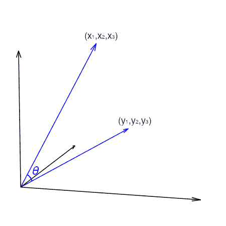

# 向量空间模型的温和介绍

> 原文:[https://machinelearning master . com/a-温柔-向量空间-模型介绍/](https://machinelearningmastery.com/a-gentle-introduction-to-vector-space-models/)

最后更新于 2021 年 10 月 23 日

向量空间模型是考虑由向量表示的数据之间的关系。它在信息检索系统中很受欢迎，但也可用于其他目的。通常，这允许我们从几何角度比较两个向量的相似性。

在本教程中，我们将了解什么是向量空间模型以及它可以做什么。

完成本教程后，您将知道:

*   什么是向量空间模型和余弦相似性的性质
*   余弦相似度如何帮助你比较两个向量
*   余弦相似度和 L2 距离有什么区别

我们开始吧。


向量空间模型简介
图片由[利亚姆弗莱彻](https://www.flickr.com/photos/49317207@N02/29539982252/)提供，版权所有。

## 教程概述

本教程分为 3 个部分；它们是:

1.  向量空间和余弦公式
2.  使用向量空间模型进行相似性分析
3.  向量空间模型和余弦距离的常用方法

## 向量空间和余弦公式

向量空间是定义一些向量运算的数学术语。用外行人的话来说，我们可以想象它是一个$n$维的度量空间，其中每个点都由一个$n$维的向量来表示。在这个空间中，我们可以做任何向量加法或标量向量乘法。

考虑向量空间是有用的，因为将事物表示为向量是有用的。例如在机器学习中，我们通常有一个具有多个特征的数据点。因此，我们可以方便地将数据点表示为向量。

有了向量，我们就可以计算出它的**范数**。最常见的是 L2 范数或向量的长度。在同一个向量空间中有两个向量，我们可以找到它们的区别。假设它是一个三维向量空间，这两个向量分别是$(x_1，x_2，x_3)$和$(y_1，y_2，y_3)$。它们的差是向量$(y_1-x_1，y_2-x_2，y_3-x_3)$，差的 L2 范数是**距离**或者更准确地说是这两个向量之间的欧几里得距离:

$
\sqrt{(y_1-x_1)^2+(y_2-x_2)^2+(y_3-x_3)^2}
$

除了距离，我们还可以考虑两个向量之间的**角**。如果我们把向量$(x_1，x_2，x_3)$看作是从 3D 坐标系中的点$(0，0，0)$到$(x_1，x_2，x_3)$的线段，那么还有另一条从$(0，0，0)$到$(y_1，y_2，y_3)的线段$。它们在交点处形成一个角度:



两条线段之间的角度可以用余弦公式计算:

$
\ cos \ theta = \ frac { a \ CDO b } { \ lvrt a \ servername _ 2 \ lvrt b \ servername _ 2 } { \ t1 }美元

其中$ a \\ cdot b $是向量点积，而$ \ lVert a \ rVert _ 2 $是向量$a$的 L2 范数。这个公式来自于把点积看作向量$a$到向量$b$所指方向的投影。余弦的性质告诉我们，当角度从 0 度增加到 90 度时，余弦从 1 度减少到 0 度。有时我们称$1-\cos\theta$为**余弦距离**，因为当两个向量彼此远离时，余弦距离从 0 到 1。这是我们将在向量空间模型中利用的一个重要特性。

## 使用向量空间模型进行相似性分析

让我们看一个向量空间模型如何有用的例子。

世界银行收集世界上各个国家和地区的各种数据。虽然每个国家都不同，但我们可以尝试在向量空间模型下比较国家。为了方便起见，我们将使用 Python 中的`pandas_datareader`模块从世界银行读取数据。您可以使用`pip`或`conda`命令安装`pandas_datareader`:

```py
pip install pandas_datareader
```

世界银行收集的数据系列由一个标识符命名。例如，“SP。URB。TOTL”是一个国家的城市总人口。许多系列是每年一次的。当我们下载一个系列时，我们必须输入开始和结束年份。通常数据不会及时更新。因此，最好查看几年前的数据，而不是最近一年的数据，以避免丢失数据。

下面我们试着收集一下 2010 年各个*国家的一些经济数据:*

```py
from pandas_datareader import wb
import pandas as pd
pd.options.display.width = 0

names = [
    "NE.EXP.GNFS.CD", # Exports of goods and services (current US$)
    "NE.IMP.GNFS.CD", # Imports of goods and services (current US$)
    "NV.AGR.TOTL.CD", # Agriculture, forestry, and fishing, value added (current US$)
    "NY.GDP.MKTP.CD", # GDP (current US$)
    "NE.RSB.GNFS.CD", # External balance on goods and services (current US$)
]

df = wb.download(country="all", indicator=names, start=2010, end=2010).reset_index()
countries = wb.get_countries()
non_aggregates = countries[countries["region"] != "Aggregates"].name
df_nonagg = df[df["country"].isin(non_aggregates)].dropna()
print(df_nonagg)
```

```py
                 country  year  NE.EXP.GNFS.CD  NE.IMP.GNFS.CD  NV.AGR.TOTL.CD  NY.GDP.MKTP.CD  NE.RSB.GNFS.CD
50               Albania  2010    3.337089e+09    5.792189e+09    2.141580e+09    1.192693e+10   -2.455100e+09
51               Algeria  2010    6.197541e+10    5.065473e+10    1.364852e+10    1.612073e+11    1.132067e+10
54                Angola  2010    5.157282e+10    3.568226e+10    5.179055e+09    8.379950e+10    1.589056e+10
55   Antigua and Barbuda  2010    9.142222e+08    8.415185e+08    1.876296e+07    1.148700e+09    7.270370e+07
56             Argentina  2010    8.020887e+10    6.793793e+10    3.021382e+10    4.236274e+11    1.227093e+10
..                   ...   ...             ...             ...             ...             ...             ...
259        Venezuela, RB  2010    1.121794e+11    6.922736e+10    2.113513e+10    3.931924e+11    4.295202e+10
260              Vietnam  2010    8.347359e+10    9.299467e+10    2.130649e+10    1.159317e+11   -9.521076e+09
262   West Bank and Gaza  2010    1.367300e+09    5.264300e+09    8.716000e+08    9.681500e+09   -3.897000e+09
264               Zambia  2010    7.503513e+09    6.256989e+09    1.909207e+09    2.026556e+10    1.246524e+09
265             Zimbabwe  2010    3.569254e+09    6.440274e+09    1.157187e+09    1.204166e+10   -2.871020e+09

[174 rows x 7 columns]
```

在上面，我们获得了 2010 年每个国家的一些经济指标。功能`wb.download()`将从世界银行下载数据，并返回一个熊猫数据帧。同样`wb.get_countries()`会得到世界银行认定的国家和地区名称，我们会用这个来过滤掉“东亚”“世界”等非国家聚合。Pandas 允许通过布尔索引过滤行，布尔索引`df["country"].isin(non_aggregates)`给出了布尔向量，表示哪一行在`non_aggregates`列表中，基于此，`df[df["country"].isin(non_aggregates)]`只选择那些行。由于各种原因，并非所有国家都有所有数据。因此，我们使用`dropna()`来删除那些丢失的数据。在实践中，我们可能希望应用一些插补技术，而不仅仅是去除它们。但是作为一个例子，我们继续剩下的 174 个数据点。

为了更好地说明这个想法，而不是隐藏熊猫或 numpy 函数中的实际操作，我们首先提取每个国家的数据作为向量:

```py
...
vectors = {}
for rowid, row in df_nonagg.iterrows():
    vectors[row["country"]] = row[names].values

print(vectors)
```

```py
{'Albania': array([3337088824.25553, 5792188899.58985, 2141580308.0144,
11926928505.5231, -2455100075.33431], dtype=object),
'Algeria': array([61975405318.205, 50654732073.2396, 13648522571.4516,
161207310515.42, 11320673244.9655], dtype=object),
'Angola': array([51572818660.8665, 35682259098.1843, 5179054574.41704,
83799496611.2004, 15890559562.6822], dtype=object),
...
'West Bank and Gaza': array([1367300000.0, 5264300000.0, 871600000.0, 9681500000.0,
-3897000000.0], dtype=object),
'Zambia': array([7503512538.82554, 6256988597.27752, 1909207437.82702,
20265559483.8548, 1246523941.54802], dtype=object),
'Zimbabwe': array([3569254400.0, 6440274000.0, 1157186600.0, 12041655200.0,
-2871019600.0], dtype=object)}
```

我们创建的 Python 字典将每个国家的名称作为关键字，将经济指标作为 numpy 数组。有 5 个度量，因此每个都是 5 维的向量。

这对我们有帮助的是，我们可以使用每个国家的向量表示来看看它与另一个国家有多相似。让我们尝试差值的 L2 范数(欧几里得距离)和余弦距离。我们选择一个国家，如澳大利亚，并根据选定的经济指标将其与名单上的所有其他国家进行比较。

```py
...
import numpy as np

euclid = {}
cosine = {}
target = "Australia"

for country in vectors:
    vecA = vectors[target]
    vecB = vectors[country]
    dist = np.linalg.norm(vecA - vecB)
    cos = (vecA @ vecB) / (np.linalg.norm(vecA) * np.linalg.norm(vecB))
    euclid[country] = dist    # Euclidean distance
    cosine[country] = 1-cos   # cosine distance
```

在上面的 for-loop 中，我们将`vecA`设置为目标国家(即澳大利亚)的向量，将`vecB`设置为其他国家的向量。然后我们计算它们的差的 L2 范数作为两个向量之间的欧几里得距离。我们还使用公式计算余弦相似度，并将其从 1 减去，以获得余弦距离。有一百多个国家，我们可以看到哪一个国家到澳大利亚的欧几里得距离最短:

```py
...
import pandas as pd

df_distance = pd.DataFrame({"euclid": euclid, "cos": cosine})
print(df_distance.sort_values(by="euclid").head())
```

```py
                 euclid           cos
Australia  0.000000e+00 -2.220446e-16
Mexico     1.533802e+11  7.949549e-03
Spain      3.411901e+11  3.057903e-03
Turkey     3.798221e+11  3.502849e-03
Indonesia  4.083531e+11  7.417614e-03
```

通过对结果进行排序，我们可以看到在欧氏距离下，墨西哥距离澳大利亚最近。然而，用余弦距离，它是哥伦比亚最接近澳大利亚的。

```py
...
df_distance.sort_values(by="cos").head()
```

```py
                 euclid           cos
Australia  0.000000e+00 -2.220446e-16
Colombia   8.981118e+11  1.720644e-03
Cuba       1.126039e+12  2.483993e-03
Italy      1.088369e+12  2.677707e-03
Argentina  7.572323e+11  2.930187e-03
```

为了理解为什么这两个距离给出不同的结果，我们可以观察这三个国家的度量标准是如何相互比较的:

```py
...
print(df_nonagg[df_nonagg.country.isin(["Mexico", "Colombia", "Australia"])])
```

```py
       country  year  NE.EXP.GNFS.CD  NE.IMP.GNFS.CD  NV.AGR.TOTL.CD  NY.GDP.MKTP.CD  NE.RSB.GNFS.CD
59   Australia  2010    2.270501e+11    2.388514e+11    2.518718e+10    1.146138e+12   -1.180129e+10
91    Colombia  2010    4.682683e+10    5.136288e+10    1.812470e+10    2.865631e+11   -4.536047e+09
176     Mexico  2010    3.141423e+11    3.285812e+11    3.405226e+10    1.057801e+12   -1.443887e+10
```

从这张表中，我们看到澳大利亚和墨西哥的指标在数量上非常接近。然而，如果你比较同一个国家内每个指标的比率，哥伦比亚比澳大利亚更匹配。事实上，从余弦公式中，我们可以看到

$
\ cos \ theta = \ frac { a \ CDO b } { \ lvrt a \ servername _ 2 \ lvrt b \ servername _ 2 } = \ frac { a } { \ lvrt a \ servername _ 2 } \ CDO \ frac { b } { \ lvrt b \ servername _ 2 } { \ t1 }美元

这意味着两个向量之间角度的余弦值是对应向量归一化为长度 1 后的点积。因此，余弦距离实际上是在计算距离之前对数据应用缩放器。

综上所述，下面是完整的代码

```py
from pandas_datareader import wb
import numpy as np
import pandas as pd
pd.options.display.width = 0

# Download data from World Bank
names = [
    "NE.EXP.GNFS.CD", # Exports of goods and services (current US$)
    "NE.IMP.GNFS.CD", # Imports of goods and services (current US$)
    "NV.AGR.TOTL.CD", # Agriculture, forestry, and fishing, value added (current US$)
    "NY.GDP.MKTP.CD", # GDP (current US$)
    "NE.RSB.GNFS.CD", # External balance on goods and services (current US$)
]
df = wb.download(country="all", indicator=names, start=2010, end=2010).reset_index()

# We remove aggregates and keep only countries with no missing data
countries = wb.get_countries()
non_aggregates = countries[countries["region"] != "Aggregates"].name
df_nonagg = df[df["country"].isin(non_aggregates)].dropna()

# Extract vector for each country
vectors = {}
for rowid, row in df_nonagg.iterrows():
    vectors[row["country"]] = row[names].values

# Compute the Euclidean and cosine distances
euclid = {}
cosine = {}

target = "Australia"
for country in vectors:
    vecA = vectors[target]
    vecB = vectors[country]
    dist = np.linalg.norm(vecA - vecB)
    cos = (vecA @ vecB) / (np.linalg.norm(vecA) * np.linalg.norm(vecB))
    euclid[country] = dist    # Euclidean distance
    cosine[country] = 1-cos   # cosine distance

# Print the results
df_distance = pd.DataFrame({"euclid": euclid, "cos": cosine})
print("Closest by Euclidean distance:")
print(df_distance.sort_values(by="euclid").head())
print()
print("Closest by Cosine distance:")
print(df_distance.sort_values(by="cos").head())

# Print the detail metrics
print()
print("Detail metrics:")
print(df_nonagg[df_nonagg.country.isin(["Mexico", "Colombia", "Australia"])])
```

## 向量空间模型和余弦距离的常用方法

向量空间模型在信息检索系统中很常见。我们可以将文档(例如，一段、一篇长文章、一本书甚至一句话)作为向量呈现。这个向量可以像计算文档包含的单词(即单词包模型)或复杂的嵌入向量(例如 Doc2Vec)一样简单。然后，可以通过按余弦距离对所有文档进行排序来回答查找最相关文档的查询。应该使用余弦距离，因为我们不想偏爱更长或更短的文档，而是专注于它包含的内容。因此，我们利用随之而来的规范化来考虑文档与查询的相关性，而不是查询中的单词在文档中被提及的次数。

如果我们将文档中的每个单词都视为一个特征，并计算余弦距离，则它是“硬”距离，因为我们不关心具有相似含义的单词(例如，“文档”和“段落”具有相似含义，但不关心“距离”)。嵌入像 word2vec 这样的向量将允许我们考虑本体。用所考虑的词的含义计算余弦距离就是“**软余弦距离**”。像 gensim 这样的库提供了一种方法。

余弦距离和向量空间模型的另一个用例是在计算机视觉中。想象一下识别手势的任务，我们可以把手的某些部位(如五指)作为关键点。然后，用关键点的(x，y)坐标作为向量，我们可以与现有的数据库进行比较，看看哪个余弦距离最近，并确定它是哪个手势。我们需要余弦距离，因为每个人的手都有不同的大小。我们不希望这影响我们对它所显示的姿态的决定。

正如你所想象的，你可以使用这种技术的例子还有很多。

## 进一步阅读

如果您想更深入地了解这个主题，本节将提供更多资源。

### 书

*   [线性代数导论](https://amzn.to/2CZgTTB)，第五版，2016。
*   [信息检索导论](https://nlp.stanford.edu/IR-book/information-retrieval-book.html)，2008。

### 软件

*   [世界银行公开数据](https://data.worldbank.org/)
*   [熊猫数据阅读器](https://pandas-datareader.readthedocs.io/)
*   基因体

### 文章

*   [维基百科上的向量空间模型](https://en.wikipedia.org/wiki/Vector_space_model)

## 摘要

在本教程中，您发现了用于测量向量相似性的向量空间模型。

具体来说，您了解到:

*   如何构建向量空间模型
*   如何计算向量空间模型中两个向量之间的余弦相似度以及余弦距离
*   如何解释余弦距离和其他距离度量如欧氏距离之间的差异
*   向量空间模型有什么用*