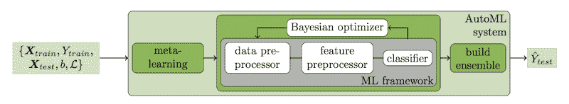

# Python 中自动机器学习的 Auto-Sklearn

> 原文:[https://machinelearning master . com/auto-sklearn-for-automatic-machine-learning-in-python/](https://machinelearningmastery.com/auto-sklearn-for-automated-machine-learning-in-python/)

最后更新于 2020 年 9 月 12 日

自动机器学习(AutoML)指的是在很少用户参与的情况下，自动发现用于预测建模任务的性能良好的模型的技术。

**Auto-Sklearn** 是一个用 Python 执行 AutoML 的开源库。它利用流行的 Scikit-Learn 机器学习库进行数据转换和机器学习算法，并使用贝叶斯优化搜索过程来有效地发现给定数据集的最佳模型管道。

在本教程中，您将发现如何在 Python 中使用 Auto-Sklearn for AutoML 和 Scikit-Learn 机器学习算法。

完成本教程后，您将知道:

*   Auto-Sklearn 是一个面向 AutoML 的开源库，具有 scikit-learn 数据准备和机器学习模型。
*   如何使用 Auto-Sklearn 为分类任务自动发现表现最好的模型。
*   如何使用 Auto-Sklearn 为回归任务自动发现性能最好的模型。

我们开始吧。


Python 中自动机器学习的 auto-Sklearn
图片由 [Richard](https://flickr.com/photos/89654772@N05/25558362110/) 提供，保留部分权利。

## 教程概述

本教程分为四个部分；它们是:

1.  汽车 ML 与汽车硬化
2.  安装和使用自动 Sklearn
3.  自我硬化进行分类
4.  回归自动学习

## 汽车 ML 与汽车硬化

[自动机器学习](https://en.wikipedia.org/wiki/Automated_machine_learning)，简称 AutoML，是发现数据集的数据转换、模型和模型配置的最佳执行流水线的过程。

AutoML 通常涉及使用复杂的优化算法，如[贝叶斯优化](https://machinelearningmastery.com/what-is-bayesian-optimization/)，以有效地导航可能的模型和模型配置的空间，并快速发现什么适合给定的预测建模任务。它允许非专家的机器学习从业者快速而容易地发现什么对给定数据集很好，甚至是最好的，而几乎没有技术背景或直接输入。

[Auto-Sklearn](https://automl.github.io/auto-sklearn/master/) 是一个面向 AutoML 的开源 Python 库，使用 scikit-learn 机器学习库中的机器学习模型。

它是由[马提亚斯·福雷尔](https://ml.informatik.uni-freiburg.de/people/feurer/index.html)等人开发的，并在他们 2015 年发表的题为“[高效稳健的自动机器学习](https://papers.nips.cc/paper/5872-efficient-and-robust-automated-machine-learning)的论文中进行了描述

> ……我们介绍了一个基于 scikit-learn 的健壮的新 AutoML 系统(使用 15 个分类器、14 种特征预处理方法和 4 种数据预处理方法，产生了一个包含 110 个超参数的结构化假设空间)。

——[高效稳健的自动化机器学习](https://papers.nips.cc/paper/5872-efficient-and-robust-automated-machine-learning)，2015。

Auto-Sklearn 的好处是，除了发现为数据集执行的数据准备和模型之外，它还能够从在类似数据集上表现良好的模型中学习，并且能够自动创建作为优化过程的一部分而发现的表现最佳的模型的集合。

> 这个系统，我们称之为 AUTO-SKLEARN，通过自动考虑过去在相似数据集上的性能，以及通过从优化过程中评估的模型构建集成，对现有的 AutoML 方法进行了改进。

——[高效稳健的自动化机器学习](https://papers.nips.cc/paper/5872-efficient-and-robust-automated-machine-learning)，2015。

作者在下面提供的论文中提供了他们系统的有用描述。



自动 Sklearn 系统概述。
摘自:高效稳健的自动化机器学习，2015。

## 安装和使用自动 Sklearn

第一步是安装 Auto-Sklearn 库，这可以使用 pip 实现，如下所示:

```py
sudo pip install autosklearn
```

安装后，我们可以导入库并打印版本号，以确认安装成功:

```py
# print autosklearn version
import autosklearn
print('autosklearn: %s' % autosklearn.__version__)
```

运行该示例会打印版本号。

您的版本号应该相同或更高。

```py
autosklearn: 0.6.0
```

使用自动学习很简单。

根据您的预测任务是分类还是回归，您可以创建并配置一个[自动学习分类器](https://automl.github.io/auto-sklearn/master/api.html#classification)或[自动学习回归器](https://automl.github.io/auto-sklearn/master/api.html#regression)类的实例，使其适合您的数据集，就是这样。然后，生成的模型可用于直接进行预测，或保存到文件中(使用 pickle)以备后用。

```py
...
# define search
model = AutoSklearnClassifier()
# perform the search
model.fit(X_train, y_train)
```

有大量的配置选项作为自动学习类的参数。

默认情况下，搜索将在搜索过程中使用数据集的训练测试分割，出于速度和简单性的考虑，建议使用此默认值。

重要的是，您应该将“ *n_jobs* ”参数设置为系统中的内核数量，例如，如果您有 8 个内核，则为 8 个。

只要您允许，优化过程就会运行，以分钟为单位。默认情况下，它将运行一个小时。

我建议将“ *time_left_for_this_task* ”参数设置为您希望进程运行的秒数。例如，对于许多小的预测建模任务(少于 1000 行)，少于 5-10 分钟可能足够了。

对于本教程中的示例，我们将使用 5 分钟(300 秒)。我们还将通过“*”per _ run _ time _ limit*”参数将分配给每个模型评估的时间限制为 30 秒。例如:

```py
...
# define search
model = AutoSklearnClassifier(time_left_for_this_task=5*60, per_run_time_limit=30, n_jobs=8)
```

您可以限制搜索中考虑的算法以及数据转换。

默认情况下，搜索将创建作为搜索的一部分发现的顶级模型的集合。有时，这可能会导致过度拟合，可以通过将“*集合 _ 大小*”参数设置为 1 并将“*初始 _ 配置 _ via _ metallowing*”设置为 0 来禁用。

```py
...
# define search
model = AutoSklearnClassifier(ensemble_size=1, initial_configurations_via_metalearning=0)
```

在运行结束时，可以访问模型列表以及其他详细信息。

也许最有用的特性是 *sprint_statistics()* 函数，它总结了最终模型的搜索和性能。

```py
...
# summarize performance
print(model.sprint_statistics())
```

现在我们已经熟悉了 Auto-Sklearn 库，让我们来看看一些工作示例。

## 自我硬化进行分类

在本节中，我们将使用 Auto-Sklearn 来发现声纳数据集的模型。

声纳数据集是一个标准的机器学习数据集，由 208 行数据组成，包含 60 个数字输入变量和一个具有两个类值的目标变量，例如二进制分类。

使用三次重复的重复分层 10 倍交叉验证的测试工具，一个简单的模型可以达到大约 53%的准确率。一个性能最好的模型在同样的测试设备上可以达到 88%的准确率。这提供了此数据集的预期性能范围。

该数据集包括预测声纳回波显示的是岩石还是模拟地雷。

*   [声纳数据集(声纳. csv)](https://raw.githubusercontent.com/jbrownlee/Datasets/master/sonar.csv)
*   [声纳数据集描述(声纳.名称)](https://raw.githubusercontent.com/jbrownlee/Datasets/master/sonar.names)

不需要下载数据集；我们将自动下载它作为我们工作示例的一部分。

下面的示例下载数据集并总结其形状。

```py
# summarize the sonar dataset
from pandas import read_csv
# load dataset
url = 'https://raw.githubusercontent.com/jbrownlee/Datasets/master/sonar.csv'
dataframe = read_csv(url, header=None)
# split into input and output elements
data = dataframe.values
X, y = data[:, :-1], data[:, -1]
print(X.shape, y.shape)
```

运行该示例会下载数据集，并将其拆分为输入和输出元素。不出所料，我们可以看到有 208 行数据，60 个输入变量。

```py
(208, 60) (208,)
```

我们将使用 Auto-Sklearn 为声纳数据集找到一个好的模型。

首先，我们将数据集分成训练集和测试集，并允许流程在训练集上找到一个好的模型，然后评估在保持测试集上找到的模型的性能。

```py
...
# split into train and test sets
X_train, X_test, y_train, y_test = train_test_split(X, y, test_size=0.33, random_state=1)
```

*自动学习分类器*配置为 8 核运行 5 分钟，每次模型评估限于 30 秒。

```py
...
# define search
model = AutoSklearnClassifier(time_left_for_this_task=5*60, per_run_time_limit=30, n_jobs=8)
```

然后对训练数据集执行搜索。

```py
...
# perform the search
model.fit(X_train, y_train)
```

随后，报告了搜索和最佳表现模型的摘要。

```py
...
# summarize
print(model.sprint_statistics())
```

最后，我们评估在保持测试数据集上准备的模型的性能。

```py
...
# evaluate best model
y_hat = model.predict(X_test)
acc = accuracy_score(y_test, y_hat)
print("Accuracy: %.3f" % acc)
```

将这些联系在一起，完整的示例如下所示。

```py
# example of auto-sklearn for the sonar classification dataset
from pandas import read_csv
from sklearn.model_selection import train_test_split
from sklearn.preprocessing import LabelEncoder
from sklearn.metrics import accuracy_score
from autosklearn.classification import AutoSklearnClassifier
# load dataset
url = 'https://raw.githubusercontent.com/jbrownlee/Datasets/master/sonar.csv'
dataframe = read_csv(url, header=None)
# print(dataframe.head())
# split into input and output elements
data = dataframe.values
X, y = data[:, :-1], data[:, -1]
# minimally prepare dataset
X = X.astype('float32')
y = LabelEncoder().fit_transform(y.astype('str'))
# split into train and test sets
X_train, X_test, y_train, y_test = train_test_split(X, y, test_size=0.33, random_state=1)
# define search
model = AutoSklearnClassifier(time_left_for_this_task=5*60, per_run_time_limit=30, n_jobs=8)
# perform the search
model.fit(X_train, y_train)
# summarize
print(model.sprint_statistics())
# evaluate best model
y_hat = model.predict(X_test)
acc = accuracy_score(y_test, y_hat)
print("Accuracy: %.3f" % acc)
```

考虑到我们对运行施加的硬性限制，运行该示例大约需要五分钟。

**注**:考虑到算法或评估程序的随机性，或数值精度的差异，您的[结果可能会有所不同](https://machinelearningmastery.com/different-results-each-time-in-machine-learning/)。考虑运行该示例几次，并比较平均结果。

运行结束时，会打印一份摘要，显示评估了 1，054 个模型，最终模型的估计性能为 91%。

```py
auto-sklearn results:
Dataset name: f4c282bd4b56d4db7e5f7fe1a6a8edeb
Metric: accuracy
Best validation score: 0.913043
Number of target algorithm runs: 1054
Number of successful target algorithm runs: 952
Number of crashed target algorithm runs: 94
Number of target algorithms that exceeded the time limit: 8
Number of target algorithms that exceeded the memory limit: 0
```

然后，我们在保持数据集上评估模型，发现分类准确率达到了 81.2%，这是相当巧妙的。

```py
Accuracy: 0.812
```

## 回归自动学习

在本节中，我们将使用 Auto-Sklearn 来发现汽车保险数据集的模型。

汽车保险数据集是一个标准的机器学习数据集，由 63 行数据组成，包括一个数字输入变量和一个数字目标变量。

使用三次重复的重复分层 10 倍交叉验证的测试工具，一个简单的模型可以获得大约 66 的平均绝对误差(MAE)。一个性能最好的模型可以在大约 28 的相同测试线束上实现 MAE。这提供了此数据集的预期性能范围。

考虑到不同地理区域的索赔数量，数据集包括预测索赔总额(千瑞典克朗)。

*   [车险数据集(auto-insurance.csv)](https://raw.githubusercontent.com/jbrownlee/Datasets/master/auto-insurance.csv)
*   [车险数据集描述(车险.名称)](https://raw.githubusercontent.com/jbrownlee/Datasets/master/auto-insurance.names)

不需要下载数据集；我们将自动下载它作为我们工作示例的一部分。

下面的示例下载数据集并总结其形状。

```py
# summarize the auto insurance dataset
from pandas import read_csv
# load dataset
url = 'https://raw.githubusercontent.com/jbrownlee/Datasets/master/auto-insurance.csv'
dataframe = read_csv(url, header=None)
# split into input and output elements
data = dataframe.values
X, y = data[:, :-1], data[:, -1]
print(X.shape, y.shape)
```

运行该示例会下载数据集，并将其拆分为输入和输出元素。不出所料，我们可以看到有 63 行数据带有一个输入变量。

```py
(63, 1) (63,)
```

我们将使用 Auto-Sklearn 为汽车保险数据集找到一个好的模型。

我们可以使用与上一节相同的过程，尽管我们将使用*自动学习回归器*类来代替*自动学习分类器*。

```py
...
# define search
model = AutoSklearnRegressor(time_left_for_this_task=5*60, per_run_time_limit=30, n_jobs=8)
```

默认情况下，回归器将优化 R^2 度量。

在这种情况下，我们对平均绝对误差(MAE)感兴趣，当调用 *fit()* 函数时，我们可以通过“*度量*”参数指定它。

```py
...
# perform the search
model.fit(X_train, y_train, metric=auto_mean_absolute_error)
```

下面列出了完整的示例。

```py
# example of auto-sklearn for the insurance regression dataset
from pandas import read_csv
from sklearn.model_selection import train_test_split
from sklearn.metrics import mean_absolute_error
from autosklearn.regression import AutoSklearnRegressor
from autosklearn.metrics import mean_absolute_error as auto_mean_absolute_error
# load dataset
url = 'https://raw.githubusercontent.com/jbrownlee/Datasets/master/auto-insurance.csv'
dataframe = read_csv(url, header=None)
# split into input and output elements
data = dataframe.values
data = data.astype('float32')
X, y = data[:, :-1], data[:, -1]
# split into train and test sets
X_train, X_test, y_train, y_test = train_test_split(X, y, test_size=0.33, random_state=1)
# define search
model = AutoSklearnRegressor(time_left_for_this_task=5*60, per_run_time_limit=30, n_jobs=8)
# perform the search
model.fit(X_train, y_train, metric=auto_mean_absolute_error)
# summarize
print(model.sprint_statistics())
# evaluate best model
y_hat = model.predict(X_test)
mae = mean_absolute_error(y_test, y_hat)
print("MAE: %.3f" % mae)
```

考虑到我们对运行施加的硬性限制，运行该示例大约需要五分钟。

在运行过程中，您可能会看到一些警告消息，您可以放心地忽略它们，例如:

```py
Target Algorithm returned NaN or inf as quality. Algorithm run is treated as CRASHED, cost is set to 1.0 for quality scenarios. (Change value through "cost_for_crash"-option.)
```

**注**:考虑到算法或评估程序的随机性，或数值精度的差异，您的[结果可能会有所不同](https://machinelearningmastery.com/different-results-each-time-in-machine-learning/)。考虑运行该示例几次，并比较平均结果。

运行结束时，会打印一份摘要，显示评估了 1，759 个模型，最终模型的估计性能为 29 的 MAE。

```py
auto-sklearn results:
Dataset name: ff51291d93f33237099d48c48ee0f9ad
Metric: mean_absolute_error
Best validation score: 29.911203
Number of target algorithm runs: 1759
Number of successful target algorithm runs: 1362
Number of crashed target algorithm runs: 394
Number of target algorithms that exceeded the time limit: 3
Number of target algorithms that exceeded the memory limit: 0
```

然后，我们在保持数据集上评估模型，看到 MAE 达到了 26，这是一个很好的结果。

```py
MAE: 26.498
```

## 进一步阅读

如果您想更深入地了解这个主题，本节将提供更多资源。

*   [自动机器学习，维基百科](https://en.wikipedia.org/wiki/Automated_machine_learning)。
*   [高效稳健的自动化机器学习](https://papers.nips.cc/paper/5872-efficient-and-robust-automated-machine-learning)，2015。
*   [自硬化主页](https://automl.github.io/auto-sklearn/master/)。
*   [自硬化 GitHub 项目](https://github.com/automl/auto-sklearn)。
*   [自制硬化手册](https://automl.github.io/auto-sklearn/master/manual.html)。

## 摘要

在本教程中，您发现了如何在 Python 中使用 Auto-Sklearn for AutoML 和 Scikit-Learn 机器学习算法。

具体来说，您了解到:

*   Auto-Sklearn 是一个面向 AutoML 的开源库，具有 scikit-learn 数据准备和机器学习模型。
*   如何使用 Auto-Sklearn 为分类任务自动发现表现最好的模型。
*   如何使用 Auto-Sklearn 为回归任务自动发现性能最好的模型。

**你有什么问题吗？**
在下面的评论中提问，我会尽力回答。