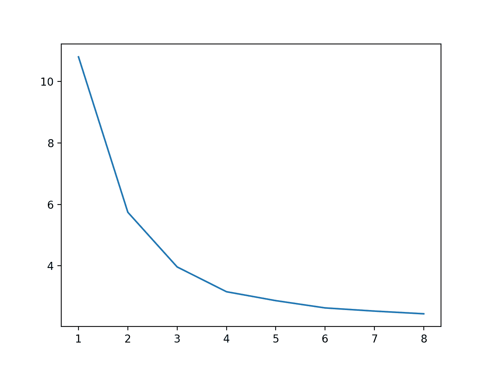

# 用 Scikit 学习 Python 中的多核机器学习

> 原文：<https://machinelearningmastery.com/multi-core-machine-learning-in-python/>

机器学习的许多计算成本很高的任务可以通过将工作划分到多个中央处理器内核(称为多核处理)来并行完成。

可以并行执行的常见机器学习任务包括训练模型(如决策树的集合)、使用重采样过程(如 k 重交叉验证)评估模型，以及调整模型超参数(如网格和随机搜索)。

将多核用于常见的机器学习任务可以显著缩短执行时间，这是系统可用内核数量的一个因素。一台普通的笔记本电脑和台式电脑可能有 2、4 或 8 个内核。较大的服务器系统可能有 32 个、64 个或更多的可用内核，从而可以在几分钟内完成耗时数小时的机器学习任务。

在本教程中，您将发现如何为多核机器学习配置 scikit-learn。

完成本教程后，您将知道:

*   如何使用多核训练机器学习模型？
*   如何使机器学习模型的评估并行化？
*   如何使用多核调整机器学习模型超参数？

我们开始吧。


带 Scikit 的 Python 多核机器学习-学习
图片由 [ER Bauer](https://www.flickr.com/photos/erix-pix/16030189175/) 提供，保留部分权利。

## 教程概述

本教程分为五个部分；它们是:

1.  多核套件-学习
2.  多核模型训练
3.  多核模型评估
4.  多核超参数调整
5.  推荐

## 多核套件-学习

机器学习在计算上可能很昂贵。

这种计算成本有三个主要中心；它们是:

*   训练机器学习模型。
*   评估机器学习模型。
*   超参数调整机器学习模型。

更糟糕的是，这些担忧加剧了。

例如，使用像 [k 倍交叉验证](https://machinelearningmastery.com/cross-validation-for-imbalanced-classification/)这样的重采样技术来评估机器学习模型需要多次重复训练过程。

*   评估需要反复训练

优化模型超参数进一步加剧了这一点，因为它需要对测试的每个超参数组合重复评估程序。

*   调整需要重复评估

如果不是全部的话，大多数现代计算机都有多核处理器。这包括您的工作站、笔记本电脑以及更大的服务器。

您可以配置您的机器学习模型来利用您的计算机的多个内核，从而大大加快计算开销。

scikit-learn Python 机器学习库通过关于关键机器学习任务的 [n_jobs 参数](https://scikit-learn.org/stable/glossary.html#term-n-jobs)提供了这种能力，例如模型训练、模型评估和超参数调整。

此配置参数允许您指定任务要使用的内核数量。默认值为无，将使用单核。您也可以将内核数量指定为整数，例如 1 或 2。最后，您可以指定-1，在这种情况下，任务将使用系统上所有可用的内核。

*   **n_jobs** :指定用于关键机器学习任务的核心数量。

常见的值有:

*   **n_jobs=None** :使用单核或您的后端库配置的默认值。
*   **n_jobs=4** :使用指定数量的内核，本例中为 4。
*   **n_jobs=-1** :使用所有可用的内核。

**什么是核心？**

一个 CPU 可能有[多个物理 CPU 核](https://en.wikipedia.org/wiki/Multi-core_processor)，本质上就像有多个 CPU 一样。每个内核还可能有[超线程](https://en.wikipedia.org/wiki/Hyper-threading)，这是一种在许多情况下可以让内核数量翻倍的技术。

例如，我的工作站有四个物理内核，由于超线程，这些物理内核增加了一倍，达到八个。因此，我可以尝试使用 1-8 个内核，或者指定-1 个内核来使用工作站上的所有内核。

现在我们已经熟悉了 scikit-learn 库支持机器学习多核并行处理的能力，让我们来看一些例子。

对于本教程中的所有示例，您将获得不同的计时；在评论中分享你的结果。您可能还需要更改内核数量，以匹配系统上的内核数量。

**注意**:是的，我知道 [timeit](https://docs.python.org/3/library/timeit.html) API，但是在本教程中选择了反对。我们没有剖析代码示例本身；相反，我希望您关注如何以及何时使用 scikit-learn 的多核功能，以及它们提供的真正好处。我希望代码示例简洁易读，即使对于初学者也是如此。我将其设置为一个扩展来更新所有示例，以使用 timeit API 并获得更精确的计时。在评论中分享你的结果。

## 多核模型训练

定义模型时，许多机器学习算法通过 n_jobs 参数支持多核训练。

这不仅会影响模型的训练，还会影响模型在进行预测时的使用。

一个流行的例子是决策树的集合，例如袋装决策树、随机森林和梯度增强。

在本节中，我们将探索使用多核加速训练[随机森林分类器](https://scikit-learn.org/stable/modules/generated/sklearn.ensemble.RandomForestClassifier.html)模型。我们将在实验中使用综合分类任务。

在这种情况下，我们将定义一个具有 500 棵树的随机森林模型，并使用单个核心来训练该模型。

```py
...
# define the model
model = RandomForestClassifier(n_estimators=500, n_jobs=1)
```

我们可以使用*时间()*功能记录调用*列车()*功能前后的时间。然后，我们可以从结束时间中减去开始时间，并以秒为单位报告执行时间。

下面列出了评估使用单核训练随机森林模型的执行时间的完整示例。

```py
# example of timing the training of a random forest model on one core
from time import time
from sklearn.datasets import make_classification
from sklearn.ensemble import RandomForestClassifier
# define dataset
X, y = make_classification(n_samples=10000, n_features=20, n_informative=15, n_redundant=5, random_state=3)
# define the model
model = RandomForestClassifier(n_estimators=500, n_jobs=1)
# record current time
start = time()
# fit the model
model.fit(X, y)
# record current time
end = time()
# report execution time
result = end - start
print('%.3f seconds' % result)
```

运行该示例会报告用单核训练模型所花费的时间。

在这种情况下，我们可以看到大约需要 10 秒钟。

你的系统需要多长时间？在下面的评论中分享你的结果。

```py
10.702 seconds
```

我们现在可以将示例更改为使用系统上的所有物理内核，在本例中为四个。

```py
...
# define the model
model = RandomForestClassifier(n_estimators=500, n_jobs=4)
```

下面列出了四核模型多核训练的完整示例。

```py
# example of timing the training of a random forest model on 4 cores
from time import time
from sklearn.datasets import make_classification
from sklearn.ensemble import RandomForestClassifier
# define dataset
X, y = make_classification(n_samples=10000, n_features=20, n_informative=15, n_redundant=5, random_state=3)
# define the model
model = RandomForestClassifier(n_estimators=500, n_jobs=4)
# record current time
start = time()
# fit the model
model.fit(X, y)
# record current time
end = time()
# report execution time
result = end - start
print('%.3f seconds' % result)
```

运行该示例会报告用单核训练模型所花费的时间。

在这种情况下，我们可以看到执行速度减半以上，约为 3.151 秒。

**你的系统需要多长时间？**在下面的评论中分享你的结果。

```py
3.151 seconds
```

我们现在可以将内核数量更改为八个，以考虑四个物理内核支持的超线程。

```py
...
# define the model
model = RandomForestClassifier(n_estimators=500, n_jobs=8)
```

我们可以通过将 *n_jobs* 设置为-1 自动使用所有内核来达到同样的效果；例如:

```py
...
# define the model
model = RandomForestClassifier(n_estimators=500, n_jobs=-1)
```

目前我们将坚持手动指定内核数量。

下面列出了八核模型多核训练的完整示例。

```py
# example of timing the training of a random forest model on 8 cores
from time import time
from sklearn.datasets import make_classification
from sklearn.ensemble import RandomForestClassifier
# define dataset
X, y = make_classification(n_samples=10000, n_features=20, n_informative=15, n_redundant=5, random_state=3)
# define the model
model = RandomForestClassifier(n_estimators=500, n_jobs=8)
# record current time
start = time()
# fit the model
model.fit(X, y)
# record current time
end = time()
# report execution time
result = end - start
print('%.3f seconds' % result)
```

运行该示例会报告用单核训练模型所花费的时间。

在这种情况下，我们可以看到，通过使用所有内核，我们的执行速度再次从大约 3.151 下降到大约 2.521。

你的系统需要多长时间？在下面的评论中分享你的结果。

```py
2.521 seconds
```

通过比较 1 和 8 之间的所有值并绘制结果，我们可以使训练期间使用的内核数量和执行速度之间的关系更加具体。

下面列出了完整的示例。

```py
# example of comparing number of cores used during training to execution speed
from time import time
from sklearn.datasets import make_classification
from sklearn.ensemble import RandomForestClassifier
from matplotlib import pyplot
# define dataset
X, y = make_classification(n_samples=10000, n_features=20, n_informative=15, n_redundant=5, random_state=3)
results = list()
# compare timing for number of cores
n_cores = [1, 2, 3, 4, 5, 6, 7, 8]
for n in n_cores:
	# capture current time
	start = time()
	# define the model
	model = RandomForestClassifier(n_estimators=500, n_jobs=n)
	# fit the model
	model.fit(X, y)
	# capture current time
	end = time()
	# store execution time
	result = end - start
	print('>cores=%d: %.3f seconds' % (n, result))
	results.append(result)
pyplot.plot(n_cores, results)
pyplot.show()
```

运行示例首先报告训练期间使用的每个内核数量的执行速度。

我们可以看到执行速度从一个内核稳步下降到八个内核，尽管在四个物理内核之后，这种显著的优势就停止了。

你的系统需要多长时间？在下面的评论中分享你的结果。

```py
>cores=1: 10.798 seconds
>cores=2: 5.743 seconds
>cores=3: 3.964 seconds
>cores=4: 3.158 seconds
>cores=5: 2.868 seconds
>cores=6: 2.631 seconds
>cores=7: 2.528 seconds
>cores=8: 2.440 seconds
```

还创建了一个图来显示训练期间使用的内核数量和执行速度之间的关系，表明我们继续看到八个内核的优势。



训练期间使用的内核数量与执行速度的线图

现在我们已经熟悉了机器学习模型多核训练的好处，下面我们来看看多核模型评估。

## 多核模型评估

模型评估的金标准是 [k 倍交叉验证](https://machinelearningmastery.com/k-fold-cross-validation/)。

这是一个重采样过程，需要在数据集的不同分区子集上训练和评估模型 *k* 次。结果是在对训练期间未使用的数据进行预测时对模型性能的估计，这些数据可用于比较和选择数据集的良好或最佳模型。

此外，多次重复此评估过程也是一种良好的做法，称为重复 k 倍交叉验证。

评估过程可以配置为使用多个核心，其中每个模型训练和评估都在单独的核心上进行。这可以通过在调用 [cross_val_score()函数](https://scikit-learn.org/stable/modules/generated/sklearn.model_selection.cross_val_score.html)时设置 *n_jobs* 参数来实现；例如:

我们可以探索多核对模型评估的影响。

首先，让我们使用单个核心来评估模型。

```py
...
# evaluate the model
n_scores = cross_val_score(model, X, y, scoring='accuracy', cv=cv, n_jobs=1)
```

我们将评估随机森林模型，并在模型的训练中使用单个核心(目前)。

```py
...
# define the model
model = RandomForestClassifier(n_estimators=100, n_jobs=1)
```

下面列出了完整的示例。

```py
# example of evaluating a model using a single core
from time import time
from sklearn.datasets import make_classification
from sklearn.model_selection import cross_val_score
from sklearn.model_selection import RepeatedStratifiedKFold
from sklearn.ensemble import RandomForestClassifier
# define dataset
X, y = make_classification(n_samples=1000, n_features=20, n_informative=15, n_redundant=5, random_state=3)
# define the model
model = RandomForestClassifier(n_estimators=100, n_jobs=1)
# define the evaluation procedure
cv = RepeatedStratifiedKFold(n_splits=10, n_repeats=3, random_state=1)
# record current time
start = time()
# evaluate the model
n_scores = cross_val_score(model, X, y, scoring='accuracy', cv=cv, n_jobs=1)
# record current time
end = time()
# report execution time
result = end - start
print('%.3f seconds' % result)
```

运行该示例使用三次重复的 10 倍交叉验证来评估模型。

在这种情况下，我们看到模型的评估花费了大约 6.412 秒。

你的系统需要多长时间？在下面的评论中分享你的结果。

```py
6.412 seconds
```

我们可以更新示例以使用系统的所有八个内核，并期待大幅加速。

```py
...
# evaluate the model
n_scores = cross_val_score(model, X, y, scoring='accuracy', cv=cv, n_jobs=8)
```

下面列出了完整的示例。

```py
# example of evaluating a model using 8 cores
from time import time
from sklearn.datasets import make_classification
from sklearn.model_selection import cross_val_score
from sklearn.model_selection import RepeatedStratifiedKFold
from sklearn.ensemble import RandomForestClassifier
# define dataset
X, y = make_classification(n_samples=1000, n_features=20, n_informative=15, n_redundant=5, random_state=3)
# define the model
model = RandomForestClassifier(n_estimators=100, n_jobs=1)
# define the evaluation procedure
cv = RepeatedStratifiedKFold(n_splits=10, n_repeats=3, random_state=1)
# record current time
start = time()
# evaluate the model
n_scores = cross_val_score(model, X, y, scoring='accuracy', cv=cv, n_jobs=8)
# record current time
end = time()
# report execution time
result = end - start
print('%.3f seconds' % result)
```

运行该示例使用多个内核评估模型。

在这种情况下，我们可以看到执行时间从 6.412 秒下降到大约 2.371 秒，这是一个可喜的加速。

你的系统需要多长时间？在下面的评论中分享你的结果。

```py
2.371 seconds
```

正如我们在上一节中所做的，我们可以将每个内核数量的执行速度从 1 计时到 8，从而了解这种关系。

下面列出了完整的示例。

```py
# compare execution speed for model evaluation vs number of cpu cores
from time import time
from sklearn.datasets import make_classification
from sklearn.model_selection import cross_val_score
from sklearn.model_selection import RepeatedStratifiedKFold
from sklearn.ensemble import RandomForestClassifier
from matplotlib import pyplot
# define dataset
X, y = make_classification(n_samples=1000, n_features=20, n_informative=15, n_redundant=5, random_state=3)
results = list()
# compare timing for number of cores
n_cores = [1, 2, 3, 4, 5, 6, 7, 8]
for n in n_cores:
	# define the model
	model = RandomForestClassifier(n_estimators=100, n_jobs=1)
	# define the evaluation procedure
	cv = RepeatedStratifiedKFold(n_splits=10, n_repeats=3, random_state=1)
	# record the current time
	start = time()
	# evaluate the model
	n_scores = cross_val_score(model, X, y, scoring='accuracy', cv=cv, n_jobs=n)
	# record the current time
	end = time()
	# store execution time
	result = end - start
	print('>cores=%d: %.3f seconds' % (n, result))
	results.append(result)
pyplot.plot(n_cores, results)
pyplot.show()
```

运行该示例首先报告用于评估模型的每个内核数量的执行时间(以秒为单位)。

我们可以看到，在四个物理内核之上没有显著的改进。

我们在这里也可以看到与之前实验中使用八个内核进行训练时的区别。在这种情况下，评估性能需要 1.492 秒，而独立的情况大约需要 2.371 秒。

这突出了我们使用的评估方法的局限性，我们报告的是单次运行而不是重复运行的性能。将类加载到内存中并执行任何 JIT 优化都需要一些加速时间。

不管我们脆弱的分析的准确性如何，我们确实看到了模型评估熟悉的加速，随着过程中使用的核心的增加。

你的系统需要多长时间？在下面的评论中分享你的结果。

```py
>cores=1: 6.339 seconds
>cores=2: 3.765 seconds
>cores=3: 2.404 seconds
>cores=4: 1.826 seconds
>cores=5: 1.806 seconds
>cores=6: 1.686 seconds
>cores=7: 1.587 seconds
>cores=8: 1.492 seconds
```

还创建了内核数量和执行速度之间的关系图。


评估期间使用的内核数量与执行速度的线图

我们还可以在模型评估过程中使模型训练过程并行。

虽然这是可能的，但我们应该这样做吗？

为了探索这个问题，让我们首先考虑模型训练使用所有核心，模型评估使用单个核心的情况。

```py
...
# define the model
model = RandomForestClassifier(n_estimators=100, n_jobs=8)
...
# evaluate the model
n_scores = cross_val_score(model, X, y, scoring='accuracy', cv=cv, n_jobs=1)
```

下面列出了完整的示例。

```py
# example of using multiple cores for model training but not model evaluation
from time import time
from sklearn.datasets import make_classification
from sklearn.model_selection import cross_val_score
from sklearn.model_selection import RepeatedStratifiedKFold
from sklearn.ensemble import RandomForestClassifier
# define dataset
X, y = make_classification(n_samples=1000, n_features=20, n_informative=15, n_redundant=5, random_state=3)
# define the model
model = RandomForestClassifier(n_estimators=100, n_jobs=8)
# define the evaluation procedure
cv = RepeatedStratifiedKFold(n_splits=10, n_repeats=3, random_state=1)
# record current time
start = time()
# evaluate the model
n_scores = cross_val_score(model, X, y, scoring='accuracy', cv=cv, n_jobs=1)
# record current time
end = time()
# report execution time
result = end - start
print('%.3f seconds' % result)
```

运行该示例使用单核评估模型，但是每个训练好的模型使用单核。

在这种情况下，我们可以看到模型评估需要 10 秒以上，比我们使用单个核心进行训练，所有核心进行并行模型评估时的 1 秒或 2 秒要长得多。

你的系统需要多长时间？在下面的评论中分享你的结果。

```py
10.461 seconds
```

如果我们在培训和评估程序之间划分核心数量，会怎么样？

```py
...
# define the model
model = RandomForestClassifier(n_estimators=100, n_jobs=4)
...
# evaluate the model
n_scores = cross_val_score(model, X, y, scoring='accuracy', cv=cv, n_jobs=4)
```

下面列出了完整的示例。

```py
# example of using multiple cores for model training and evaluation
from time import time
from sklearn.datasets import make_classification
from sklearn.model_selection import cross_val_score
from sklearn.model_selection import RepeatedStratifiedKFold
from sklearn.ensemble import RandomForestClassifier
# define dataset
X, y = make_classification(n_samples=1000, n_features=20, n_informative=15, n_redundant=5, random_state=3)
# define the model
model = RandomForestClassifier(n_estimators=100, n_jobs=8)
# define the evaluation procedure
cv = RepeatedStratifiedKFold(n_splits=10, n_repeats=3, random_state=4)
# record current time
start = time()
# evaluate the model
n_scores = cross_val_score(model, X, y, scoring='accuracy', cv=cv, n_jobs=4)
# record current time
end = time()
# report execution time
result = end - start
print('%.3f seconds' % result)
```

运行该示例使用四个核心评估模型，每个模型使用四个不同的核心进行训练。

我们可以看到使用所有核心进行训练和使用一个核心进行评估相比有所改进，但至少对于这个数据集上的这个模型，使用所有核心进行模型评估和使用单个核心进行模型训练效率更高。

你的系统需要多长时间？在下面的评论中分享你的结果。

```py
3.434 seconds
```

## 多核超参数调整

通常使用网格搜索或随机搜索来调整机器学习模型的超参数。

scikit-learn 库分别通过 [GridSearchCV](https://scikit-learn.org/stable/modules/generated/sklearn.model_selection.GridSearchCV.html) 和 [RandomizedSearchCV](https://scikit-learn.org/stable/modules/generated/sklearn.model_selection.RandomizedSearchCV.html) 类提供这些功能。

通过设置 *n_jobs* 参数，将每个超参数配置分配给一个核心进行评估，这两个搜索过程可以并行进行。

模型评估本身也可以是多核的，正如我们在上一节中看到的，给定评估的模型训练也可以是我们在之前的第二节中看到的训练。因此，潜在多核进程的堆栈开始变得难以配置。

在这个具体的实现中，我们可以使模型训练并行，但是我们无法控制每个模型超参数以及每个模型评估如何多核化。在撰写本文时，文档还不清楚，但我猜想使用单核超参数配置的每个模型评估都会被分成几个作业。

让我们探索使用多核执行模型超参数调整的好处。

首先，让我们使用一个内核来评估随机森林算法的不同配置的网格。

```py
...
# define grid search
search = GridSearchCV(model, grid, n_jobs=1, cv=cv)
```

下面列出了完整的示例。

```py
# example of tuning model hyperparameters with a single core
from time import time
from sklearn.datasets import make_classification
from sklearn.model_selection import RepeatedStratifiedKFold
from sklearn.ensemble import RandomForestClassifier
from sklearn.model_selection import GridSearchCV
# define dataset
X, y = make_classification(n_samples=1000, n_features=20, n_informative=15, n_redundant=5, random_state=3)
# define the model
model = RandomForestClassifier(n_estimators=100, n_jobs=1)
# define the evaluation procedure
cv = RepeatedStratifiedKFold(n_splits=10, n_repeats=3, random_state=1)
# define grid
grid = dict()
grid['max_features'] = [1, 2, 3, 4, 5]
# define grid search
search = GridSearchCV(model, grid, n_jobs=1, cv=cv)
# record current time
start = time()
# perform search
search.fit(X, y)
# record current time
end = time()
# report execution time
result = end - start
print('%.3f seconds' % result)
```

运行该示例测试随机森林的 *max_features* 配置的不同值，其中使用重复的 k 倍交叉验证来评估每个配置。

在这种情况下，单核上的网格搜索大约需要 28.838 秒。

你的系统需要多长时间？在下面的评论中分享你的结果。

```py
28.838 seconds
```

我们现在可以将网格搜索配置为使用系统上所有可用的内核，在本例中是八个内核。

```py
...
# define grid search
search = GridSearchCV(model, grid, n_jobs=8, cv=cv)
```

然后，我们可以评估多核网格搜索需要执行多长时间。下面列出了完整的示例。

```py
# example of tuning model hyperparameters with 8 cores
from time import time
from sklearn.datasets import make_classification
from sklearn.model_selection import RepeatedStratifiedKFold
from sklearn.ensemble import RandomForestClassifier
from sklearn.model_selection import GridSearchCV
# define dataset
X, y = make_classification(n_samples=1000, n_features=20, n_informative=15, n_redundant=5, random_state=3)
# define the model
model = RandomForestClassifier(n_estimators=100, n_jobs=1)
# define the evaluation procedure
cv = RepeatedStratifiedKFold(n_splits=10, n_repeats=3, random_state=1)
# define grid
grid = dict()
grid['max_features'] = [1, 2, 3, 4, 5]
# define grid search
search = GridSearchCV(model, grid, n_jobs=8, cv=cv)
# record current time
start = time()
# perform search
search.fit(X, y)
# record current time
end = time()
# report execution time
result = end - start
print('%.3f seconds' % result)
```

运行该示例会报告网格搜索的执行时间。

在这种情况下，我们看到大约四倍的速度从大约 28.838 秒增加到大约 7.418 秒。

你的系统需要多长时间？在下面的评论中分享你的结果。

```py
7.418 seconds
```

直觉上，我们会认为让网格搜索多核应该是重点，而不是模型训练。

然而，我们可以在模型训练和网格搜索之间划分核心数量，看看它是否为这个数据集上的这个模型提供了好处。

```py
...
# define the model
model = RandomForestClassifier(n_estimators=100, n_jobs=4)
...
# define grid search
search = GridSearchCV(model, grid, n_jobs=4, cv=cv)
```

多核模型训练和多核超参数调整的完整示例如下所示。

```py
# example of multi-core model training and hyperparameter tuning
from time import time
from sklearn.datasets import make_classification
from sklearn.model_selection import RepeatedStratifiedKFold
from sklearn.ensemble import RandomForestClassifier
from sklearn.model_selection import GridSearchCV
# define dataset
X, y = make_classification(n_samples=1000, n_features=20, n_informative=15, n_redundant=5, random_state=3)
# define the model
model = RandomForestClassifier(n_estimators=100, n_jobs=4)
# define the evaluation procedure
cv = RepeatedStratifiedKFold(n_splits=10, n_repeats=3, random_state=1)
# define grid
grid = dict()
grid['max_features'] = [1, 2, 3, 4, 5]
# define grid search
search = GridSearchCV(model, grid, n_jobs=4, cv=cv)
# record current time
start = time()
# perform search
search.fit(X, y)
# record current time
end = time()
# report execution time
result = end - start
print('%.3f seconds' % result)
```

在这种情况下，与单核情况相比，我们确实看到了执行速度的下降，但没有将所有内核分配给网格搜索过程那么多好处。

你的系统需要多长时间？在下面的评论中分享你的结果。

```py
14.148 seconds
```

## 推荐

本节列出了使用多核进行机器学习时的一些一般建议。

*   确认系统上可用的内核数量。
*   考虑使用具有多个内核的 AWS EC2 实例来获得即时加速。
*   查看应用编程接口文档，查看您使用的模型是否支持多核培训。
*   确认多核培训为您的系统带来了可衡量的好处。
*   当使用 k 倍交叉验证时，最好将核分配给重采样过程，并保留模型训练单核。
*   在使用超参数调优时，可能更好的做法是使搜索成为多核，而让模型训练和评估成为单核。

你有自己的推荐吗？

## 进一步阅读

如果您想更深入地了解这个主题，本节将提供更多资源。

### 相关教程

*   [k 倍交叉验证的温和介绍](https://machinelearningmastery.com/k-fold-cross-validation/)

### 蜜蜂

*   [如何优化速度，scikit-学习文档](https://scikit-learn.org/stable/developers/performance.html)。
*   [Joblib:运行 Python 函数作为流水线作业](https://joblib.readthedocs.io/en/latest/)
*   时间 API 。
*   [硬化。一起。随机应变分类 API](https://scikit-learn.org/stable/modules/generated/sklearn.ensemble.RandomForestClassifier.html) 。
*   [sklearn . model _ selection . cross _ val _ score API](https://scikit-learn.org/stable/modules/generated/sklearn.model_selection.cross_val_score.html)。
*   [sklearn.model_selection。GridSearchCV API](https://scikit-learn.org/stable/modules/generated/sklearn.model_selection.GridSearchCV.html) 。
*   [硬化. model_selection。random mizedsearchv API](https://scikit-learn.org/stable/modules/generated/sklearn.model_selection.RandomizedSearchCV.html)。
*   [n _ jobs sci kit-学习参数](https://scikit-learn.org/stable/glossary.html#term-n-jobs)。

### 文章

*   [多核处理器，维基百科](https://en.wikipedia.org/wiki/Multi-core_processor)。
*   [超线程，维基百科](https://en.wikipedia.org/wiki/Hyper-threading)。

## 摘要

在本教程中，您发现了如何为多核机器学习配置 scikit-learn。

具体来说，您了解到:

*   如何使用多核训练机器学习模型？
*   如何使机器学习模型的评估并行化？
*   如何使用多核调整机器学习模型超参数？

**你有什么问题吗？**
在下面的评论中提问，我会尽力回答。