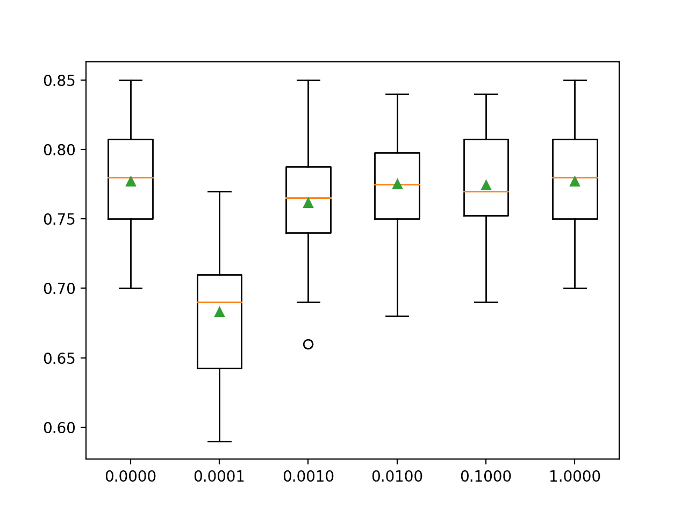

# Python 多项式逻辑回归

> 原文：<https://machinelearningmastery.com/multinomial-logistic-regression-with-python/>

**多项式逻辑回归**是逻辑回归的扩展，增加了对多类分类问题的原生支持。

默认情况下，逻辑回归仅限于两类分类问题。像 one-vs-rest 这样的一些扩展可以允许逻辑回归用于多类分类问题，尽管它们要求首先将分类问题转化为多个二元分类问题。

相反，多项式逻辑回归算法是逻辑回归模型的扩展，其包括将损失函数改变为交叉熵损失，并将概率分布预测为多项式概率分布，以固有地支持多类分类问题。

在本教程中，您将发现如何在 Python 中开发多项式逻辑回归模型。

完成本教程后，您将知道:

*   多项式逻辑回归是多分类逻辑回归的扩展。
*   如何开发和评估多项逻辑回归，并开发一个最终模型，对新数据进行预测。
*   多项式逻辑回归模型中惩罚超参数的调整。

我们开始吧。


尼古拉斯·雷纳克拍摄的 Python 多项式逻辑回归
图片，保留部分权利。

## 教程概述

本教程分为三个部分；它们是:

1.  多项式逻辑回归
2.  评估多项式逻辑回归模型
3.  多项式逻辑回归的调谐惩罚

## 多项式逻辑回归

逻辑回归是一种分类算法。

它适用于具有数字输入变量和具有两个值或类的分类目标变量的数据集。这类问题被称为二元分类问题。

逻辑回归是为两类问题设计的，使用[二项概率分布函数](https://machinelearningmastery.com/discrete-probability-distributions-for-machine-learning/)对目标建模。对于积极的类别或结果，类别标签被映射为 1，对于消极的类别或结果，类别标签被映射为 0。拟合模型预测一个例子属于类别 1 的概率。

默认情况下，逻辑回归不能用于具有两个以上类别标签的分类任务，即所谓的多类别分类。

相反，它需要修改以支持多类分类问题。

一种使逻辑回归适应多类分类问题的流行方法是将多类分类问题分成多个二元分类问题，并在每个子问题上拟合标准逻辑回归模型。这种类型的技术包括[一对一和一对一包装模型](https://machinelearningmastery.com/one-vs-rest-and-one-vs-one-for-multi-class-classification/)。

另一种方法是改变逻辑回归模型，直接支持多类标签的预测。具体来说，就是预测一个输入示例属于每个已知类标签的概率。

定义多类概率的概率分布称为多项式概率分布。适于学习和预测多项式概率分布的逻辑回归模型被称为多项式逻辑回归。同样，我们可以将默认或标准逻辑回归称为二项式逻辑回归。

*   **二项逻辑回归**:预测每个输入示例的二项概率(即两类)的标准逻辑回归。
*   **多项式逻辑回归**:逻辑回归的修改版本，预测每个输入示例的多项式概率(即两个以上的类)。

如果您不熟悉二项式和多项式概率分布，您可能需要阅读教程:

*   [机器学习的离散概率分布](https://machinelearningmastery.com/discrete-probability-distributions-for-machine-learning/)

将逻辑回归从二项式概率更改为多项式概率需要更改用于训练模型的损失函数(例如，将对数损失更改为交叉熵损失)，并将输出从单个概率值更改为每个类别标签的一个概率。

现在我们已经熟悉了多项式逻辑回归，让我们看看如何在 Python 中开发和评估多项式逻辑回归模型。

## 评价多项式逻辑回归模型

在本节中，我们将使用 Sklearn Python 机器学习库开发和评估一个多项式逻辑回归模型。

首先，我们将定义一个合成的多类分类数据集，作为调查的基础。这是一个通用数据集，您可以在以后用自己加载的数据集轻松替换它。

[make_classification()函数](https://Sklearn.org/stable/modules/generated/sklearn.datasets.make_classification.html)可用于生成具有给定行数、列数和类数的数据集。在这种情况下，我们将生成一个包含 1，000 行、10 个输入变量或列以及 3 个类的数据集。

下面的示例生成数据集，并总结了数组的形状以及示例在三个类中的分布。

```py
# test classification dataset
from collections import Counter
from sklearn.datasets import make_classification
# define dataset
X, y = make_classification(n_samples=1000, n_features=10, n_informative=5, n_redundant=5, n_classes=3, random_state=1)
# summarize the dataset
print(X.shape, y.shape)
print(Counter(y))
```

运行该示例确认数据集有 1，000 行和 10 列，正如我们预期的那样，并且这些行在三个类中大致均匀分布，每个类中大约有 334 个示例。

```py
(1000, 10) (1000,)
Counter({1: 334, 2: 334, 0: 332})
```

Sklearn 库中通过[后勤回归类](https://Sklearn.org/stable/modules/generated/sklearn.linear_model.LogisticRegression.html)支持逻辑回归。

通过将“ *multi_class* ”参数设置为“*多项式*”并将“*求解器*”参数设置为支持多项式逻辑回归的求解器，如“ *lbfgs* ”，可以为多项式逻辑回归配置*逻辑回归*类。

```py
...
# define the multinomial logistic regression model
model = LogisticRegression(multi_class='multinomial', solver='lbfgs')
```

多项式逻辑回归模型将使用[交叉熵损失](https://machinelearningmastery.com/cross-entropy-for-machine-learning/)进行拟合，并将预测每个整数编码类别标签的整数值。

现在我们已经熟悉了多项式逻辑回归应用编程接口，我们可以看看如何在我们的合成多类分类数据集上评估多项式逻辑回归模型。

使用[重复分层 k 折交叉验证](https://machinelearningmastery.com/repeated-k-fold-cross-validation-with-python/)来评估分类模型是一个很好的做法。分层确保每个交叉验证文件夹在每个类中的示例分布与整个训练数据集大致相同。

我们将使用 10 倍的三个重复，这是一个很好的默认值，并使用分类精确率来评估模型表现，假设类是平衡的。

下面列出了评估多类分类的多项逻辑回归的完整示例。

```py
# evaluate multinomial logistic regression model
from numpy import mean
from numpy import std
from sklearn.datasets import make_classification
from sklearn.model_selection import cross_val_score
from sklearn.model_selection import RepeatedStratifiedKFold
from sklearn.linear_model import LogisticRegression
# define dataset
X, y = make_classification(n_samples=1000, n_features=10, n_informative=5, n_redundant=5, n_classes=3, random_state=1)
# define the multinomial logistic regression model
model = LogisticRegression(multi_class='multinomial', solver='lbfgs')
# define the model evaluation procedure
cv = RepeatedStratifiedKFold(n_splits=10, n_repeats=3, random_state=1)
# evaluate the model and collect the scores
n_scores = cross_val_score(model, X, y, scoring='accuracy', cv=cv, n_jobs=-1)
# report the model performance
print('Mean Accuracy: %.3f (%.3f)' % (mean(n_scores), std(n_scores)))
```

运行该示例会报告评估过程中所有折叠和重复的平均分类精确率。

**注**:考虑到算法或评估程序的随机性，或数值精确率的差异，您的[结果可能会有所不同](https://machinelearningmastery.com/different-results-each-time-in-machine-learning/)。考虑运行该示例几次，并比较平均结果。

在这种情况下，我们可以看到，在我们的综合分类数据集上，具有默认惩罚的多项式逻辑回归模型实现了大约 68.1%的平均分类精确率。

```py
Mean Accuracy: 0.681 (0.042)
```

我们可能会决定使用多项式逻辑回归模型作为我们的最终模型，并对新数据进行预测。

这可以通过首先在所有可用数据上拟合模型，然后调用 *predict()* 函数对新数据进行预测来实现。

下面的例子演示了如何使用多项式逻辑回归模型对新数据进行预测。

```py
# make a prediction with a multinomial logistic regression model
from sklearn.datasets import make_classification
from sklearn.linear_model import LogisticRegression
# define dataset
X, y = make_classification(n_samples=1000, n_features=10, n_informative=5, n_redundant=5, n_classes=3, random_state=1)
# define the multinomial logistic regression model
model = LogisticRegression(multi_class='multinomial', solver='lbfgs')
# fit the model on the whole dataset
model.fit(X, y)
# define a single row of input data
row = [1.89149379, -0.39847585, 1.63856893, 0.01647165, 1.51892395, -3.52651223, 1.80998823, 0.58810926, -0.02542177, -0.52835426]
# predict the class label
yhat = model.predict([row])
# summarize the predicted class
print('Predicted Class: %d' % yhat[0])
```

运行该示例首先在所有可用数据上拟合模型，然后定义一行数据，提供给模型以进行预测。

在这种情况下，我们可以看到模型为单行数据预测了类“1”。

```py
Predicted Class: 1
```

多项式逻辑回归的一个好处是，它可以预测数据集中所有已知类别标签的校准概率。

这可以通过在模型上调用 *predict_proba()* 函数来实现。

下面的例子演示了如何使用多项式逻辑回归模型来预测一个新例子的多项式概率分布。

```py
# predict probabilities with a multinomial logistic regression model
from sklearn.datasets import make_classification
from sklearn.linear_model import LogisticRegression
# define dataset
X, y = make_classification(n_samples=1000, n_features=10, n_informative=5, n_redundant=5, n_classes=3, random_state=1)
# define the multinomial logistic regression model
model = LogisticRegression(multi_class='multinomial', solver='lbfgs')
# fit the model on the whole dataset
model.fit(X, y)
# define a single row of input data
row = [1.89149379, -0.39847585, 1.63856893, 0.01647165, 1.51892395, -3.52651223, 1.80998823, 0.58810926, -0.02542177, -0.52835426]
# predict a multinomial probability distribution
yhat = model.predict_proba([row])
# summarize the predicted probabilities
print('Predicted Probabilities: %s' % yhat[0])
```

运行该示例首先在所有可用数据上拟合模型，然后定义一行数据，提供给模型以预测类概率。

**注**:考虑到算法或评估程序的随机性，或数值精确率的差异，您的[结果可能会有所不同](https://machinelearningmastery.com/different-results-each-time-in-machine-learning/)。考虑运行该示例几次，并比较平均结果。

在这种情况下，我们可以看到类 1(例如，数组索引被映射到类整数值)具有大约 0.50 的最大预测概率。

```py
Predicted Probabilities: [0.16470456 0.50297138 0.33232406]
```

现在我们已经熟悉了评估和使用多项式逻辑回归模型，让我们探索如何调整模型超参数。

## 多项式逻辑回归的调谐惩罚

用于多项式逻辑回归的一个重要超参数是惩罚项。

该术语对模型施加压力，要求其寻求更小的模型权重。这是通过将模型系数的加权和添加到损失函数中来实现的，鼓励模型在拟合模型时减小权重的大小以及误差。

一种流行的惩罚是 L2 惩罚，它将平方系数的(加权)和加到损失函数上。可以使用系数加权，将惩罚的强度从完全惩罚降低到非常轻微的惩罚。

默认情况下，*物流配送*类使用 L2 惩罚，权重系数设置为 1.0。处罚类型可以通过“*处罚*”参数设置，值为“ *l1* ”、“ *l2* ”、“ *elasticnet* ”(例如两者都有)，尽管并非所有解算器都支持所有处罚类型。惩罚中系数的权重可以通过“ *C* 参数设置。

```py
...
# define the multinomial logistic regression model with a default penalty
LogisticRegression(multi_class='multinomial', solver='lbfgs', penalty='l2', C=1.0)
```

惩罚的权重实际上是反向权重，也许惩罚= 1–c

从文档中:

> C : float，默认值=1.0
> 正则化强度的倒数；必须是正浮动。像在支持向量机中一样，较小的值指定更强的正则化。

这意味着接近 1.0 的值表示很小的损失，接近 0 的值表示很大的损失。C 值为 1.0 可能表示没有任何惩罚。

*   **C 接近 1.0** :轻罚。
*   **C 接近 0.0** :强罚。

通过将“*惩罚*”参数设置为字符串“*无*，可以禁用惩罚。

```py
...
# define the multinomial logistic regression model without a penalty
LogisticRegression(multi_class='multinomial', solver='lbfgs', penalty='none')
```

现在我们已经熟悉了惩罚，让我们看看我们如何探索不同的惩罚值对多项式逻辑回归模型表现的影响。

通常在对数尺度上测试惩罚值，以便快速发现适合模型的惩罚尺度。一旦找到，在这个尺度上进一步调整可能是有益的。

除了无惩罚或 0.0 之外，我们还将探讨对数标度上加权值在 0.0001 到 1.0 之间的 L2 惩罚。

下面列出了评估多项逻辑回归的 L2 罚值的完整示例。

```py
# tune regularization for multinomial logistic regression
from numpy import mean
from numpy import std
from sklearn.datasets import make_classification
from sklearn.model_selection import cross_val_score
from sklearn.model_selection import RepeatedStratifiedKFold
from sklearn.linear_model import LogisticRegression
from matplotlib import pyplot

# get the dataset
def get_dataset():
	X, y = make_classification(n_samples=1000, n_features=20, n_informative=15, n_redundant=5, random_state=1, n_classes=3)
	return X, y

# get a list of models to evaluate
def get_models():
	models = dict()
	for p in [0.0, 0.0001, 0.001, 0.01, 0.1, 1.0]:
		# create name for model
		key = '%.4f' % p
		# turn off penalty in some cases
		if p == 0.0:
			# no penalty in this case
			models[key] = LogisticRegression(multi_class='multinomial', solver='lbfgs', penalty='none')
		else:
			models[key] = LogisticRegression(multi_class='multinomial', solver='lbfgs', penalty='l2', C=p)
	return models

# evaluate a give model using cross-validation
def evaluate_model(model, X, y):
	# define the evaluation procedure
	cv = RepeatedStratifiedKFold(n_splits=10, n_repeats=3, random_state=1)
	# evaluate the model
	scores = cross_val_score(model, X, y, scoring='accuracy', cv=cv, n_jobs=-1)
	return scores

# define dataset
X, y = get_dataset()
# get the models to evaluate
models = get_models()
# evaluate the models and store results
results, names = list(), list()
for name, model in models.items():
	# evaluate the model and collect the scores
	scores = evaluate_model(model, X, y)
	# store the results
	results.append(scores)
	names.append(name)
	# summarize progress along the way
	print('>%s %.3f (%.3f)' % (name, mean(scores), std(scores)))
# plot model performance for comparison
pyplot.boxplot(results, labels=names, showmeans=True)
pyplot.show()
```

运行该示例会报告沿途每个配置的平均分类精确率。

**注**:考虑到算法或评估程序的随机性，或数值精确率的差异，您的[结果可能会有所不同](https://machinelearningmastery.com/different-results-each-time-in-machine-learning/)。考虑运行该示例几次，并比较平均结果。

在这种情况下，我们可以看到，C 值为 1.0 的最佳分数约为 77.7%，这与不使用达到相同分数的惩罚相同。

```py
>0.0000 0.777 (0.037)
>0.0001 0.683 (0.049)
>0.0010 0.762 (0.044)
>0.0100 0.775 (0.040)
>0.1000 0.774 (0.038)
>1.0000 0.777 (0.037)
```

为每种配置的准确度分数创建了一个方框图和触须图，所有图都以相同的比例并排显示在图形上，以便直接比较。

在这种情况下，我们可以看到，我们对这个数据集使用的惩罚越大(即 C 值越小)，模型的表现就越差。



多项逻辑回归的 L2 罚结构与精确度的盒须图

## 进一步阅读

如果您想更深入地了解这个主题，本节将提供更多资源。

### 相关教程

*   [机器学习逻辑回归教程](https://machinelearningmastery.com/logistic-regression-tutorial-for-machine-learning/)
*   [机器学习的逻辑回归](https://machinelearningmastery.com/logistic-regression-for-machine-learning/)
*   [带最大似然估计的逻辑回归入门](https://machinelearningmastery.com/logistic-regression-with-maximum-likelihood-estimation/)
*   [如何在 Python 中从头开始实现逻辑回归](https://machinelearningmastery.com/implement-logistic-regression-stochastic-gradient-descent-scratch-python/)
*   [不平衡分类的成本敏感逻辑回归](https://machinelearningmastery.com/cost-sensitive-logistic-regression/)

### 蜜蜂

*   [sklearn . datasets . make _ classification API](https://Sklearn.org/stable/modules/generated/sklearn.datasets.make_classification.html)。
*   [sklearn.linear_model。物流配送应用编程接口](https://Sklearn.org/stable/modules/generated/sklearn.linear_model.LogisticRegression.html)。

### 文章

*   [逻辑回归，维基百科](https://en.wikipedia.org/wiki/Logistic_regression)。
*   [多项式逻辑回归，维基百科](https://en.wikipedia.org/wiki/Multinomial_logistic_regression)。

## 摘要

在本教程中，您发现了如何在 Python 中开发多项式逻辑回归模型。

具体来说，您了解到:

*   多项式逻辑回归是多分类逻辑回归的扩展。
*   如何开发和评估多项逻辑回归，并开发一个最终模型，对新数据进行预测。
*   多项式逻辑回归模型中惩罚超参数的调整。

**你有什么问题吗？**
在下面的评论中提问，我会尽力回答。