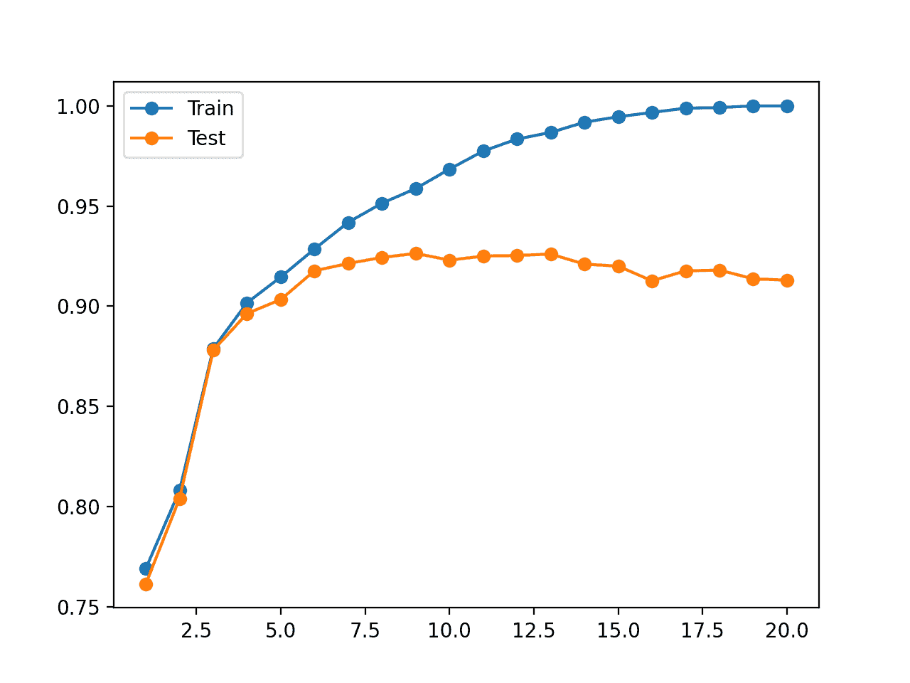
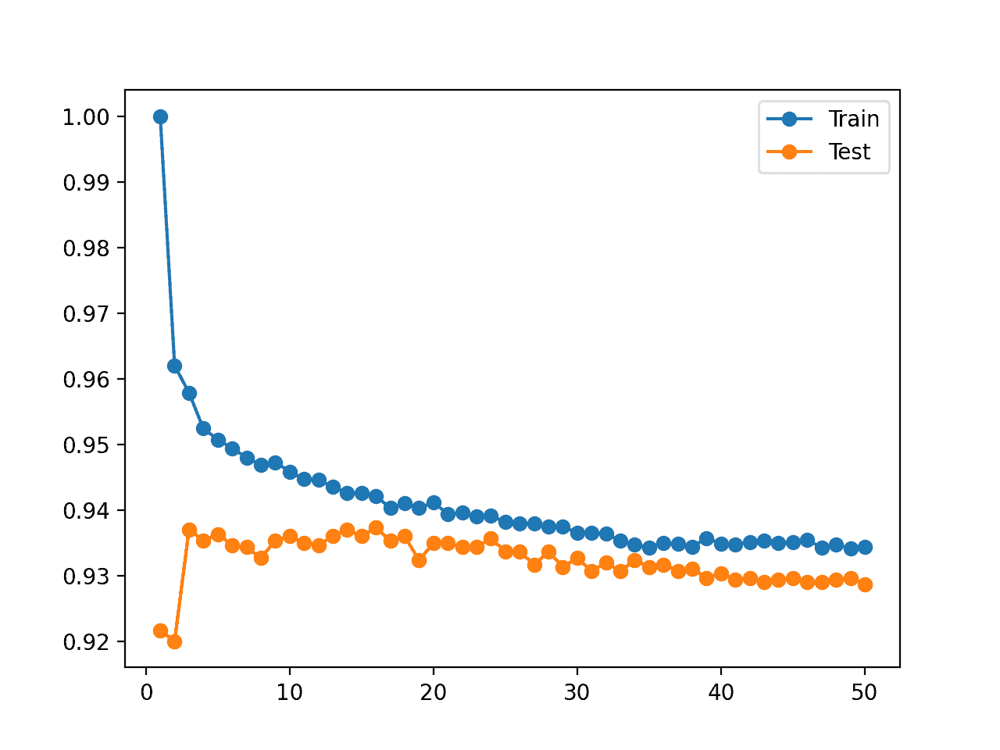

# 如何在 Scikit-Learn 中识别过拟合机器学习模型

> 原文：<https://machinelearningmastery.com/overfitting-machine-learning-models/>

最后更新于 2020 年 11 月 27 日

**过拟合**是预测模型表现不佳的常见解释。

对学习动态的分析可以帮助识别模型是否过度训练了训练数据集，并且可以建议使用替代配置来获得更好的预测表现。

对于像神经网络这样的增量学习算法来说，对学习动态进行分析是很简单的，但是不太清楚我们如何对其他不增量学习的算法进行同样的分析，例如决策树、k 近邻以及 scikit-learn 机器学习库中的其他通用算法。

在本教程中，您将发现如何在 Python 中识别机器学习模型的过拟合。

完成本教程后，您将知道:

*   过拟合是预测模型泛化表现差的一个可能原因。
*   可以通过改变关键模型超参数来分析机器学习模型的过拟合。
*   虽然过拟合是一个有用的分析工具，但它不能与模型选择混淆。

我们开始吧。


用 Scikit 识别过度拟合的机器学习模型-学习
图片由[邦妮·莫兰](https://www.flickr.com/photos/icetsarina/24082660497/)提供，保留部分权利。

## 教程概述

本教程分为五个部分；它们是:

1.  什么是过度拟合
2.  如何执行过度拟合分析
3.  Scikit-Learn 中的过度拟合示例
4.  科学知识学习中过度拟合的反例
5.  将过拟合分析与模型选择分开

## 什么是过度拟合

过拟合指的是用于预测建模的机器学习算法的有害行为。

在这种情况下，模型在训练数据集上的表现得到了提高，但代价是在训练期间看不到的数据(如保持测试数据集或新数据)上的表现更差。

我们可以通过首先在训练数据集上评估模型，然后在保持测试数据集上评估相同的模型，来识别机器学习模型是否过度。

如果模型在训练数据集上的表现明显优于在测试数据集上的表现，则模型可能过度填充了训练数据集。

我们关心过拟合，因为这是模型“T0”泛化能力差的常见原因，用高“*泛化误差*来衡量。”这是模型在对新数据进行预测时产生的误差。

这意味着，如果我们的模型表现不佳，可能是因为它过度了。

但是，如果一个模型在训练集上的表现比测试集上的表现“T0”明显更好，这意味着什么呢？

例如，模型在训练集上比在测试集上有更好的表现是常见的，也可能是正常的。

因此，我们可以对数据集执行算法分析，以更好地揭示过拟合行为。

## 如何执行过度拟合分析

过拟合分析是一种探索特定模型如何以及何时对特定数据集进行过拟合的方法。

它是一个工具，可以帮助您了解更多关于机器学习模型的学习动态。

这可以通过在单次运行过程中检查模型行为来实现，例如逐步适应训练数据集的神经网络算法。

在训练过程中，可以在每个点计算模型在列车和测试集上的表现图，并创建图。该图通常称为学习曲线图，显示了训练集上模型表现的一条曲线和每次学习增量的测试集的一条曲线。

如果您想了解有关增量学习算法的学习曲线的更多信息，请参阅教程:

*   [如何利用学习曲线诊断机器学习模型表现](https://machinelearningmastery.com/learning-curves-for-diagnosing-machine-learning-model-performance/)

在学习曲线图上可以看到过度拟合的常见模式，其中训练数据集上的模型表现持续改善(例如，损失或误差持续下降或精确率持续上升)，测试或验证集上的表现改善到一定程度，然后开始变差。

如果观察到这种模式，那么训练应该停止在增量学习算法的测试或验证集表现变差的地方

这对于像神经网络那样增量学习的算法是有意义的，但是其他算法呢？

*   **如何在 scikit-learn 中对机器学习算法进行过拟合分析？**

一种对不增量学习的算法执行过拟合分析的方法是通过改变关键模型超参数并评估每个配置的训练和测试集上的模型表现。

为了说明这一点，让我们在下一节探讨一个分析过拟合模型的案例。

## Scikit-Learn 中的过度拟合示例

在本节中，我们将看一个将机器学习模型过度拟合到训练数据集的例子。

首先，让我们定义一个综合分类数据集。

我们将使用 [make_classification()函数](https://scikit-learn.org/stable/modules/generated/sklearn.datasets.make_classification.html)定义一个包含 10，000 个示例(行)和 20 个输入特征(列)的二进制(两类)分类预测问题。

下面的示例创建数据集并总结输入和输出组件的形状。

```py
# synthetic classification dataset
from sklearn.datasets import make_classification
# define dataset
X, y = make_classification(n_samples=10000, n_features=20, n_informative=5, n_redundant=15, random_state=1)
# summarize the dataset
print(X.shape, y.shape)
```

运行该示例会创建数据集并报告形状，这证实了我们的预期。

```py
(10000, 20) (10000,)
```

接下来，我们需要将数据集分割成训练和测试子集。

我们将使用 [train_test_split()函数](https://scikit-learn.org/stable/modules/generated/sklearn.model_selection.train_test_split.html)，将数据分成 70%用于训练模型，30%用于评估模型。

```py
# split a dataset into train and test sets
from sklearn.datasets import make_classification
from sklearn.model_selection import train_test_split
# create dataset
X, y = make_classification(n_samples=10000, n_features=20, n_informative=5, n_redundant=15, random_state=1)
# split into train test sets
X_train, X_test, y_train, y_test = train_test_split(X, y, test_size=0.3)
# summarize the shape of the train and test sets
print(X_train.shape, X_test.shape, y_train.shape, y_test.shape)
```

运行该示例会分割数据集，我们可以确认我们有 7000 个示例用于训练，3000 个示例用于评估模型。

```py
(7000, 20) (3000, 20) (7000,) (3000,)
```

接下来，我们可以探索一种超拟合训练数据集的机器学习模型。

我们将通过[决策树分类器](https://scikit-learn.org/stable/modules/generated/sklearn.tree.DecisionTreeClassifier.html)使用决策树，并用“*最大深度*参数测试不同的树深度。

浅层决策树(例如，几个级别)通常不会过度拟合，但表现较差(高偏差、低方差)。而深树(例如，许多级别)通常会过度填充并具有良好的表现(低偏差、高方差)。理想的树不是浅到技能低，也不是深到覆盖训练数据集。

我们评估决策树深度从 1 到 20。

```py
...
# define the tree depths to evaluate
values = [i for i in range(1, 21)]
```

我们将枚举每个树的深度，在训练数据集上用给定的深度拟合一棵树，然后在训练集和测试集上评估该树。

预期随着树的深度增加，训练和测试的表现将提高到一定程度，随着树变得太深，它将开始过度填充训练数据集，代价是保持测试集的表现变差。

```py
...
# evaluate a decision tree for each depth
for i in values:
	# configure the model
	model = DecisionTreeClassifier(max_depth=i)
	# fit model on the training dataset
	model.fit(X_train, y_train)
	# evaluate on the train dataset
	train_yhat = model.predict(X_train)
	train_acc = accuracy_score(y_train, train_yhat)
	train_scores.append(train_acc)
	# evaluate on the test dataset
	test_yhat = model.predict(X_test)
	test_acc = accuracy_score(y_test, test_yhat)
	test_scores.append(test_acc)
	# summarize progress
	print('>%d, train: %.3f, test: %.3f' % (i, train_acc, test_acc))
```

在运行结束时，我们将在列车和测试集上绘制所有模型准确度分数，以便进行视觉比较。

```py
...
# plot of train and test scores vs tree depth
pyplot.plot(values, train_scores, '-o', label='Train')
pyplot.plot(values, test_scores, '-o', label='Test')
pyplot.legend()
pyplot.show()
```

综上所述，下面列出了在合成二进制分类数据集上探索不同树深度的完整示例。

```py
# evaluate decision tree performance on train and test sets with different tree depths
from sklearn.datasets import make_classification
from sklearn.model_selection import train_test_split
from sklearn.metrics import accuracy_score
from sklearn.tree import DecisionTreeClassifier
from matplotlib import pyplot
# create dataset
X, y = make_classification(n_samples=10000, n_features=20, n_informative=5, n_redundant=15, random_state=1)
# split into train test sets
X_train, X_test, y_train, y_test = train_test_split(X, y, test_size=0.3)
# define lists to collect scores
train_scores, test_scores = list(), list()
# define the tree depths to evaluate
values = [i for i in range(1, 21)]
# evaluate a decision tree for each depth
for i in values:
	# configure the model
	model = DecisionTreeClassifier(max_depth=i)
	# fit model on the training dataset
	model.fit(X_train, y_train)
	# evaluate on the train dataset
	train_yhat = model.predict(X_train)
	train_acc = accuracy_score(y_train, train_yhat)
	train_scores.append(train_acc)
	# evaluate on the test dataset
	test_yhat = model.predict(X_test)
	test_acc = accuracy_score(y_test, test_yhat)
	test_scores.append(test_acc)
	# summarize progress
	print('>%d, train: %.3f, test: %.3f' % (i, train_acc, test_acc))
# plot of train and test scores vs tree depth
pyplot.plot(values, train_scores, '-o', label='Train')
pyplot.plot(values, test_scores, '-o', label='Test')
pyplot.legend()
pyplot.show()
```

运行该示例适合并评估列车上的决策树和每个树深度的测试集，并报告准确性分数。

**注**:考虑到算法或评估程序的随机性，或数值精确率的差异，您的[结果可能会有所不同](https://machinelearningmastery.com/different-results-each-time-in-machine-learning/)。考虑运行该示例几次，并比较平均结果。

在这种情况下，我们可以看到一种趋势，即随着树的深度达到 19-20 层深度附近的一个点，训练数据集的精确率会提高，在这个点上树与训练数据集完全匹配。

我们还可以看到，测试集上的准确性随着树的深度而提高，直到大约八到九个级别的深度，之后准确性随着树深度的每次增加而开始变差。

这正是我们期望在过度拟合模式中看到的。

在模型开始过度填充训练数据集之前，我们会选择 8 或 9 的树深度。

```py
>1, train: 0.769, test: 0.761
>2, train: 0.808, test: 0.804
>3, train: 0.879, test: 0.878
>4, train: 0.902, test: 0.896
>5, train: 0.915, test: 0.903
>6, train: 0.929, test: 0.918
>7, train: 0.942, test: 0.921
>8, train: 0.951, test: 0.924
>9, train: 0.959, test: 0.926
>10, train: 0.968, test: 0.923
>11, train: 0.977, test: 0.925
>12, train: 0.983, test: 0.925
>13, train: 0.987, test: 0.926
>14, train: 0.992, test: 0.921
>15, train: 0.995, test: 0.920
>16, train: 0.997, test: 0.913
>17, train: 0.999, test: 0.918
>18, train: 0.999, test: 0.918
>19, train: 1.000, test: 0.914
>20, train: 1.000, test: 0.913
```

还创建了一个图形，显示了列车上模型精确率的线图和具有不同树深的测试集。

该图清楚地表明，在早期阶段增加树的深度会导致训练集和测试集的相应改进。

这种情况一直持续到大约 10 个级别的深度，之后该模型被显示为过度填充训练数据集，代价是保持数据集的表现更差。



不同树深的训练和测试数据集上决策树精确率的线图

这个分析很有意思。它显示了为什么当“ *max_depth* ”设置为大值时，模型的保持测试集表现更差。

但这不是必需的。

我们可以使用网格搜索轻松选择“ *max_depth* ”，而无需分析为什么有些值会导致更好的表现，而有些值会导致更差的表现。

事实上，在下一节中，我们将展示这种分析在哪些地方会产生误导。

## 科学知识学习中过度拟合的反例

有时，我们可能会对机器学习模型行为进行分析，并被结果所欺骗。

一个很好的例子是改变 k 近邻算法的邻居数量，我们可以使用 [KNeighborsClassifier](https://scikit-learn.org/stable/modules/generated/sklearn.neighbors.KNeighborsClassifier.html) 类实现，并通过“*n _ neights*参数进行配置。

让我们暂时忘记 KNN 是如何工作的。

我们可以对 KNN 算法执行与上一节中对决策树所做的分析相同的分析，并查看我们的模型对于不同的配置值是否过度。在这种情况下，我们将改变邻居的数量，从 1 到 50，以获得更多的效果。

下面列出了完整的示例。

```py
# evaluate knn performance on train and test sets with different numbers of neighbors
from sklearn.datasets import make_classification
from sklearn.model_selection import train_test_split
from sklearn.metrics import accuracy_score
from sklearn.neighbors import KNeighborsClassifier
from matplotlib import pyplot
# create dataset
X, y = make_classification(n_samples=10000, n_features=20, n_informative=5, n_redundant=15, random_state=1)
# split into train test sets
X_train, X_test, y_train, y_test = train_test_split(X, y, test_size=0.3)
# define lists to collect scores
train_scores, test_scores = list(), list()
# define the tree depths to evaluate
values = [i for i in range(1, 51)]
# evaluate a decision tree for each depth
for i in values:
	# configure the model
	model = KNeighborsClassifier(n_neighbors=i)
	# fit model on the training dataset
	model.fit(X_train, y_train)
	# evaluate on the train dataset
	train_yhat = model.predict(X_train)
	train_acc = accuracy_score(y_train, train_yhat)
	train_scores.append(train_acc)
	# evaluate on the test dataset
	test_yhat = model.predict(X_test)
	test_acc = accuracy_score(y_test, test_yhat)
	test_scores.append(test_acc)
	# summarize progress
	print('>%d, train: %.3f, test: %.3f' % (i, train_acc, test_acc))
# plot of train and test scores vs number of neighbors
pyplot.plot(values, train_scores, '-o', label='Train')
pyplot.plot(values, test_scores, '-o', label='Test')
pyplot.legend()
pyplot.show()
```

运行该示例适合并评估列车上的 KNN 模型和每个邻居的测试集，并报告准确性分数。

**注**:考虑到算法或评估程序的随机性，或数值精确率的差异，您的[结果可能会有所不同](https://machinelearningmastery.com/different-results-each-time-in-machine-learning/)。考虑运行该示例几次，并比较平均结果。

回想一下，我们正在寻找一种模式，在这种模式下，测试集的表现会提高，然后开始变得更差，而训练集的表现会继续提高。

我们看不到这种模式。

相反，我们看到训练数据集的精确率从完美的精确率开始，几乎随着邻居数量的每一次增加而下降。

我们还看到，模型在保持测试中的表现提高到大约五个邻居的值，保持水平，并在此之后开始下降趋势。

```py
>1, train: 1.000, test: 0.919
>2, train: 0.965, test: 0.916
>3, train: 0.962, test: 0.932
>4, train: 0.957, test: 0.932
>5, train: 0.954, test: 0.935
>6, train: 0.953, test: 0.934
>7, train: 0.952, test: 0.932
>8, train: 0.951, test: 0.933
>9, train: 0.949, test: 0.933
>10, train: 0.950, test: 0.935
>11, train: 0.947, test: 0.934
>12, train: 0.947, test: 0.933
>13, train: 0.945, test: 0.932
>14, train: 0.945, test: 0.932
>15, train: 0.944, test: 0.932
>16, train: 0.944, test: 0.934
>17, train: 0.943, test: 0.932
>18, train: 0.943, test: 0.935
>19, train: 0.942, test: 0.933
>20, train: 0.943, test: 0.935
>21, train: 0.942, test: 0.933
>22, train: 0.943, test: 0.933
>23, train: 0.941, test: 0.932
>24, train: 0.942, test: 0.932
>25, train: 0.942, test: 0.931
>26, train: 0.941, test: 0.930
>27, train: 0.941, test: 0.932
>28, train: 0.939, test: 0.932
>29, train: 0.938, test: 0.931
>30, train: 0.938, test: 0.931
>31, train: 0.937, test: 0.931
>32, train: 0.938, test: 0.931
>33, train: 0.937, test: 0.930
>34, train: 0.938, test: 0.931
>35, train: 0.937, test: 0.930
>36, train: 0.937, test: 0.928
>37, train: 0.936, test: 0.930
>38, train: 0.937, test: 0.930
>39, train: 0.935, test: 0.929
>40, train: 0.936, test: 0.929
>41, train: 0.936, test: 0.928
>42, train: 0.936, test: 0.929
>43, train: 0.936, test: 0.930
>44, train: 0.935, test: 0.929
>45, train: 0.935, test: 0.929
>46, train: 0.934, test: 0.929
>47, train: 0.935, test: 0.929
>48, train: 0.934, test: 0.929
>49, train: 0.934, test: 0.929
>50, train: 0.934, test: 0.929
```

还创建了一个图形，显示了列车上模型精确率的线图和具有不同邻居数量的测试集。

情节使情况变得更清楚了。看起来训练集的线图正在下降以与测试集的线收敛。事实上，这正是正在发生的事情。



不同邻居数的训练和测试数据集上 KNN 精确率的线图

现在，回想一下 KNN 是如何工作的。

“*模型*”实际上只是存储在高效数据结构中的整个训练数据集。训练数据集中“*模型*”的技能应该是 100%，任何低于这个的都是不可原谅的。

事实上，这一论点适用于任何机器学习算法，并切中了初学者过度拟合的核心困惑。

## 将过拟合分析与模型选择分开

过度拟合可能是预测模型表现不佳的一个原因。

创建显示模型在训练和测试数据集上的学习动态的学习曲线是一种有助于学习更多关于数据集上的模型的分析。

**但过拟合不应与模型选择混淆。**

我们根据其样本外表现选择预测模型或模型配置。也就是说，它在训练中没有看到的新数据上的表现。

我们这样做的原因是，在预测建模中，我们主要对能够做出巧妙预测的模型感兴趣。我们希望这个模型能够在给定时间和计算资源的情况下做出最好的预测。

这可能意味着我们选择一个看起来已经覆盖了训练数据集的模型。在这种情况下，过度分析可能会产生误导。

这也可能意味着模型在训练数据集上的表现很差或很糟糕。

一般来说，如果我们在模型选择中关心模型在训练数据集上的表现，那么我们将期望模型在训练数据集上具有完美的表现。这是我们现有的数据；我们不应该容忍任何不足。

正如我们在上面的 KNN 示例中看到的那样，我们可以通过直接存储训练集并使用一个邻居返回预测来实现训练集的完美表现，但代价是任何新数据的表现都很差。

*   **在训练数据集和测试数据集上都表现良好的模型不是更好的模型吗？**

也许吧。但是，也许不是。

这个论点是基于这样的想法，即在训练集和测试集上都表现良好的模型对潜在问题有更好的理解。

一个推论是，在测试集上表现良好但在训练集上表现不佳的模型是幸运的(例如统计侥幸)，而在训练集上表现良好但在测试集上表现不佳的模型是过度匹配的。

我相信这是初学者的症结所在，他们经常问如何为他们的 scikit-learn 机器学习模型修复过度拟合。

令人担心的是，模型必须在列车和测试集上都表现良好，否则，它们就有麻烦了。

**情况并非如此**。

训练集的表现与模型选择无关。只有在选择预测模型时，您才必须关注样本外表现。

## 进一步阅读

如果您想更深入地了解这个主题，本节将提供更多资源。

### 教程

*   [如何避免深度学习神经网络中的过拟合](https://machinelearningmastery.com/introduction-to-regularization-to-reduce-overfitting-and-improve-generalization-error/)
*   [用机器学习算法进行过拟合和欠拟合](https://machinelearningmastery.com/overfitting-and-underfitting-with-machine-learning-algorithms/)
*   [如何利用学习曲线诊断机器学习模型表现](https://machinelearningmastery.com/learning-curves-for-diagnosing-machine-learning-model-performance/)

### 蜜蜂

*   [sklearn . datasets . make _ classification API](https://scikit-learn.org/stable/modules/generated/sklearn.datasets.make_classification.html)。
*   [sklearn . model _ selection . train _ test _ split API](https://scikit-learn.org/stable/modules/generated/sklearn.model_selection.train_test_split.html)。
*   [硬化. tree .决策树分类器 API](https://scikit-learn.org/stable/modules/generated/sklearn.tree.DecisionTreeClassifier.html) 。
*   [sklearn . neighborsclassifier API](https://scikit-learn.org/stable/modules/generated/sklearn.neighbors.KNeighborsClassifier.html)。

### 文章

*   [过拟合，维基百科](https://en.wikipedia.org/wiki/Overfitting)。

## 摘要

在本教程中，您发现了如何在 Python 中识别机器学习模型的过拟合。

具体来说，您了解到:

*   过拟合是预测模型泛化表现差的一个可能原因。
*   可以通过改变关键模型超参数来分析机器学习模型的过拟合。
*   虽然过拟合是一个有用的分析工具，但它不能与模型选择混淆。

**你有什么问题吗？**
在下面的评论中提问，我会尽力回答。