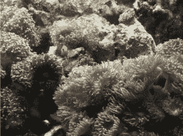
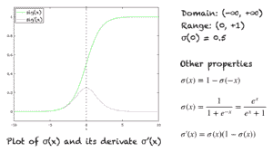

# 乙状结肠功能的温和介绍

> 原文：<https://machinelearningmastery.com/a-gentle-introduction-to-sigmoid-function/>

无论您是自己实现神经网络，还是使用内置库进行神经网络学习，理解 sigmoid 函数的意义都是至关重要的。sigmoid 函数是理解神经网络如何学习复杂问题的关键。这一功能也是发现其他功能的基础，这些功能为深度学习架构中的监督学习提供了高效且良好的解决方案。

在本教程中，您将从神经网络的示例中发现 sigmoid 函数及其在学习中的作用。

完成本教程后，您将知道:

*   sigmoid 函数
*   线性与非线性分离性
*   如果使用 sigmoid 单元，为什么神经网络可以做出复杂的决策边界

我们开始吧。

乙状结肠功能简介。梅赫林·赛义德摄，版权所有。

## **教程概述**

本教程分为 3 个部分；它们是:

1.  sigmoid 函数
    1.  sigmoid 函数及其性质
2.  线性与非线性可分离问题
3.  在神经网络中使用 sigmoid 作为激活函数

## **乙状结肠功能**

sigmoid 函数是逻辑函数的一种特殊形式，通常用σ(x)或 sig(x)表示。它由下式给出:

σ(x) = 1/(1+exp(-x))

## **Sigmoid 函数的性质和恒等式**

sigmoid 函数的图形是一条 S 形曲线，如下图中的绿线所示。该图还以粉红色显示了导数的图形。右边显示了导数的表达式以及一些重要的性质。

sigmoid 函数及其导数的图形。还显示了一些重要特性。

其他一些属性包括:

1.  域:(-∞，+∞)
2.  范围:(0，+1)
3.  σ(0) = 0.5
4.  函数是单调递增的。
5.  函数在任何地方都是连续的。
6.  函数在其定义域内处处可微。
7.  从数值上来说，在一个小的数字范围内计算这个函数的值就足够了，例如，[-10，+10]。对于小于-10 的值，该函数的值几乎为零。对于大于 10 的值，该函数的值几乎为 1。

## **乙状结肠挤压功能**

sigmoid 函数也被称为挤压函数，因为它的定义域是所有实数的集合，范围是(0，1)。因此，如果函数的输入是非常大的负数或非常大的正数，  输出总是在 0 和 1 之间。-∞和+∞之间的任何数字也是如此。

## **Sigmoid 作为神经网络中的激活函数**

sigmoid 函数用作神经网络中的激活函数。为了回顾什么是激活函数，下图显示了激活函数在神经网络的一层中的作用。输入的加权和通过激活函数传递，该输出作为下一层的输入。

神经网络中的 sigmoid 单元

当神经元的激活函数是 sigmoid 函数时，可以保证该单元的输出总是在 0 和 1 之间。此外，由于 sigmoid 是非线性函数，该单元的输出将是输入加权和的非线性函数。这种采用乙状结肠功能作为激活函数的神经元被称为乙状结肠单位。

## **线性与非线性可分性？**

假设我们有一个典型的分类问题，其中我们在空间中有一组点，每个点都被分配了一个类标签。如果一条直线(或者 n 维空间中的超平面)可以划分这两类，那么我们就有了一个线性可分问题。另一方面，如果一条直线不足以划分这两个类，那么我们就有一个非线性可分问题。下图显示了二维空间中的数据。每个点都分配有红色或蓝色的类别标签。左图显示了一个线性可分的问题，需要一个线性边界来区分这两个类。右图显示了一个非线性可分问题，其中需要一个非线性决策边界。

Linera 与非线性可分问题

对于三维空间，线性决策边界可以通过平面方程来描述。对于 n 维空间，线性决策边界由超平面方程描述。

## **为什么 Sigmoid 函数在神经网络中很重要？**

如果我们在神经网络中使用线性激活函数，那么这个模型只能学习线性可分的问题。然而，通过仅添加一个隐藏层和隐藏层中的 sigmoid 激活函数，神经网络可以容易地学习非线性可分问题。使用非线性函数会产生非线性边界，因此，sigmoid 函数可用于学习复杂决策函数的神经网络。

在神经网络中，唯一可以用作激活函数的非线性函数是单调递增的。例如，sin(x)或 cos(x)不能用作激活函数。此外，激活函数应该在实数空间的任何地方都被定义，并且应该在任何地方都是连续的。该函数还要求在整个实数空间上是可微的。

典型地，反向传播算法使用梯度下降来学习神经网络的权重。为了导出该算法，需要激活函数的导数。

sigmoid 函数在任何地方都是单调的、连续的和可微的，加上它的导数可以用它自己来表示的特性，使得在使用反向传播算法时，很容易推导出用于学习神经网络中的权重的更新方程。

## **延伸**

本节列出了一些您可能希望探索的扩展教程的想法。

*   其他非线性激活函数，例如 tanh 函数
*   [整流线性单元的温和介绍](https://machinelearningmastery.com/rectified-linear-activation-function-for-deep-learning-neural-networks/)
*   深度学习

如果你探索这些扩展，我很想知道。在下面的评论中发表你的发现。

## **进一步阅读**

如果您想更深入地了解这个主题，本节将提供更多资源。

### **教程**

*   [作用中的微积分:神经网络](https://machinelearningmastery.com/calculus-in-action-neural-networks/)
*   [缓步介绍梯度下降程序](https://machinelearningmastery.com/a-gentle-introduction-to-gradient-descent-procedure)
*   [神经网络是函数近似算法](https://machinelearningmastery.com/neural-networks-are-function-approximators/)
*   [如何选择深度学习的激活函数](https://machinelearningmastery.com/choose-an-activation-function-for-deep-learning/)

### **资源**

*   杰森·布朗利关于机器学习微积分书籍的优秀资源

### **书籍**

*   [模式识别和机器学习](https://www.amazon.com/Pattern-Recognition-Learning-Information-Statistics/dp/0387310738)克里斯托弗·m·毕肖普著。
*   [深度学习](https://www.amazon.com/Deep-Learning-Adaptive-Computation-Machine/dp/0262035618/ref=as_li_ss_tl?dchild=1&keywords=deep+learning&qid=1606171954&s=books&sr=1-1&linkCode=sl1&tag=inspiredalgor-20&linkId=0a0c58945768a65548b639df6d1a98ed&language=en_US)作者:伊恩·古德费勒，约书亚·贝吉奥，亚伦·库维尔。
*   [托马斯微积分](https://amzn.to/35Yeolv)，第 14 版，2017。(根据乔治·托马斯的原著改编，乔尔·哈斯、克里斯托弗·海尔、莫里斯·韦尔修订)

## **总结**

在本教程中，您发现了什么是 sigmoid 函数。具体来说，您了解到:

*   sigmoid 函数及其性质
*   线性与非线性决策边界
*   为什么在隐藏层添加 sigmoid 函数可以使神经网络学习复杂的非线性边界

## **你有什么问题吗？**

请在下面的评论中提问，我会尽力回答