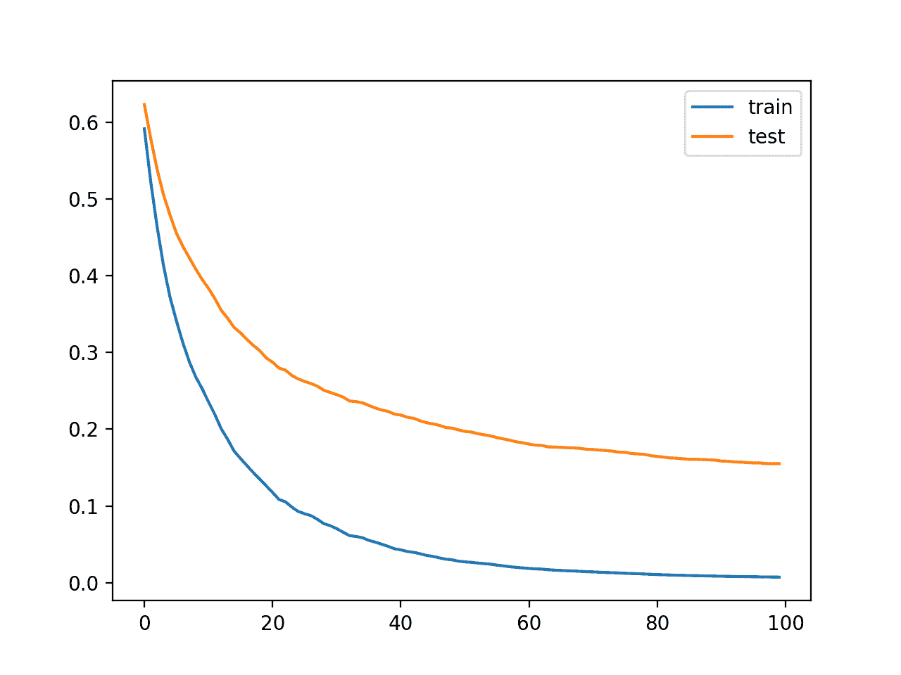
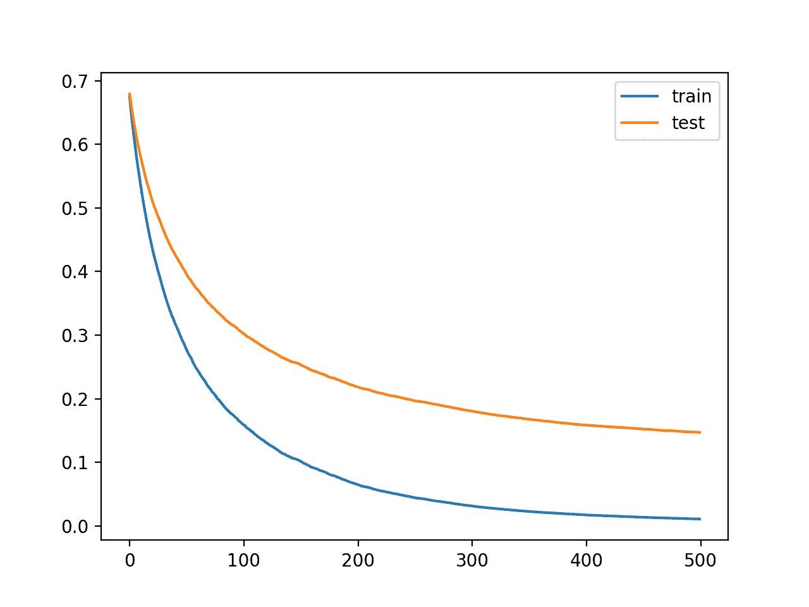
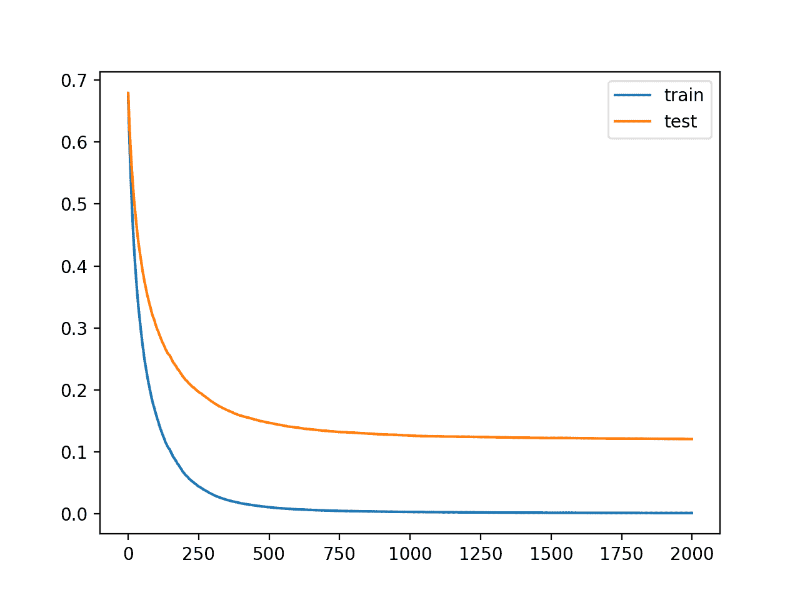

# 通过学习曲线调整 XGBoost 表现

> 原文：<https://machinelearningmastery.com/tune-xgboost-performance-with-learning-curves/>

XGBoost 是梯度增强集成算法的一个强大而有效的实现。

配置 XGBoost 模型的超参数可能具有挑战性，这通常会导致使用既耗时又计算成本高的大型网格搜索实验。

配置 **XGBoost** 模型的另一种方法是在训练期间评估算法每次迭代的模型表现，并将结果绘制为**学习曲线**。这些学习曲线提供了一种诊断工具，可以对其进行解释，并建议对模型超参数进行特定的更改，从而提高预测表现。

在本教程中，您将发现如何在 Python 中绘制和解释 XGBoost 模型的学习曲线。

完成本教程后，您将知道:

*   学习曲线为理解像 XGBoost 这样的监督学习模型的训练动态提供了一个有用的诊断工具。
*   如何配置 XGBoost 来评估每次迭代的数据集，并将结果绘制为学习曲线。
*   如何解读和使用学习曲线图提高 XGBoost 模型表现？

我们开始吧。


通过学习曲线调整 XGBoost 表现
图片由[伯纳德·斯拉格提供。新西兰](https://www.flickr.com/photos/volvob12b/21180557498/)，保留部分权利。

## 教程概述

本教程分为四个部分；它们是:

1.  极限梯度助推
2.  学习曲线
3.  绘制扩展学习曲线
4.  使用学习曲线调整 XGBoost 模型

## 极限梯度助推

**梯度提升**是指一类可用于分类或回归预测建模问题的集成机器学习算法。

集成是由决策树模型构建的。树被一次一个地添加到集合中，并且适合于校正由先前模型产生的预测误差。这是一种称为 boosting 的集成机器学习模型。

使用任意可微损失函数和梯度下降优化算法拟合模型。这给这项技术起了个名字，叫做“梯度增强”，因为随着模型的拟合，损失梯度被最小化，很像一个神经网络。

有关渐变增强的更多信息，请参见教程:

*   [机器学习梯度增强算法简介](https://machinelearningmastery.com/gentle-introduction-gradient-boosting-algorithm-machine-learning/)

极限梯度增强，简称 XGBoost，是梯度增强算法的一个高效开源实现。因此，XGBoost 是一个算法、一个开源项目和一个 Python 库。

它最初是由[陈天棋](https://www.linkedin.com/in/tianqi-chen-679a9856/)开发的，并由陈和在他们 2016 年的论文《XGBoost:一个可扩展的树木提升系统》中进行了描述

它被设计为既有计算效率(例如，执行速度快)，又非常有效，可能比其他开源实现更有效。

使用 XGBoost 的两个主要原因是执行速度和模型表现。

XGBoost 在分类和回归预测建模问题上主导结构化或表格数据集。证据是，它是 Kaggle 竞争数据科学平台上竞争赢家的 go-to 算法。

> 在 2015 年 Kaggle 博客上发布的 29 个挑战获胜解决方案 3 中，有 17 个解决方案使用了 XGBoost。[……]该系统的成功也在 KDDCup 2015 中得到了见证，在该赛事中，XGBoost 被前 10 名中的每一个获胜团队所使用。

——[xboost:一个可扩展的树提升系统](https://arxiv.org/abs/1603.02754)，2016。

有关 xboost 以及如何安装和使用 XGBoost Python API 的更多信息，请参见教程:

*   [Python 中的极限梯度增强(XGBoost)集成](https://machinelearningmastery.com/extreme-gradient-boosting-ensemble-in-python/)

既然我们已经熟悉了什么是 XGBoost 以及它为什么重要，那么让我们来仔细看看学习曲线。

## 学习曲线

一般来说，学习曲线是在 x 轴上显示时间或经验，在 y 轴上显示学习或进步的曲线。

学习曲线在机器学习中被广泛用于随时间递增学习(优化其内部参数)的算法，例如深度学习神经网络。

用于评估学习的指标可能是最大化，这意味着更好的分数(更大的数字)表明更多的学习。分类准确性就是一个例子。

更常见的是使用最小化的分数，例如损失或错误，由此更好的分数(更小的数字)表示更多的学习，值 0.0 表示训练数据集被完美地学习并且没有出错。

在机器学习模型的训练期间，可以评估在训练算法的每个步骤中模型的当前状态。可以在训练数据集上对其进行评估，以给出模型学习*有多好的想法也可以在不属于训练数据集的保留验证数据集上对其进行评估。对验证数据集的评估给出了该模型概括的“T2”程度的概念*

 *在训练和验证数据集的训练过程中，为机器学习模型创建双重学习曲线是很常见的。

学习曲线的形状和动态可以用于诊断机器学习模型的行为，并且反过来可能建议可以进行的配置改变的类型，以改进学习和/或表现。

在学习曲线中，你可能会观察到三种常见的动态；它们是:

*   在它下面。
*   吃多了。
*   很合身。

最常见的是，学习曲线用于诊断模型的过拟合行为，这可以通过调整模型的超参数来解决。

过拟合是指模型对训练数据集的学习太好，包括训练数据集中的统计噪声或随机波动。

过拟合的问题是，模型对训练数据越专门化，它对新数据的泛化能力就越差，导致泛化误差增加。泛化误差的增加可以通过模型在验证数据集上的表现来衡量。

有关学习曲线的更多信息，请参见教程:

*   [如何利用学习曲线诊断机器学习模型表现](https://machinelearningmastery.com/learning-curves-for-diagnosing-machine-learning-model-performance/)

现在我们已经熟悉了学习曲线，让我们看看如何为 XGBoost 模型绘制学习曲线。

## 绘制扩展学习曲线

在本节中，我们将绘制一个 XGBoost 模型的学习曲线。

首先，我们需要一个数据集作为拟合和评估模型的基础。

在本教程中，我们将使用合成二进制(两类)分类数据集。

[make _ classification()sci kit-learn 功能](https://Sklearn.org/stable/modules/generated/sklearn.datasets.make_classification.html)可用于创建合成分类数据集。在这种情况下，我们将使用 50 个输入特征(列)并生成 10，000 个样本(行)。伪随机数生成器的种子是固定的，以确保每次生成样本时使用相同的基数“*问题*”。

下面的示例生成了合成分类数据集，并总结了生成数据的形状。

```py
# test classification dataset
from sklearn.datasets import make_classification
# define dataset
X, y = make_classification(n_samples=10000, n_features=50, n_informative=50, n_redundant=0, random_state=1)
# summarize the dataset
print(X.shape, y.shape)
```

运行该示例会生成数据并报告输入和输出组件的大小，从而确认预期的形状。

```py
(10000, 50) (10000,)
```

接下来，我们可以在这个数据集上拟合一个 XGBoost 模型，并绘制学习曲线。

首先，我们必须将数据集分成一部分用于训练模型(train)，另一部分不用于训练模型，而是保留下来用于评估训练算法(测试集或验证集)每一步的模型。

```py
...
# split data into train and test sets
X_train, X_test, y_train, y_test = train_test_split(X, y, test_size=0.50, random_state=1)
```

然后我们可以定义一个带有默认超参数的 XGBoost 分类模型。

```py
...
# define the model
model = XGBClassifier()
```

接下来，可以在数据集上拟合模型。

在这种情况下，我们必须向训练算法指定，我们希望它在每次迭代中评估模型和测试集的表现(例如，在每个新树被添加到集合中之后)。

为此，我们必须指定要评估的数据集和要评估的指标。

数据集必须指定为元组列表，其中每个元组包含数据集的输入和输出列，列表中的每个元素都是要评估的不同数据集，例如训练集和测试集。

```py
...
# define the datasets to evaluate each iteration
evalset = [(X_train, y_train), (X_test,y_test)]
```

我们可能需要评估许多指标，尽管假设这是一个分类任务，我们将评估模型的对数损失([交叉熵](https://machinelearningmastery.com/cross-entropy-for-machine-learning/))，这是一个最小化分数(值越低越好)。

这可以通过在调用 *fit()* 时指定“ *eval_metric* ”参数并为其提供我们将评估的度量名称“ *logloss* ”来实现。我们还可以通过“ *eval_set* ”参数指定要评估的数据集。 *fit()* 函数按照常规将训练数据集作为前两个参数。

```py
...
# fit the model
model.fit(X_train, y_train, eval_metric='logloss', eval_set=evalset)
```

一旦模型被拟合，我们可以评估它的表现作为测试数据集上的分类精确率。

```py
...
# evaluate performance
yhat = model.predict(X_test)
score = accuracy_score(y_test, yhat)
print('Accuracy: %.3f' % score)
```

然后，我们可以通过调用 *evals_result()* 函数来检索为每个数据集计算的指标。

```py
...
# retrieve performance metrics
results = model.evals_result()
```

这将返回一个字典，该字典首先按数据集(' T0 ' validation _ 0'和' *validation_1* '组织，然后按度量(' T4】 logloss ')组织。

我们可以为每个数据集创建度量的线图。

```py
...
# plot learning curves
pyplot.plot(results['validation_0']['logloss'], label='train')
pyplot.plot(results['validation_1']['logloss'], label='test')
# show the legend
pyplot.legend()
# show the plot
pyplot.show()
```

就这样。

将所有这些结合在一起，下面列出了在综合分类任务上拟合 XGBoost 模型并绘制学习曲线的完整示例。

```py
# plot learning curve of an xgboost model
from sklearn.datasets import make_classification
from sklearn.model_selection import train_test_split
from sklearn.metrics import accuracy_score
from xgboost import XGBClassifier
from matplotlib import pyplot
# define dataset
X, y = make_classification(n_samples=10000, n_features=50, n_informative=50, n_redundant=0, random_state=1)
# split data into train and test sets
X_train, X_test, y_train, y_test = train_test_split(X, y, test_size=0.50, random_state=1)
# define the model
model = XGBClassifier()
# define the datasets to evaluate each iteration
evalset = [(X_train, y_train), (X_test,y_test)]
# fit the model
model.fit(X_train, y_train, eval_metric='logloss', eval_set=evalset)
# evaluate performance
yhat = model.predict(X_test)
score = accuracy_score(y_test, yhat)
print('Accuracy: %.3f' % score)
# retrieve performance metrics
results = model.evals_result()
# plot learning curves
pyplot.plot(results['validation_0']['logloss'], label='train')
pyplot.plot(results['validation_1']['logloss'], label='test')
# show the legend
pyplot.legend()
# show the plot
pyplot.show()
```

运行该示例符合 XGBoost 模型，检索计算出的指标，并绘制学习曲线。

**注**:考虑到算法或评估程序的随机性，或数值精确率的差异，您的[结果可能会有所不同](https://machinelearningmastery.com/different-results-each-time-in-machine-learning/)。考虑运行该示例几次，并比较平均结果。

首先，报告模型表现，表明该模型在等待测试集上实现了约 94.5%的分类精确率。

```py
Accuracy: 0.945
```

该图显示了训练和测试数据集的学习曲线，其中 x 轴是算法的迭代次数(或添加到集合中的树的数量)，y 轴是模型的对数损失。每行显示给定数据集每次迭代的对数损失。

从学习曲线中，我们可以看到模型在训练数据集上的表现(蓝色线)比模型在测试数据集上的表现(橙色线)更好或损失更低，这是我们通常可能预期的。



综合分类数据集上 XGBoost 模型的学习曲线

现在我们知道了如何绘制 XGBoost 模型的学习曲线，让我们看看如何使用这些曲线来提高模型表现。

## 使用学习曲线调整 XGBoost 模型

我们可以使用学习曲线作为诊断工具。

这些曲线可以被解释并用作对模型配置提出可能导致更好表现的具体改变的基础。

上一节中的模型和结果可以用作基线和起点。

看一下图，我们可以看到两条曲线都是向下倾斜的，这表明更多的迭代(增加更多的树)可能会导致损失的进一步减少。

让我们试试看。

我们可以通过默认为 100 的“*n _ estimates*”超参数来增加算法的迭代次数。让我们把它增加到 500。

```py
...
# define the model
model = XGBClassifier(n_estimators=500)
```

下面列出了完整的示例。

```py
# plot learning curve of an xgboost model
from sklearn.datasets import make_classification
from sklearn.model_selection import train_test_split
from sklearn.metrics import accuracy_score
from xgboost import XGBClassifier
from matplotlib import pyplot
# define dataset
X, y = make_classification(n_samples=10000, n_features=50, n_informative=50, n_redundant=0, random_state=1)
# split data into train and test sets
X_train, X_test, y_train, y_test = train_test_split(X, y, test_size=0.50, random_state=1)
# define the model
model = XGBClassifier(n_estimators=500)
# define the datasets to evaluate each iteration
evalset = [(X_train, y_train), (X_test,y_test)]
# fit the model
model.fit(X_train, y_train, eval_metric='logloss', eval_set=evalset)
# evaluate performance
yhat = model.predict(X_test)
score = accuracy_score(y_test, yhat)
print('Accuracy: %.3f' % score)
# retrieve performance metrics
results = model.evals_result()
# plot learning curves
pyplot.plot(results['validation_0']['logloss'], label='train')
pyplot.plot(results['validation_1']['logloss'], label='test')
# show the legend
pyplot.legend()
# show the plot
pyplot.show()
```

运行示例拟合和评估模型，并绘制模型表现的学习曲线。

**注**:考虑到算法或评估程序的随机性，或数值精确率的差异，您的[结果可能会有所不同](https://machinelearningmastery.com/different-results-each-time-in-machine-learning/)。考虑运行该示例几次，并比较平均结果。

我们可以看到，更多的迭代导致精确率从大约 94.5%提升到大约 95.8%。

```py
Accuracy: 0.958
```

我们可以从学习曲线中看到，实际上算法的额外迭代导致曲线继续下降，然后在大约 150 次迭代后变平，在那里它们保持相当平坦。


具有更多迭代的 XGBoost 模型的学习曲线

长而平坦的曲线可能表明算法学习太快，我们可能会受益于减慢它。

这可以使用学习速率来实现，学习速率限制了添加到集合中的每棵树的贡献。这可以通过“ *eta* ”超参数控制，默认值为 0.3。我们可以尝试较小的值，例如 0.05。

```py
...
# define the model
model = XGBClassifier(n_estimators=500, eta=0.05)
```

下面列出了完整的示例。

```py
# plot learning curve of an xgboost model
from sklearn.datasets import make_classification
from sklearn.model_selection import train_test_split
from sklearn.metrics import accuracy_score
from xgboost import XGBClassifier
from matplotlib import pyplot
# define dataset
X, y = make_classification(n_samples=10000, n_features=50, n_informative=50, n_redundant=0, random_state=1)
# split data into train and test sets
X_train, X_test, y_train, y_test = train_test_split(X, y, test_size=0.50, random_state=1)
# define the model
model = XGBClassifier(n_estimators=500, eta=0.05)
# define the datasets to evaluate each iteration
evalset = [(X_train, y_train), (X_test,y_test)]
# fit the model
model.fit(X_train, y_train, eval_metric='logloss', eval_set=evalset)
# evaluate performance
yhat = model.predict(X_test)
score = accuracy_score(y_test, yhat)
print('Accuracy: %.3f' % score)
# retrieve performance metrics
results = model.evals_result()
# plot learning curves
pyplot.plot(results['validation_0']['logloss'], label='train')
pyplot.plot(results['validation_1']['logloss'], label='test')
# show the legend
pyplot.legend()
# show the plot
pyplot.show()
```

运行示例拟合和评估模型，并绘制模型表现的学习曲线。

**注**:考虑到算法或评估程序的随机性，或数值精确率的差异，您的[结果可能会有所不同](https://machinelearningmastery.com/different-results-each-time-in-machine-learning/)。考虑运行该示例几次，并比较平均结果。

我们可以看到，学习率越小，准确率越差，从 95.8%左右下降到 95.1%左右。

```py
Accuracy: 0.951
```

我们可以从学习曲线中看到，学习确实已经慢了下来。这些曲线表明，我们可以继续增加更多的迭代，并可能获得更好的表现，因为曲线将有更多的机会继续减少。



学习率较小的 XGBoost 模型的学习曲线

让我们尝试将迭代次数从 500 次增加到 2000 次。

```py
...
# define the model
model = XGBClassifier(n_estimators=2000, eta=0.05)
```

下面列出了完整的示例。

```py
# plot learning curve of an xgboost model
from sklearn.datasets import make_classification
from sklearn.model_selection import train_test_split
from sklearn.metrics import accuracy_score
from xgboost import XGBClassifier
from matplotlib import pyplot
# define dataset
X, y = make_classification(n_samples=10000, n_features=50, n_informative=50, n_redundant=0, random_state=1)
# split data into train and test sets
X_train, X_test, y_train, y_test = train_test_split(X, y, test_size=0.50, random_state=1)
# define the model
model = XGBClassifier(n_estimators=2000, eta=0.05)
# define the datasets to evaluate each iteration
evalset = [(X_train, y_train), (X_test,y_test)]
# fit the model
model.fit(X_train, y_train, eval_metric='logloss', eval_set=evalset)
# evaluate performance
yhat = model.predict(X_test)
score = accuracy_score(y_test, yhat)
print('Accuracy: %.3f' % score)
# retrieve performance metrics
results = model.evals_result()
# plot learning curves
pyplot.plot(results['validation_0']['logloss'], label='train')
pyplot.plot(results['validation_1']['logloss'], label='test')
# show the legend
pyplot.legend()
# show the plot
pyplot.show()
```

运行示例拟合和评估模型，并绘制模型表现的学习曲线。

**注**:考虑到算法或评估程序的随机性，或数值精确率的差异，您的[结果可能会有所不同](https://machinelearningmastery.com/different-results-each-time-in-machine-learning/)。考虑运行该示例几次，并比较平均结果。

我们可以看到，更多的迭代给了算法更大的改进空间，达到了 96.1%的准确率，是目前为止最好的。

```py
Accuracy: 0.961
```

学习曲线再次显示了算法的稳定收敛，具有陡峭的下降和长的平坦化。



具有较小学习率和多次迭代的 XGBoost 模型的学习曲线

我们可以重复降低学习率和增加迭代次数的过程，看看是否有可能进一步改进。

减缓学习速度的另一种方法是以减少样本数量和用于构建集成中每棵树的特征(行和列)的形式添加正则化。

在这种情况下，我们将尝试分别通过“*子样本*”和“ *colsample_bytree* ”超参数将样本和特征的数量减半。

```py
...
# define the model
model = XGBClassifier(n_estimators=2000, eta=0.05, subsample=0.5, colsample_bytree=0.5)
```

下面列出了完整的示例。

```py
# plot learning curve of an xgboost model
from sklearn.datasets import make_classification
from sklearn.model_selection import train_test_split
from sklearn.metrics import accuracy_score
from xgboost import XGBClassifier
from matplotlib import pyplot
# define dataset
X, y = make_classification(n_samples=10000, n_features=50, n_informative=50, n_redundant=0, random_state=1)
# split data into train and test sets
X_train, X_test, y_train, y_test = train_test_split(X, y, test_size=0.50, random_state=1)
# define the model
model = XGBClassifier(n_estimators=2000, eta=0.05, subsample=0.5, colsample_bytree=0.5)
# define the datasets to evaluate each iteration
evalset = [(X_train, y_train), (X_test,y_test)]
# fit the model
model.fit(X_train, y_train, eval_metric='logloss', eval_set=evalset)
# evaluate performance
yhat = model.predict(X_test)
score = accuracy_score(y_test, yhat)
print('Accuracy: %.3f' % score)
# retrieve performance metrics
results = model.evals_result()
# plot learning curves
pyplot.plot(results['validation_0']['logloss'], label='train')
pyplot.plot(results['validation_1']['logloss'], label='test')
# show the legend
pyplot.legend()
# show the plot
pyplot.show()
```

运行示例拟合和评估模型，并绘制模型表现的学习曲线。

**注**:考虑到算法或评估程序的随机性，或数值精确率的差异，您的[结果可能会有所不同](https://machinelearningmastery.com/different-results-each-time-in-machine-learning/)。考虑运行该示例几次，并比较平均结果。

我们可以看到，正则化的加入导致了进一步的改进，碰撞精确率从大约 96.1%提高到大约 96.6%。

```py
Accuracy: 0.966
```

这些曲线表明，正则化减缓了学习，也许增加迭代次数可能会带来进一步的改进。


正则化 XGBoost 模型的学习曲线

这个过程可以继续，我有兴趣看看你能想出什么。

## 进一步阅读

如果您想更深入地了解这个主题，本节将提供更多资源。

### 教程

*   [机器学习梯度增强算法的简单介绍](https://machinelearningmastery.com/gentle-introduction-gradient-boosting-algorithm-machine-learning/)
*   [Python 中的极限梯度增强(XGBoost)集成](https://machinelearningmastery.com/extreme-gradient-boosting-ensemble-in-python/)
*   [如何利用学习曲线诊断机器学习模型表现](https://machinelearningmastery.com/learning-curves-for-diagnosing-machine-learning-model-performance/)
*   [通过在 Python 中使用 XGBoost 提前停止来避免过度拟合](https://machinelearningmastery.com/avoid-overfitting-by-early-stopping-with-xgboost-in-python/)

### 报纸

*   [XGBoost:一个可扩展的树木助推系统](https://arxiv.org/abs/1603.02754)，2016。

### 蜜蜂

*   [xgboost。xgbcclassifier API](https://xgboost.readthedocs.io/en/latest/python/python_api.html#xgboost.XGBClassifier)。
*   [xboost。xgbreversor API](https://xgboost.readthedocs.io/en/latest/python/python_api.html#xgboost.XGBRegressor)。
*   [XGBoost:学习任务参数](https://xgboost.readthedocs.io/en/latest/parameter.html#learning-task-parameters)

## 摘要

在本教程中，您发现了如何在 Python 中绘制和解释 XGBoost 模型的学习曲线。

具体来说，您了解到:

*   学习曲线为理解像 XGBoost 这样的监督学习模型的训练动态提供了一个有用的诊断工具。
*   如何配置 XGBoost 来评估每次迭代的数据集，并将结果绘制为学习曲线。
*   如何解读和使用学习曲线图提高 XGBoost 模型表现？

**你有什么问题吗？**
在下面的评论中提问，我会尽力回答。*