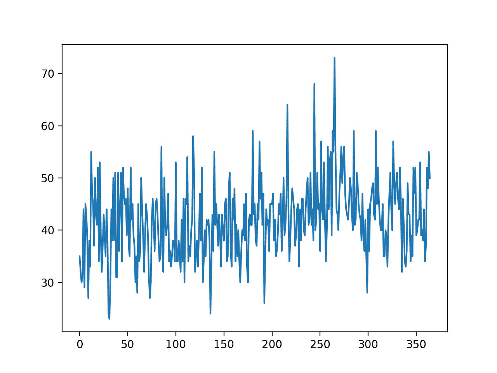
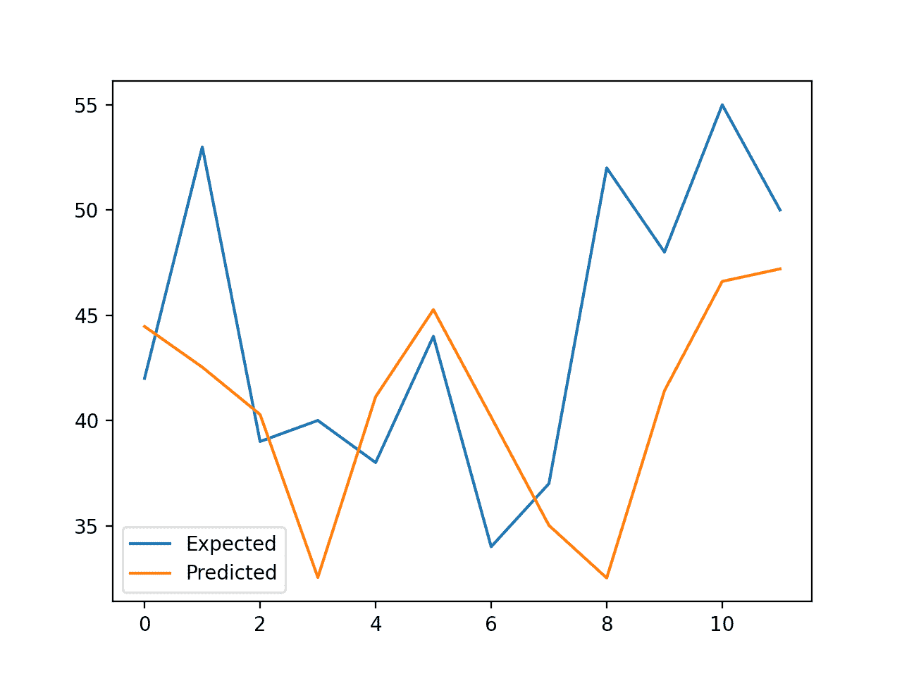

# 如何使用 XGBoost 进行时间序列预测

> 原文:[https://machinelearning master . com/xboost-for-time-series-prediction/](https://machinelearningmastery.com/xgboost-for-time-series-forecasting/)

最后更新于 2021 年 3 月 19 日

XGBoost 是针对分类和回归问题的梯度提升的有效实现。

它既快速又高效，在广泛的预测建模任务中表现良好，如果不是最好的，也是数据科学竞赛获奖者的最爱，例如 Kaggle 上的获奖者。

XGBoost 也可以用于时间序列预测，尽管它需要先将时间序列数据集转化为有监督的学习问题。它还需要使用一种专门的技术来评估模型，称为向前验证，因为使用 k-fold 交叉验证来评估模型会导致乐观偏差的结果。

在本教程中，您将发现如何开发一个用于时间序列预测的 XGBoost 模型。

完成本教程后，您将知道:

*   XGBoost 是用于分类和回归的梯度提升集成算法的实现。
*   可以使用滑动窗口表示将时间序列数据集转换为监督学习。
*   如何使用用于时间序列预测的 XGBoost 模型进行拟合、评估和预测。

**用我的新书 [XGBoost With Python](https://machinelearningmastery.com/xgboost-with-python/) 启动你的项目**，包括*分步教程*和所有示例的 *Python 源代码*文件。

我们开始吧。

*   **更新 2020 年 8 月**:修复了 MAE 计算中的 bug，更新了模型配置，做出了更好的预测(感谢考斯塔夫！)


如何使用 XGBoost 进行时间序列预测
图片由[gothoptam](https://flickr.com/photos/zagrobot/2687464215/)提供，保留部分权利。

## 教程概述

本教程分为三个部分；它们是:

1.  XGBoost 一起
2.  时间序列数据准备
3.  用于时间序列预测的 XGBoost

## XGBoost 一起

XGBoost 是[极限梯度提升](https://machinelearningmastery.com/xgboost-python-mini-course/)的简称，是随机梯度提升机器学习算法的高效实现。

随机梯度增强算法，也称为梯度增强机器或树增强，是一种强大的机器学习技术，在一系列具有挑战性的机器学习问题上表现良好，甚至最好。

> 树提升已经被证明在许多标准分类基准上给出了最先进的结果。

——[xboost:一个可扩展的树提升系统](https://arxiv.org/abs/1603.02754)，2016。

这是一个决策树算法的集合，其中新的树修复了那些已经是模型一部分的树的错误。树被添加，直到模型没有进一步的改进。

XGBoost 提供了随机梯度增强算法的高效实现，并提供了对一组模型超参数的访问，这些参数旨在提供对模型训练过程的控制。

> XGBoost 成功背后最重要的因素是它在所有场景中的可扩展性。该系统在单台机器上的运行速度比现有的流行解决方案快十倍以上，并且在分布式或内存有限的环境中可扩展到数十亿个示例。

——[xboost:一个可扩展的树提升系统](https://arxiv.org/abs/1603.02754)，2016。

XGBoost 是为表格数据集的分类和回归而设计的，尽管它可以用于时间序列预测。

有关渐变增强和 XGBoost 实现的更多信息，请参见教程:

*   [机器学习梯度增强算法的简单介绍](https://machinelearningmastery.com/gentle-introduction-gradient-boosting-algorithm-machine-learning/)

首先，必须安装 XGBoost 库。

您可以使用 pip 安装它，如下所示:

```py
sudo pip install xgboost
```

安装完成后，您可以通过运行以下代码来确认安装成功，并且您使用的是现代版本:

```py
# xgboost
import xgboost
print("xgboost", xgboost.__version__)
```

运行代码时，您应该会看到以下版本号或更高的版本号。

```py
xgboost 1.0.1
```

虽然 XGBoost 库有自己的 Python API，但是我们可以通过[xgbreversor](https://xgboost.readthedocs.io/en/latest/python/python_api.html#xgboost.XGBRegressor)包装类将 XGBoost 模型与 scikit-learn API 一起使用。

模型的一个实例可以像任何其他用于模型评估的 scikit-learn 类一样被实例化和使用。例如:

```py
...
# define model
model = XGBRegressor()
```

现在我们已经熟悉了 XGBoost，让我们看看如何为监督学习准备一个时间序列数据集。

## 时间序列数据准备

时间序列数据可以被称为监督学习。

给定一个时间序列数据集的数字序列，我们可以重构数据，使其看起来像一个有监督的学习问题。我们可以通过使用以前的时间步长作为输入变量，并使用下一个时间步长作为输出变量来实现这一点。

让我们用一个例子来具体说明。假设我们有一个时间序列如下:

```py
time, measure
1, 100
2, 110
3, 108
4, 115
5, 120
```

我们可以通过使用前一时间步的值来预测下一时间步的值，从而将这个时间序列数据集重构为一个有监督的学习问题。

以这种方式重新组织时间序列数据集，数据将如下所示:

```py
X, y
?, 100
100, 110
110, 108
108, 115
115, 120
120, ?
```

请注意，时间列被删除，一些数据行不可用于训练模型，例如第一行和最后一行。

这种表示称为滑动窗口，因为输入和预期输出的窗口随着时间向前移动，为监督学习模型创建新的“*样本*”。

有关准备时间序列预测数据的滑动窗口方法的更多信息，请参见教程:

*   [作为监督学习的时间序列预测](https://machinelearningmastery.com/time-series-forecasting-supervised-learning/)

我们可以使用 Pandas 中的 [shift()函数](https://pandas.pydata.org/pandas-docs/stable/generated/pandas.DataFrame.shift.html)在给定输入和输出序列的期望长度的情况下，自动创建时间序列问题的新框架。

这将是一个有用的工具，因为它将允许我们用机器学习算法探索时间序列问题的不同框架，看看哪一个可能导致更好的模型。

下面的函数将把一个时间序列作为一个具有一列或多列的 NumPy 数组时间序列，并将其转换为具有指定数量的输入和输出的监督学习问题。

```py
# transform a time series dataset into a supervised learning dataset
def series_to_supervised(data, n_in=1, n_out=1, dropnan=True):
	n_vars = 1 if type(data) is list else data.shape[1]
	df = DataFrame(data)
	cols = list()
	# input sequence (t-n, ... t-1)
	for i in range(n_in, 0, -1):
		cols.append(df.shift(i))
	# forecast sequence (t, t+1, ... t+n)
	for i in range(0, n_out):
		cols.append(df.shift(-i))
	# put it all together
	agg = concat(cols, axis=1)
	# drop rows with NaN values
	if dropnan:
		agg.dropna(inplace=True)
	return agg.values
```

我们可以使用这个函数为 XGBoost 准备一个时间序列数据集。

有关该函数逐步开发的更多信息，请参见教程:

*   [如何在 Python 中将时间序列转换为监督学习问题](https://machinelearningmastery.com/convert-time-series-supervised-learning-problem-python/)

一旦准备好数据集，我们必须小心如何使用它来拟合和评估模型。

例如，用未来的数据拟合模型并让它预测过去是无效的。模型必须基于过去进行训练，并预测未来。

这意味着在评估期间随机化数据集的方法，如 k 倍交叉验证，不能使用。相反，我们必须使用一种叫做向前验证的技术。

在向前行走验证中，首先通过选择切割点将数据集分割成训练集和测试集，例如，除了最后 12 天之外的所有数据都用于训练，最后 12 天用于测试。

如果我们有兴趣进行一步预测，例如一个月，那么我们可以通过在训练数据集上训练和预测测试数据集中的第一步来评估模型。然后，我们可以将测试集中的真实观察值添加到训练数据集中，重新调整模型，然后让模型预测测试数据集中的第二步。

对整个测试数据集重复这一过程将给出对整个测试数据集的一步预测，由此可以计算误差度量来评估模型的技能。

有关向前验证的更多信息，请参见教程:

*   [如何回溯测试用于时间序列预测的机器学习模型](https://machinelearningmastery.com/backtest-machine-learning-models-time-series-forecasting/)

下面的函数执行向前行走验证。

它将时间序列数据集的整个监督学习版本和用作测试集的行数作为参数。

然后它遍历测试集，调用*xboost _ forecast()*函数进行一步预测。计算误差度量，并返回详细信息进行分析。

```py
# walk-forward validation for univariate data
def walk_forward_validation(data, n_test):
	predictions = list()
	# split dataset
	train, test = train_test_split(data, n_test)
	# seed history with training dataset
	history = [x for x in train]
	# step over each time-step in the test set
	for i in range(len(test)):
		# split test row into input and output columns
		testX, testy = test[i, :-1], test[i, -1]
		# fit model on history and make a prediction
		yhat = xgboost_forecast(history, testX)
		# store forecast in list of predictions
		predictions.append(yhat)
		# add actual observation to history for the next loop
		history.append(test[i])
		# summarize progress
		print('>expected=%.1f, predicted=%.1f' % (testy, yhat))
	# estimate prediction error
	error = mean_absolute_error(test[:, -1], predictions)
	return error, test[:, 1], predictions
```

调用 *train_test_split()* 函数将数据集拆分为训练集和测试集。

我们可以在下面定义这个函数。

```py
# split a univariate dataset into train/test sets
def train_test_split(data, n_test):
	return data[:-n_test, :], data[-n_test:, :]
```

我们可以使用*xgbreversor*类进行一步预测。

下面的*xboost _ forecast()*函数实现了这一点，以训练数据集和测试输入行为输入，拟合一个模型，进行一步预测。

```py
# fit an xgboost model and make a one step prediction
def xgboost_forecast(train, testX):
	# transform list into array
	train = asarray(train)
	# split into input and output columns
	trainX, trainy = train[:, :-1], train[:, -1]
	# fit model
	model = XGBRegressor(objective='reg:squarederror', n_estimators=1000)
	model.fit(trainX, trainy)
	# make a one-step prediction
	yhat = model.predict([testX])
	return yhat[0]
```

现在我们知道了如何准备时间序列数据来预测和评估 xboost 模型，接下来我们可以看看如何在真实数据集上使用 xboost。

## 用于时间序列预测的 XGBoost

在本节中，我们将探讨如何使用 XGBoost 进行时间序列预测。

我们将使用标准的单变量时间序列数据集，目的是使用该模型进行一步预测。

您可以将本节中的代码用作自己项目的起点，并轻松地将其用于多元输入、多元预测和多步预测。

我们将使用每日女性出生数据，即三年间的每月出生数据。

您可以从这里下载数据集，并将其放在当前工作目录中，文件名为“*每日女性出生总数. csv* ”。

*   [数据集(每日总女性分娩数)](https://raw.githubusercontent.com/jbrownlee/Datasets/master/daily-total-female-births.csv)
*   [描述(每日出生总数-女性姓名)](https://raw.githubusercontent.com/jbrownlee/Datasets/master/daily-total-female-births.names)

数据集的前几行如下所示:

```py
"Date","Births"
"1959-01-01",35
"1959-01-02",32
"1959-01-03",30
"1959-01-04",31
"1959-01-05",44
...
```

首先，让我们加载并绘制数据集。

下面列出了完整的示例。

```py
# load and plot the time series dataset
from pandas import read_csv
from matplotlib import pyplot
# load dataset
series = read_csv('daily-total-female-births.csv', header=0, index_col=0)
values = series.values
# plot dataset
pyplot.plot(values)
pyplot.show()
```

运行该示例会创建数据集的线图。

我们可以看到没有明显的趋势或季节性。



月出生时间序列数据集的线图

当预测最后 12 天时，持久性模型可以实现大约 6.7 次出生的 MAE。这提供了一个性能基线，在这个基线之上，模型可以被认为是熟练的。

接下来，当对过去 12 天的数据进行一步预测时，我们可以在数据集上评估 XGBoost 模型。

我们将只使用前面的 6 个时间步长作为模型和默认模型超参数的输入，除了我们将损失更改为“ *reg:squarederror* ”(以避免警告消息)并在集合中使用 1000 棵树(以避免欠学习)。

下面列出了完整的示例。

```py
# forecast monthly births with xgboost
from numpy import asarray
from pandas import read_csv
from pandas import DataFrame
from pandas import concat
from sklearn.metrics import mean_absolute_error
from xgboost import XGBRegressor
from matplotlib import pyplot

# transform a time series dataset into a supervised learning dataset
def series_to_supervised(data, n_in=1, n_out=1, dropnan=True):
	n_vars = 1 if type(data) is list else data.shape[1]
	df = DataFrame(data)
	cols = list()
	# input sequence (t-n, ... t-1)
	for i in range(n_in, 0, -1):
		cols.append(df.shift(i))
	# forecast sequence (t, t+1, ... t+n)
	for i in range(0, n_out):
		cols.append(df.shift(-i))
	# put it all together
	agg = concat(cols, axis=1)
	# drop rows with NaN values
	if dropnan:
		agg.dropna(inplace=True)
	return agg.values

# split a univariate dataset into train/test sets
def train_test_split(data, n_test):
	return data[:-n_test, :], data[-n_test:, :]

# fit an xgboost model and make a one step prediction
def xgboost_forecast(train, testX):
	# transform list into array
	train = asarray(train)
	# split into input and output columns
	trainX, trainy = train[:, :-1], train[:, -1]
	# fit model
	model = XGBRegressor(objective='reg:squarederror', n_estimators=1000)
	model.fit(trainX, trainy)
	# make a one-step prediction
	yhat = model.predict(asarray([testX]))
	return yhat[0]

# walk-forward validation for univariate data
def walk_forward_validation(data, n_test):
	predictions = list()
	# split dataset
	train, test = train_test_split(data, n_test)
	# seed history with training dataset
	history = [x for x in train]
	# step over each time-step in the test set
	for i in range(len(test)):
		# split test row into input and output columns
		testX, testy = test[i, :-1], test[i, -1]
		# fit model on history and make a prediction
		yhat = xgboost_forecast(history, testX)
		# store forecast in list of predictions
		predictions.append(yhat)
		# add actual observation to history for the next loop
		history.append(test[i])
		# summarize progress
		print('>expected=%.1f, predicted=%.1f' % (testy, yhat))
	# estimate prediction error
	error = mean_absolute_error(test[:, -1], predictions)
	return error, test[:, -1], predictions

# load the dataset
series = read_csv('daily-total-female-births.csv', header=0, index_col=0)
values = series.values
# transform the time series data into supervised learning
data = series_to_supervised(values, n_in=6)
# evaluate
mae, y, yhat = walk_forward_validation(data, 12)
print('MAE: %.3f' % mae)
# plot expected vs preducted
pyplot.plot(y, label='Expected')
pyplot.plot(yhat, label='Predicted')
pyplot.legend()
pyplot.show()
```

运行该示例会报告测试集中每个步骤的预期值和预测值，然后是所有预测值的 MAE。

**注**:考虑到算法或评估程序的随机性，或数值精度的差异，您的[结果可能会有所不同](https://machinelearningmastery.com/different-results-each-time-in-machine-learning/)。考虑运行该示例几次，并比较平均结果。

我们可以看到，该模型比持久性模型表现得更好，实现了大约 5.9 次出生的 MAE，而不是 6.7 次出生。

**你能做得更好吗？**
你可以测试不同的 XGBoost 超参数和时间步数作为输入，看看是否能达到更好的性能。在下面的评论中分享你的结果。

```py
>expected=42.0, predicted=44.5
>expected=53.0, predicted=42.5
>expected=39.0, predicted=40.3
>expected=40.0, predicted=32.5
>expected=38.0, predicted=41.1
>expected=44.0, predicted=45.3
>expected=34.0, predicted=40.2
>expected=37.0, predicted=35.0
>expected=52.0, predicted=32.5
>expected=48.0, predicted=41.4
>expected=55.0, predicted=46.6
>expected=50.0, predicted=47.2
MAE: 5.957
```

将数据集最后 12 天的一系列预期值和预测值进行比较，创建一个折线图。

这给出了模型在测试集上表现如何的几何解释。



使用 XGBoost 预测的预期与出生的线图

一旦选择了最终的 XGBoost 模型配置，就可以最终确定一个模型，并用于对新数据进行预测。

这被称为**样本外预测**，例如预测超出训练数据集。这与在模型评估过程中进行预测是一样的:因为我们总是希望使用我们期望在模型用于对新数据进行预测时使用的相同过程来评估模型。

下面的例子演示了在所有可用数据上拟合最终的 XGBoost 模型，并在数据集结束后进行一步预测。

```py
# finalize model and make a prediction for monthly births with xgboost
from numpy import asarray
from pandas import read_csv
from pandas import DataFrame
from pandas import concat
from xgboost import XGBRegressor

# transform a time series dataset into a supervised learning dataset
def series_to_supervised(data, n_in=1, n_out=1, dropnan=True):
	n_vars = 1 if type(data) is list else data.shape[1]
	df = DataFrame(data)
	cols = list()
	# input sequence (t-n, ... t-1)
	for i in range(n_in, 0, -1):
		cols.append(df.shift(i))
	# forecast sequence (t, t+1, ... t+n)
	for i in range(0, n_out):
		cols.append(df.shift(-i))
	# put it all together
	agg = concat(cols, axis=1)
	# drop rows with NaN values
	if dropnan:
		agg.dropna(inplace=True)
	return agg.values

# load the dataset
series = read_csv('daily-total-female-births.csv', header=0, index_col=0)
values = series.values
# transform the time series data into supervised learning
train = series_to_supervised(values, n_in=6)
# split into input and output columns
trainX, trainy = train[:, :-1], train[:, -1]
# fit model
model = XGBRegressor(objective='reg:squarederror', n_estimators=1000)
model.fit(trainX, trainy)
# construct an input for a new preduction
row = values[-6:].flatten()
# make a one-step prediction
yhat = model.predict(asarray([row]))
print('Input: %s, Predicted: %.3f' % (row, yhat[0]))
```

运行该示例符合所有可用数据的 XGBoost 模型。

使用最后 6 天的已知数据准备新的输入行，并预测数据集结束后的下一个月。

```py
Input: [34 37 52 48 55 50], Predicted: 42.708
```

## 进一步阅读

如果您想更深入地了解这个主题，本节将提供更多资源。

### 相关教程

*   [机器学习梯度增强算法的简单介绍](https://machinelearningmastery.com/gentle-introduction-gradient-boosting-algorithm-machine-learning/)
*   [作为监督学习的时间序列预测](https://machinelearningmastery.com/time-series-forecasting-supervised-learning/)
*   [如何在 Python 中将时间序列转换为监督学习问题](https://machinelearningmastery.com/convert-time-series-supervised-learning-problem-python/)
*   [如何回溯测试用于时间序列预测的机器学习模型](https://machinelearningmastery.com/backtest-machine-learning-models-time-series-forecasting/)

## 摘要

在本教程中，您发现了如何开发用于时间序列预测的 XGBoost 模型。

具体来说，您了解到:

*   XGBoost 是用于分类和回归的梯度提升集成算法的实现。
*   可以使用滑动窗口表示将时间序列数据集转换为监督学习。
*   如何使用用于时间序列预测的 XGBoost 模型进行拟合、评估和预测。

**你有什么问题吗？**
在下面的评论中提问，我会尽力回答。